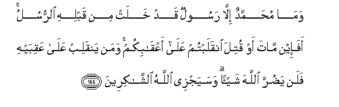
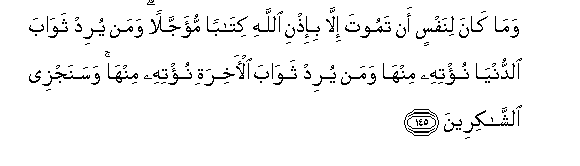
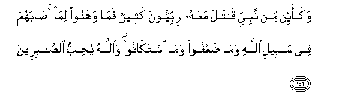
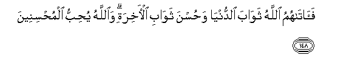

  
[Intangible Textual Heritage](../../index)  [Islam](../index) 
[Index](index)   
[Hypertext Qur'an](../htq/index)  [Unicode](../uq/003.htm#003_144) 
[Palmer](../sbe06/003)  [Pickthall](../pick/003.htm#003_144)  [Yusuf Ali
English](../yaq/yaq003)  [Rodwell](../qr/003)   
  
[Sūra III.: Āl-i-’Imrān, or The Family of ’Imrān. Index](003)  
  [Previous](00314)  [Next](00316) 

------------------------------------------------------------------------

  
*The Holy Quran*, tr. by Yusuf Ali, \[1934\], at Intangible Textual
Heritage

------------------------------------------------------------------------

# Sūra III.: Āl-i-’Imrān, or The Family of ’Imrān.

### Section 15

------------------------------------------------------------------------

144. Wam<u>a</u> mu<u>h</u>ammadun ill<u>a</u> rasoolun qad khalat min
qablihi a**l**rrusulu afa-in m<u>a</u>ta aw qutila inqalabtum
AAal<u>a</u> aAAq<u>a</u>bikum waman yanqalib AAal<u>a</u> AAaqibayhi
falan ya<u>d</u>urra All<u>a</u>ha shay-an wasayajzee All<u>a</u>hu
a**l**shsh<u>a</u>kireen**a**

144\. Muhammad is no more  
Than an Apostle: many  
Were the Apostles that passed away  
Before him. If he died  
Or were slain, will ye then  
Turn back on your heels?  
If any did turn back  
On his heels, not the least  
Harm will he do to God;  
But God (on the other hand)  
Will swiftly reward those  
Who (serve him) with gratitude.

------------------------------------------------------------------------

145. Wam<u>a</u> k<u>a</u>na linafsin an tamoota ill<u>a</u>
bi-i<u>th</u>ni All<u>a</u>hi kit<u>a</u>ban mu-ajjalan waman yurid
thaw<u>a</u>ba a**l**dduny<u>a</u> nu/tihi minh<u>a</u> waman yurid
thaw<u>a</u>ba al-<u>a</u>khirati nu/tihi minh<u>a</u> wasanajzee
a**l**shsh<u>a</u>kireen**a**

145\. Nor can a soul die  
Except by God's leave,  
The term being fixed  
As by writing. If any  
Do desire a reward  
In this life, We shall give it  
To him; and if any  
Do desire a reward  
In the Hereafter, We shall  
Give it to him.  
And swiftly shall We reward  
Those that (serve us with) gratitude.

------------------------------------------------------------------------

146. Wakaayyin min nabiyyin q<u>a</u>tala maAAahu ribbiyyoona katheerun
fam<u>a</u> wahanoo lim<u>a</u> a<u>sa</u>bahum fee sabeeli
All<u>a</u>hi wam<u>a</u> <u>d</u>aAAufoo wam<u>a</u> istak<u>a</u>noo
wa**A**ll<u>a</u>hu yu<u>h</u>ibbu a**l**<u>ssa</u>bireen**a**

146\. How many of the Prophets  
Fought (in God's way),  
And with them (fought)  
Large bands of godly men?  
But they never lost heart  
If they met with disaster  
In God's way, nor did  
They weaken (in will)  
Nor give in. And God  
Loves those who are  
Firm and steadfast.

------------------------------------------------------------------------

147. Wam<u>a</u> k<u>a</u>na qawlahum ill<u>a</u> an q<u>a</u>loo
rabban<u>a</u> ighfir lan<u>a</u> <u>th</u>unooban<u>a</u>
wa-isr<u>a</u>fan<u>a</u> fee amrin<u>a</u> wathabbit
aqd<u>a</u>man<u>a</u> wa**o**n<u>s</u>urn<u>a</u> AAal<u>a</u> alqawmi
alk<u>a</u>fireen**a**

147\. All that they said was:  
"Our Lord! forgive us  
Our sins and anything  
We may have done  
That transgressed our duty:  
Establish our feet firmly,  
And help us against  
Those that resist  
Faith."

------------------------------------------------------------------------

148. Fa<u>a</u>t<u>a</u>humu All<u>a</u>hu thaw<u>a</u>ba
a**l**dduny<u>a</u> wa<u>h</u>usna thaw<u>a</u>bi al-<u>a</u>khirati
wa**A**ll<u>a</u>hu yu<u>h</u>ibbu almu<u>h</u>sineen**a**

148\. And God gave them  
A reward in this world,  
And the excellent reward  
Of the Hereafter. For God  
Loveth those who do good.

------------------------------------------------------------------------

[Next: Section 16 (149-155)](00316)

