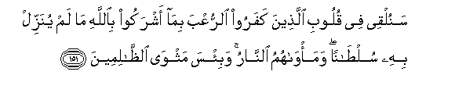
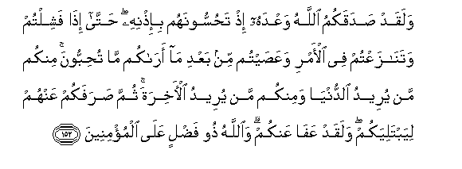
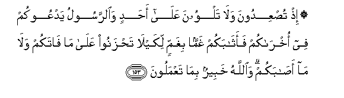
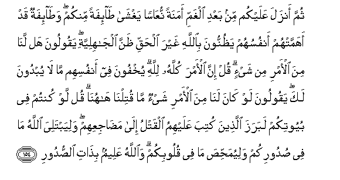

  
[Intangible Textual Heritage](../../index)  [Islam](../index.md) 
[Index](index.md)   
[Hypertext Qur'an](../htq/index)  [Unicode](../uq/003.htm#003_149.md) 
[Palmer](../sbe06/003)  [Pickthall](../pick/003.htm#003_149.md)  [Yusuf Ali
English](../yaq/yaq003)  [Rodwell](../qr/003.md)   
  
[Sūra III.: Āl-i-’Imrān, or The Family of ’Imrān. Index](003.md)  
  [Previous](00315)  [Next](00317.md) 

------------------------------------------------------------------------

  
*The Holy Quran*, tr. by Yusuf Ali, \[1934\], at Intangible Textual
Heritage

------------------------------------------------------------------------

# Sūra III.: Āl-i-’Imrān, or The Family of ’Imrān.

### Section 16

------------------------------------------------------------------------

149. Y<u>a</u> ayyuh<u>a</u> alla<u>th</u>eena <u>a</u>manoo in
tu<u>t</u>eeAAoo alla<u>th</u>eena kafaroo yaruddookum AAal<u>a</u>
aAAq<u>a</u>bikum fatanqaliboo kh<u>a</u>sireen**a**

149\. O ye who believe!  
If ye obey the Unbelievers,  
They will drive you back  
On your heels, and ye  
Will turn back (from Faith)  
To your own loss.

------------------------------------------------------------------------

150. Bali All<u>a</u>hu mawl<u>a</u>kum wahuwa khayru
a**l**nn<u>as</u>ireen**a**

150\. Nay, God is your Protector,  
And He is the best of helpers.

------------------------------------------------------------------------

151. Sanulqee fee quloobi alla<u>th</u>eena kafaroo a**l**rruAAba
bim<u>a</u> ashrakoo bi**A**ll<u>a</u>hi m<u>a</u> lam yunazzil bihi
sul<u>ta</u>nan wama/w<u>a</u>humu a**l**nn<u>a</u>ru wabi/sa
mathw<u>a</u> a**l***<u>thth</u>*<u>a</u>limeen**a**

151\. Soon shall We cast terror  
Into the hearts of the Unbelievers  
For that they joined companions  
With God, for which He had sew  
No authority: their abode  
Will be the Fire: and evil  
Is the home of the wrong-doers!

------------------------------------------------------------------------

152. Walaqad <u>s</u>adaqakumu All<u>a</u>hu waAAdahu i<u>th</u>
ta<u>h</u>ussoonahum bi-i<u>th</u>nihi <u>h</u>att<u>a</u> i<u>tha</u>
fashiltum watan<u>a</u>zaAAtum fee al-amri waAAa<u>s</u>aytum min baAAdi
m<u>a</u> ar<u>a</u>kum m<u>a</u> tu<u>h</u>ibboona minkum man yureedu
a**l**dduny<u>a</u> waminkum man yureedu al-<u>a</u>khirata thumma
<u>s</u>arafakum AAanhum liyabtaliyakum walaqad AAaf<u>a</u> AAankum
wa**A**ll<u>a</u>hu <u>th</u>oo fa<u>d</u>lin AAal<u>a</u>
almu/mineen**a**

152\. God did indeed fulfil  
His promise to you  
When ye with His permission  
Were about to annihilate  
Your enemy,—until ye flinched  
And fell to disputing  
About the order,  
And disobeyed it  
After He brought you in sight  
(Of the Booty) which ye covet.  
Among you are some  
That hanker after this world  
And some that desire  
The Hereafter. Then did He  
Divert you from your foes  
In order to test you.  
But He forgave you:  
For God is full of grace  
To those who believe.

------------------------------------------------------------------------

153. I<u>th</u> tu<u>s</u>AAidoona wal<u>a</u> talwoona AAal<u>a</u>
a<u>h</u>adin wa**al**rrasoolu yadAAookum fee okhr<u>a</u>kum
faath<u>a</u>bakum ghamman bighammin likay l<u>a</u> ta<u>h</u>zanoo
AAal<u>a</u> m<u>a</u> f<u>a</u>takum wal<u>a</u> m<u>a</u>
a<u>sa</u>bakum wa**A**ll<u>a</u>hu khabeerun bim<u>a</u>
taAAmaloon**a**

153\. Behold! ye were climbing up  
The high ground, without even  
Casting a side glance  
At any one, and the Apostle  
In your rear was calling you  
Back. There did God give you  
One distress after another  
By way of requital,  
To teach you not to grieve  
For (the booty) that had escaped you  
And for (the ill) that had befallen you.  
For God is well aware  
Of all that ye do.

------------------------------------------------------------------------

154. Thumma anzala AAalaykum min baAAdi alghammi amanatan
nuAA<u>a</u>san yaghsh<u>a</u> <u>ta</u>-ifatan minkum
wa<u>ta</u>-ifatun qad ahammat-hum anfusuhum ya*<u>th</u>*unnoona
bi**A**ll<u>a</u>hi ghayra al<u>h</u>aqqi *<u>th</u>*anna
alj<u>a</u>hiliyyati yaqooloona hal lan<u>a</u> mina al-amri min shay-in
qul inna al-amra kullahu lill<u>a</u>hi yukhfoona fee anfusihim
m<u>a</u> l<u>a</u> yubdoona laka yaqooloona law k<u>a</u>na lan<u>a</u>
mina al-amri shay-on m<u>a</u> qutiln<u>a</u> h<u>a</u>hun<u>a</u> qul
law kuntum fee buyootikum labaraza alla<u>th</u>eena kutiba AAalayhimu
alqatlu il<u>a</u> ma<u>da</u>jiAAihim waliyabtaliya All<u>a</u>hu
m<u>a</u> fee <u>s</u>udoorikum waliyuma<u>hh</u>i<u>s</u>a m<u>a</u>
fee quloobikum wa**A**ll<u>a</u>hu AAaleemun bi<u>tha</u>ti
a**l**<u>ss</u>udoor**i**

154\. After (the excitement)  
Of the distress, He sent down  
Calm on a band of you  
Overcome with slumber,  
While another band  
Was stirred to anxiety  
By their own feelings,  
Moved by wrong suspicions  
Of God—suspicions due  
To Ignorance. They said:  
"What affair is this of ours?"  
Say thou: "Indeed, this affair  
Is wholly God's." They hide  
In their minds what they  
Dare not reveal to thee.  
They say (to themselves):  
"If we had had anything  
To do with this affair,  
We should not have been  
In the slaughter here."  
Say: "Even if you had remained  
In your homes, those  
For whom death was decreed  
Would certainly have gone forth  
To the place of their death";  
But (all this was)  
That God might test  
What is in your breasts  
And purge what is  
In your hearts.  
For God knoweth well  
The secrets of your hearts.

------------------------------------------------------------------------

155. Inna alla<u>th</u>eena tawallaw minkum yawma iltaq<u>a</u>
aljamAA<u>a</u>ni innam<u>a</u> istazallahumu a**l**shshay<u>ta</u>nu
bibaAA<u>d</u>i m<u>a</u> kasaboo walaqad AAaf<u>a</u> All<u>a</u>hu
AAanhum inna All<u>a</u>ha ghafoorun <u>h</u>aleem**un**

155\. Those of you  
Who turned back  
On the day the two hosts  
Met,—it was Satan  
Who caused them to fail,  
Because of some (evil)  
They had done. But God  
Has blotted out (their fault):  
For God is Oft-forgiving,  
Most Forbearing.

------------------------------------------------------------------------

[Next: Section 17 (156-171)](00317.md)

