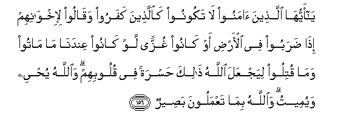
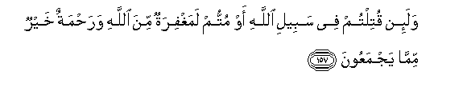
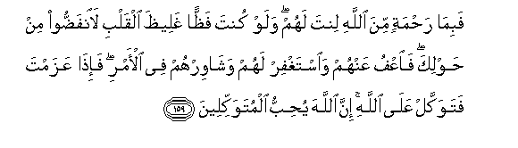
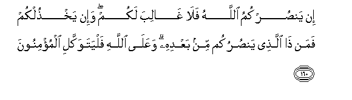
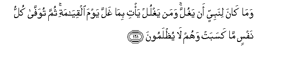
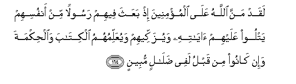
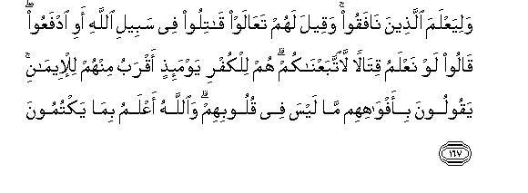
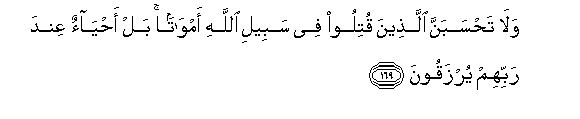
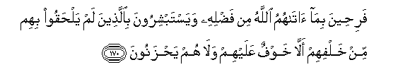

  
[Intangible Textual Heritage](../../index)  [Islam](../index) 
[Index](index)   
[Hypertext Qur'an](../htq/index)  [Unicode](../uq/003.htm#003_156) 
[Palmer](../sbe06/003)  [Pickthall](../pick/003.htm#003_156)  [Yusuf Ali
English](../yaq/yaq003)  [Rodwell](../qr/003)   
  
[Sūra III.: Āl-i-’Imrān, or The Family of ’Imrān. Index](003)  
  [Previous](00316)  [Next](00318) 

------------------------------------------------------------------------

  
*The Holy Quran*, tr. by Yusuf Ali, \[1934\], at Intangible Textual
Heritage

------------------------------------------------------------------------

# Sūra III.: Āl-i-’Imrān, or The Family of ’Imrān.

### Section 17

------------------------------------------------------------------------

156. Y<u>a</u> ayyuh<u>a</u> alla<u>th</u>eena <u>a</u>manoo l<u>a</u>
takoonoo ka**a**lla<u>th</u>eena kafaroo waq<u>a</u>loo
li-ikhw<u>a</u>nihim i<u>tha</u> <u>d</u>araboo fee al-ar<u>d</u>i aw
k<u>a</u>noo ghuzzan law k<u>a</u>noo AAindan<u>a</u> m<u>a</u>
m<u>a</u>too wam<u>a</u> qutiloo liyajAAala All<u>a</u>hu <u>tha</u>lika
<u>h</u>asratan fee quloobihim wa**A**ll<u>a</u>hu yu<u>h</u>yee
wayumeetu wa**A**ll<u>a</u>hu bim<u>a</u> taAAmaloona
ba<u>s</u>eer**un**

156\. O ye who believe!  
Be not like the Unbelievers,  
Who say of their brethren,  
When they are travelling  
Through the earth or engaged  
In fighting: "If they had stayed  
With us, they would not  
Have died, or been slain."  
This that God may make it  
A cause of sighs and regrets  
In their hearts. It is God  
That gives Life and Death,  
And God sees well  
All that ye do.

------------------------------------------------------------------------

157. Wala-in qutiltum fee sabeeli All<u>a</u>hi aw muttum lamaghfiratun
mina All<u>a</u>hi wara<u>h</u>matun khayrun mimm<u>a</u>
yajmaAAoon**a**

157\. And if ye are slain, or die,  
In the way of God,  
Forgiveness and mercy  
From God are far better  
Than all they could amass.

------------------------------------------------------------------------

158. Wala-in muttum aw qutiltum la-il<u>a</u> All<u>a</u>hi
tu<u>h</u>sharoon**a**

158\. And if ye die, or are slain,  
Lo! it is-unto God  
That ye are brought together.

------------------------------------------------------------------------

159. Fabim<u>a</u> ra<u>h</u>matin mina All<u>a</u>hi linta lahum walaw
kunta fa*<u>thth</u>*an ghalee*<u>th</u>*a alqalbi la**i**nfa<u>dd</u>oo
min <u>h</u>awlika fa**o**AAfu AAanhum wa**i**staghfir lahum
wash<u>a</u>wirhum fee al-amri fa-i<u>tha</u> AAazamta fatawakkal
AAal<u>a</u> All<u>a</u>hi inna All<u>a</u>ha yu<u>h</u>ibbu
almutawakkileen**a**

159\. It is part of the Mercy  
Of God that thou dost deal  
Gently with them.  
Wert thou severe  
Or harsh-hearted,  
They would have broken away  
From about thee: so pass over  
(Their faults), and ask  
For (God's) forgiveness  
For them; and consult  
Them in affairs (of moment).  
Then, when thou hast  
Taken a decision,  
Put thy trust in God.  
For God loves those  
Who put their trust (in Him).

------------------------------------------------------------------------

160. In yan<u>s</u>urkumu All<u>a</u>hu fal<u>a</u> gh<u>a</u>liba lakum
wa-in yakh<u>th</u>ulkum faman <u>tha</u> alla<u>th</u>ee
yan<u>s</u>urukum min baAAdihi waAAal<u>a</u> All<u>a</u>hi
falyatawakkali almu/minoon**a**

160\. If God helps you,  
Non can overcome you:  
If He forsakes you,  
Who is there, after that,  
That can help you?  
In God, then,  
Let Believers put their trust.

------------------------------------------------------------------------

161. Wam<u>a</u> k<u>a</u>na linabiyyin an yaghulla waman yaghlul ya/ti
bim<u>a</u> ghalla yawma alqiy<u>a</u>mati thumma tuwaff<u>a</u> kullu
nafsin m<u>a</u> kasabat wahum l<u>a</u> yu*<u>th</u>*lamoon**a**

161\. No prophet could (ever)  
Be false to his trust.  
If any person is so false,  
He shall, on the Day  
Of Judgment, restore  
What he misappropriated;  
Then shall every soul  
Receive its due,—  
Whatever it earned,—  
And none shall be  
Dealt with unjustly.

------------------------------------------------------------------------

162. Afamani ittabaAAa ri<u>d</u>w<u>a</u>na All<u>a</u>hi kaman
b<u>a</u>a bisakha<u>t</u>in mina All<u>a</u>hi wama/w<u>a</u>hu
jahannamu wabi/sa alma<u>s</u>eer**u**

162\. Is the man who follows  
The good pleasure of God  
Like the man who draws  
On himself the wrath  
Of God, and whose abode  
Is in Hell?—  
A woeful refuge!

------------------------------------------------------------------------

163. Hum daraj<u>a</u>tun AAinda All<u>a</u>hi wa**A**ll<u>a</u>hu
ba<u>s</u>eerun bim<u>a</u> yaAAmaloon**a**

163\. They are in varying grades  
In the sight of God,  
And God sees well  
All that they do.

------------------------------------------------------------------------

164. Laqad manna All<u>a</u>hu AAal<u>a</u> almu/mineena i<u>th</u>
baAAatha feehim rasoolan min anfusihim yatloo AAalayhim
<u>a</u>y<u>a</u>tihi wayuzakkeehim wayuAAallimuhumu alkit<u>a</u>ba
wa**a**l<u>h</u>ikmata wa-in k<u>a</u>noo min qablu lafee
<u>d</u>al<u>a</u>lin mubeen**in**

164\. God did confer  
A great favour  
On the Believers  
When He sent among them  
An Apostle from among  
Themselves, rehearsing  
Unto them the Signs  
Of God, sanctifying them,  
And instructing them  
In Scripture and Wisdom,  
While, before that,  
They had been  
In manifest error.

------------------------------------------------------------------------

165. Awa lamm<u>a</u> a<u>sa</u>batkum mu<u>s</u>eebatun qad
a<u>s</u>abtum mithlayh<u>a</u> qultum ann<u>a</u> h<u>atha</u> qul huwa
min AAindi anfusikum inna All<u>a</u>ha AAal<u>a</u> kulli shay-in
qadeer**un**

165\. What! When a single  
Disaster smites you,  
Although ye smote (your enemies)  
With one twice as great,  
Do ye say?—  
"Whence is this?"  
Say (to them):  
"It is from yourselves:  
For God hath power  
Over all things."

------------------------------------------------------------------------

166. Wam<u>a</u> a<u>sa</u>bakum yawma iltaq<u>a</u> aljamAA<u>a</u>ni
fabi-i<u>th</u>ni All<u>a</u>hi waliyaAAlama almu/mineen**a**

166\. What ye suffered  
On the day the two armies  
Met, was with the leave  
Of God, in order that  
He might test the Believers,—

------------------------------------------------------------------------

167. WaliyaAAlama alla<u>th</u>eena n<u>a</u>faqoo waqeela lahum
taAA<u>a</u>law q<u>a</u>tiloo fee sabeeli All<u>a</u>hi awi idfaAAoo
q<u>a</u>loo law naAAlamu qit<u>a</u>lan la**i**ttabaAAn<u>a</u>kum hum
lilkufri yawma-i<u>th</u>in aqrabu minhum lil-eem<u>a</u>ni yaqooloona
bi-afw<u>a</u>hihim m<u>a</u> laysa fee quloobihim wa**A**ll<u>a</u>hu
aAAlamu bim<u>a</u> yaktumoon**a**

167\. And the Hypocrites also.  
These were told: "Come,  
Fight in the way of God,  
Or (at least) drive  
(The foe from Your city)."  
They said: "Had we known  
How to fight, we should  
Certainly have followed you."  
They were that day  
Nearer to Unbelief  
Than to Faith,  
Saying with their lips  
What was not in their hearts.  
But God hath full knowledge  
Of all they conceal.

------------------------------------------------------------------------

168. Alla<u>th</u>eena q<u>a</u>loo li-ikhw<u>a</u>nihim waqaAAadoo law
a<u>ta</u>AAoon<u>a</u> m<u>a</u> qutiloo qul fa**i**draoo AAan
anfusikumu almawta in kuntum <u>sa</u>diqeen**a**

168\. (They are) the ones that say,  
(Of their brethren slain),  
While they themselves  
Sit (at ease): "If only  
They had listened to us,  
They would not have been slain."  
Say: "Avert death  
From your own selves,  
If ye speak the truth."

------------------------------------------------------------------------

169. Wal<u>a</u> ta<u>h</u>sabanna alla<u>th</u>eena qutiloo fee sabeeli
All<u>a</u>hi amw<u>a</u>tan bal a<u>h</u>y<u>a</u>on AAinda rabbihim
yurzaqoon**a**

169\. Think not of those  
Who are slain in God's way  
As dead. Nay, they live,  
Finding their sustenance  
In the Presence of their Lord;

------------------------------------------------------------------------

170. Fari<u>h</u>eena bim<u>a</u> <u>a</u>t<u>a</u>humu All<u>a</u>hu
min fa<u>d</u>lihi wayastabshiroona bi**a**lla<u>th</u>eena lam
yal<u>h</u>aqoo bihim min khalfihim all<u>a</u> khawfun AAalayhim
wal<u>a</u> hum ya<u>h</u>zanoon**a**

170\. They rejoice in the Bounty  
Provided by God:  
And with regard to those  
Left behind, who have not  
Yet joined them (in their bliss),  
The (Martyrs) glory in the fact  
That on them is no fear,  
Nor have they (cause to) grieve.

------------------------------------------------------------------------

171. Yastabshiroona biniAAmatin mina All<u>a</u>hi wafa<u>d</u>lin
waanna All<u>a</u>ha l<u>a</u> yu<u>d</u>eeAAu ajra almu/mineen**a**

171\. They glory in the Grace  
And the Bounty from God,  
And in the fact that  
God suffereth not  
The reward of the Faithful  
To be lost (in the least).

------------------------------------------------------------------------

[Next: Section 18 (172-180)](00318)

