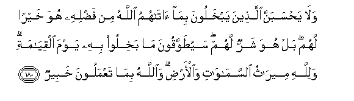

  
[Intangible Textual Heritage](../../index)  [Islam](../index.md) 
[Index](index.md)   
[Hypertext Qur'an](../htq/index)  [Unicode](../uq/003.htm#003_172.md) 
[Palmer](../sbe06/003)  [Pickthall](../pick/003.htm#003_172.md)  [Yusuf Ali
English](../yaq/yaq003)  [Rodwell](../qr/003.md)   
  
[Sūra III.: Āl-i-’Imrān, or The Family of ’Imrān. Index](003.md)  
  [Previous](00317)  [Next](00319.md) 

------------------------------------------------------------------------

  
*The Holy Quran*, tr. by Yusuf Ali, \[1934\], at Intangible Textual
Heritage

------------------------------------------------------------------------

# Sūra III.: Āl-i-’Imrān, or The Family of ’Imrān.

### Section 18

------------------------------------------------------------------------

172. Alla<u>th</u>eena istaj<u>a</u>boo lill<u>a</u>hi wa**al**rrasooli
min baAAdi m<u>a</u> a<u>sa</u>bahumu alqar<u>h</u>u lilla<u>th</u>eena
a<u>h</u>sanoo minhum wa**i**ttaqaw ajrun AAa*<u>th</u>*eem**un**

172\. Of those who answered  
The call of God  
And the Apostle,  
Even after being wounded,  
Those who do right  
And refrain from wrong  
Have a great reward;—

------------------------------------------------------------------------

173. Alla<u>th</u>eena q<u>a</u>la lahumu a**l**nn<u>a</u>su inna
a**l**nn<u>a</u>sa qad jamaAAoo lakum fa**i**khshawhum faz<u>a</u>dahum
eem<u>a</u>nan waq<u>a</u>loo <u>h</u>asbun<u>a</u> All<u>a</u>hu
waniAAma alwakeel**u**

173\. Men said to them:  
"A great army is gathering  
Against you":  
And frightened them:  
But it (only) increased  
Their Faith: they said:  
"For us God sufficeth,  
And He is the best  
Disposer of affairs."

------------------------------------------------------------------------

174. Fa**i**nqalaboo biniAAmatin mina All<u>a</u>hi wafa<u>d</u>lin lam
yamsas-hum soo-on wa**i**ttabaAAoo ri<u>d</u>w<u>a</u>na All<u>a</u>hi
wa**A**ll<u>a</u>hu <u>th</u>oo fa<u>d</u>lin AAa*<u>th</u>*eem**in**

174\. And they returned  
With Grace and Bounty  
From God: no harm  
Ever touched them:  
For they followed  
The good pleasure of God:  
And God is the Lord  
Of bounties unbounded.

------------------------------------------------------------------------

175. Innam<u>a</u> <u>tha</u>likumu a**l**shshay<u>ta</u>nu yukhawwifu
awliy<u>a</u>ahu fal<u>a</u> takh<u>a</u>foohum wakh<u>a</u>fooni in
kuntum mu/mineen**a**

175\. It is only the Evil One  
That suggests to you  
The fear of his votaries:  
Be ye not afraid  
Of them, but fear Me,  
If ye have Faith.

------------------------------------------------------------------------

176. Wal<u>a</u> ya<u>h</u>zunka alla<u>th</u>eena yus<u>a</u>riAAoona
fee alkufri innahum lan ya<u>d</u>urroo All<u>a</u>ha shay-an yureedu
All<u>a</u>hu all<u>a</u> yajAAala lahum <u>h</u>a*<u>thth</u>*an fee
al-<u>a</u>khirati walahum AAa<u>tha</u>bun AAa*<u>th</u>*eem**un**

176\. Let not those grieve thee  
Who rush headlong  
Into Unbelief:  
Not the least harm  
Will they do to God:  
God's Plan is that He  
Will give them no portion  
In the Hereafter,  
But a severe punishment.

------------------------------------------------------------------------

177. Inna alla<u>th</u>eena ishtarawoo alkufra bi**a**l-eem<u>a</u>ni
lan ya<u>d</u>urroo All<u>a</u>ha shay-an walahum AAa<u>tha</u>bun
aleem**un**

177\. Those who purchase  
Unbelief at the price  
Of faith,  
Not the least harm  
Will they do to God,  
But they will have  
A grievous punishment.

------------------------------------------------------------------------

178. Wal<u>a</u> ya<u>h</u>sabanna alla<u>th</u>eena kafaroo
annam<u>a</u> numlee lahum khayrun li-anfusihim innam<u>a</u> numlee
lahum liyazd<u>a</u>doo ithman walahum AAa<u>tha</u>bun muheen**un**

178\. Let not the Unbelievers  
Think that Our respite  
To them is good for themselves:  
We grant them respite  
That they may grow  
In their iniquity:  
But they will have  
A shameful punishment.

------------------------------------------------------------------------

179. M<u>a</u> k<u>a</u>na All<u>a</u>hu liya<u>th</u>ara almu/mineena
AAal<u>a</u> m<u>a</u> antum AAalayhi <u>h</u>att<u>a</u> yameeza
alkhabeetha mina a**l**<u>tt</u>ayyibi wam<u>a</u> k<u>a</u>na
All<u>a</u>hu liyu<u>t</u>liAAakum AAal<u>a</u> alghaybi
wal<u>a</u>kinna All<u>a</u>ha yajtabee min rusulihi man yash<u>a</u>o
fa<u>a</u>minoo bi**A**ll<u>a</u>hi warusulihi wa-in tu/minoo watattaqoo
falakum ajrun AAa*<u>th</u>*eem**un**

179\. God will not leave  
The Believers in the state  
In which ye are now,  
Until He separates  
What is evil  
From what is good.  
Nor will He disclose  
To you the secrets  
Of the Unseen,  
But He chooses  
Of His Apostles  
(For the purpose)  
Whom He pleases.  
So believe in God  
And His Apostles:  
And if ye believe  
And do right,  
Ye have a reward  
Without measure.

------------------------------------------------------------------------

180. Wal<u>a</u> ya<u>h</u>sabanna alla<u>th</u>eena yabkhaloona
bim<u>a</u> <u>a</u>t<u>a</u>hummu All<u>a</u>hu min fa<u>d</u>lihi huwa
khayran lahum bal huwa sharrun lahum sayu<u>t</u>awwaqoona m<u>a</u>
bakhiloo bihi yawma alqiy<u>a</u>mati walill<u>a</u>hi meer<u>a</u>thu
a**l**ssam<u>a</u>w<u>a</u>ti wa**a**l-ar<u>d</u>i wa**A**ll<u>a</u>hu
bim<u>a</u> taAAmaloona khabeer**un**

180\. And let not those  
Who covetously withhold  
Of the gifts which God  
Hath given them of His Grace,  
Think that it is good for them:  
Nay, it will be the worse  
For them: soon shall the things  
Which they covetously withheld  
Be tied to their necks  
Like a twisted collar,  
On the Day of Judgment.  
To God belongs the heritage  
Of the heavens and the earth;  
And God is well-acquainted  
With all that ye do.

------------------------------------------------------------------------

[Next: Section 19 (181-189)](00319.md)

