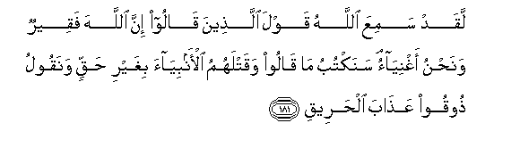
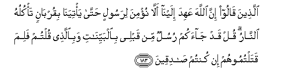
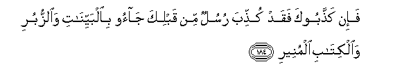
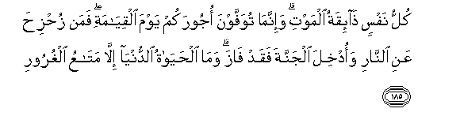
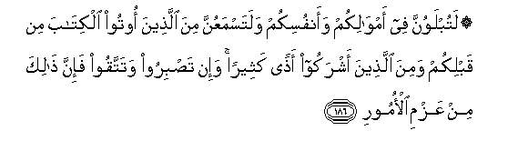
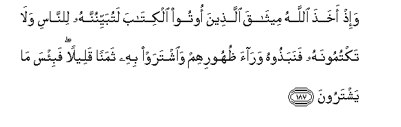
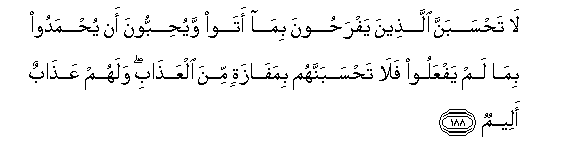
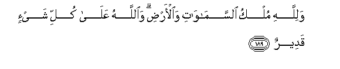

  
[Intangible Textual Heritage](../../index)  [Islam](../index.md) 
[Index](index.md)   
[Hypertext Qur'an](../htq/index)  [Unicode](../uq/003.htm#003_181.md) 
[Palmer](../sbe06/003)  [Pickthall](../pick/003.htm#003_181.md)  [Yusuf Ali
English](../yaq/yaq003)  [Rodwell](../qr/003.md)   
  
[Sūra III.: Āl-i-’Imrān, or The Family of ’Imrān. Index](003.md)  
  [Previous](00318)  [Next](00320.md) 

------------------------------------------------------------------------

  
*The Holy Quran*, tr. by Yusuf Ali, \[1934\], at Intangible Textual
Heritage

------------------------------------------------------------------------

# Sūra III.: Āl-i-’Imrān, or The Family of ’Imrān.

### Section 19

------------------------------------------------------------------------

181. Laqad samiAAa All<u>a</u>hu qawla alla<u>th</u>eena q<u>a</u>loo
inna All<u>a</u>ha faqeerun wana<u>h</u>nu aghniy<u>a</u>on sanaktubu
m<u>a</u> q<u>a</u>loo waqatlahumu al-anbiy<u>a</u>a bighayri
<u>h</u>aqqin wanaqoolu <u>th</u>ooqoo AAa<u>tha</u>ba
al<u>h</u>areeq**i**

181\. God hath heard  
The taunt of those  
Who say: "Truly, God  
Is indigent and we  
Are rich!"—We shall  
Certainly record their word  
And (their act) of slaying  
The Prophets in defiance  
Of right, and We shall say:  
"Taste ye the Penalty  
Of the Scorching Fire!

------------------------------------------------------------------------

182. <u>Tha</u>lika bim<u>a</u> qaddamat aydeekum waanna All<u>a</u>ha
laysa bi*<u>th</u>*all<u>a</u>min lilAAabeed**i**

182\. "This is because  
Of the (unrighteous deeds)  
Which your hands  
Sent on before ye:  
For God never harms  
Those who serve Him."

------------------------------------------------------------------------

183. Alla<u>th</u>eena q<u>a</u>loo inna All<u>a</u>ha AAahida
ilayn<u>a</u> all<u>a</u> nu/mina lirasoolin <u>h</u>att<u>a</u>
ya/tiyan<u>a</u> biqurb<u>a</u>nin ta/kuluhu a**l**nn<u>a</u>ru qul qad
j<u>a</u>akum rusulun min qablee bi**a**lbayyin<u>a</u>ti
wabi**a**lla<u>th</u>ee qultum falima qataltumoohum in kutum
<u>sa</u>diqeen**a**

183\. They (also) said: "God took  
Our promise not to believe  
In an apostle unless  
He showed us a sacrifice  
Consumed by fire  
(From heaven)." Say:  
"There came to you  
Apostles before me,  
With Clear Signs  
And even with what  
Ye ask for: why then  
Did ye slay them,  
If ye speak the truth?"

------------------------------------------------------------------------

184. Fa-in ka<u>thth</u>abooka faqad ku<u>thth</u>iba rusulun min
qablika j<u>a</u>oo bi**a**lbayyin<u>a</u>ti wa**al**zzuburi
wa**a**lkit<u>a</u>bi almuneer**i**

184\. Then if they reject thee,  
So were rejected apostles  
Before thee, who came  
With Clear Signs,  
Books of dark prophecies,  
And the Book of Enlightenment.

------------------------------------------------------------------------

185. Kullu nafsin <u>tha</u>-iqatu almawti wa-innam<u>a</u> tuwaffawna
ojoorakum yawma alqiy<u>a</u>mati faman zu<u>h</u>zi<u>h</u>a AAani
a**l**nn<u>a</u>ri waodkhila aljannata faqad f<u>a</u>za wam<u>a</u>
al<u>h</u>ay<u>a</u>tu a**l**dduny<u>a</u> ill<u>a</u> mat<u>a</u>AAu
alghuroor**i**

185\. Every soul shall have  
A taste of death:  
And only on the Day  
Of Judgment shall you  
Be paid your full recompense.  
Only he who is saved  
Far from the Fire  
And admitted to the Garden  
Will have attained  
The object (of Life):  
For the life of this world  
Is but goods and chattels  
Of deception.

------------------------------------------------------------------------

186. Latublawunna fee amw<u>a</u>likum waanfusikum walatasmaAAunna mina
alla<u>th</u>eena ootoo alkit<u>a</u>ba min qablikum wamina
alla<u>th</u>eena ashrakoo a<u>th</u>an katheeran wa-in ta<u>s</u>biroo
watattaqoo fa-inna <u>tha</u>lika min AAazmi al-omoor**i**

186\. Ye shall certainly  
Be tried and tested  
In your possessions  
And in your personal selves;  
And ye shall certainly  
Hear much that will grieve you,  
From those who received  
The Book before yot:  
And from those who  
Worship many gods.  
But if ye persevere  
Patiently, and guard  
Against evil,—then  
That will be  
A determining factor  
In all affairs.

------------------------------------------------------------------------

187. Wa-i<u>th</u> akha<u>th</u>a All<u>a</u>hu meeth<u>a</u>qa
alla<u>th</u>eena ootoo alkit<u>a</u>ba latubayyinunnahu
li**l**nn<u>a</u>si wal<u>a</u> taktumoonahu fanaba<u>th</u>oohu
war<u>a</u>a *<u>th</u>*uhoorihim wa**i**shtaraw bihi thamanan qaleelan
fabi/sa m<u>a</u> yashtaroon**a**

187\. And remember  
God took a Covenant  
From the People of the Book,  
To make it known  
And clear to mankind,  
And not to hide it;  
But they threw it away  
Behind their backs,  
And purchased with it  
Some miserable gain!  
And vile was the bargain  
They made!

------------------------------------------------------------------------

188. L<u>a</u> ta<u>h</u>sabanna alla<u>th</u>eena yafra<u>h</u>oona
bim<u>a</u> ataw wayu<u>h</u>ibboona an yu<u>h</u>madoo bim<u>a</u> lam
yafAAaloo fal<u>a</u> ta<u>h</u>sabannahum bimaf<u>a</u>zatin mina
alAAa<u>tha</u>bi walahum AAa<u>tha</u>bun aleem**un**

188\. Think not that those  
Who exult in what they  
Have brought about, and love  
To be praised for what  
They have not done,—  
Think not that they  
Can escape the Penalty.  
For them is a Penalty  
Grievous indeed.

------------------------------------------------------------------------

189. Walill<u>a</u>hi mulku a**l**ssam<u>a</u>w<u>a</u>ti
wa**a**l-ar<u>d</u>i wa**A**ll<u>a</u>hu AAal<u>a</u> kulli shay-in
qadeer**un**

189\. To God belongeth  
The dominion  
Of the heavens  
And the earth;  
And God hath power  
Over all things.

------------------------------------------------------------------------

[Next: Section 20 (190-200)](00320.md)

