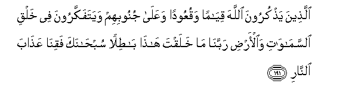
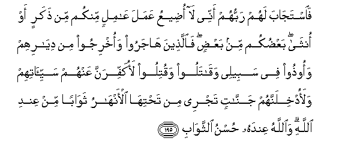
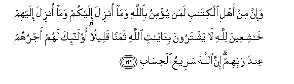

  
[Intangible Textual Heritage](../../index)  [Islam](../index.md) 
[Index](index.md)   
[Hypertext Qur'an](../htq/index)  [Unicode](../uq/003.htm#003_190.md) 
[Palmer](../sbe06/003)  [Pickthall](../pick/003.htm#003_190.md)  [Yusuf Ali
English](../yaq/yaq003)  [Rodwell](../qr/003.md)   
  
[Sūra III.: Āl-i-’Imrān, or The Family of ’Imrān. Index](003.md)  
  [Previous](00319)  [Next](00401.md) 

------------------------------------------------------------------------

  
*The Holy Quran*, tr. by Yusuf Ali, \[1934\], at Intangible Textual
Heritage

------------------------------------------------------------------------

# Sūra III.: Āl-i-’Imrān, or The Family of ’Imrān.

### Section 20

------------------------------------------------------------------------

190. Inna fee khalqi a**l**ssam<u>a</u>w<u>a</u>ti wa**a**l-ar<u>d</u>i
wa**i**khtil<u>a</u>fi allayli wa**al**nnah<u>a</u>ri
la<u>a</u>y<u>a</u>tin li-olee al-alb<u>a</u>b**i**

190\. Behold! In the creation  
Of the heavens and the earth,  
And the alternation  
Of Night and Day,—  
There are indeed Signs  
For men of understanding,—

------------------------------------------------------------------------

191. Alla<u>th</u>eena ya<u>th</u>kuroona All<u>a</u>ha qiy<u>a</u>man
waquAAoodan waAAal<u>a</u> junoobihim wayatafakkaroona fee khalqi
a**l**ssam<u>a</u>w<u>a</u>ti wa**a**l-ar<u>d</u>i rabban<u>a</u>
m<u>a</u> khalaqta h<u>atha</u> b<u>at</u>ilan sub<u>ha</u>naka
faqin<u>a</u> AAa<u>tha</u>ba a**l**nn<u>a</u>r**i**

191\. Men who celebrate  
The praises of God,  
Standing, sitting,  
And lying down on their sides,  
And contemplate  
The (wonders of) creation  
In the heavens and the earth,  
(With the thought):  
"Our Lord! not for naught  
Hast Thou created (all) this!  
Glory to Thee! Give us  
Salvation from the Penalty  
Of the Fire.

------------------------------------------------------------------------

192. Rabban<u>a</u> innaka man tudkhili a**l**nn<u>a</u>ra faqad
akhzaytahu wam<u>a</u> li**l***<u>thth</u>*<u>a</u>limeena min
an<u>sa</u>r**in**

192\. "Our Lord! any whom Thou  
Dost admit to the Fire,  
Truly Thou coverest with shame,  
And never will wrong-doers  
Find any helpers!

------------------------------------------------------------------------

193. Rabban<u>a</u> innan<u>a</u> samiAAn<u>a</u> mun<u>a</u>diyan
yun<u>a</u>dee lil-eem<u>a</u>ni an <u>a</u>minoo birabbikum
fa<u>a</u>mann<u>a</u> rabban<u>a</u> fa**i**ghfir lan<u>a</u>
<u>th</u>unooban<u>a</u> wakaffir AAann<u>a</u>
sayyi-<u>a</u>tin<u>a</u> watawaffan<u>a</u> maAAa al-abr<u>a</u>r**i**

193\. "Our Lord! we have heard  
The call of one calling  
(Us) to Faith, 'Believe ye  
In the Lord,' and we  
Have believed. Our Lord!  
Forgive us our sins,  
Blot out from us  
Our iniquities, and take  
To Thyself our souls  
In the company of the righteous.

------------------------------------------------------------------------

194. Rabban<u>a</u> wa<u>a</u>tin<u>a</u> m<u>a</u> waAAadtan<u>a</u>
AAal<u>a</u> rusulika wal<u>a</u> tukhzin<u>a</u> yawma
alqiy<u>a</u>mati innaka l<u>a</u> tukhlifu almeeAA<u>a</u>d**a**

194\. "Our Lord! Grant us  
What Thou didst promise  
Unto us through Thine Apostles,  
And save us from shame  
On the Day of Judgment:  
For Thou never breakest  
Thy promise."

------------------------------------------------------------------------

195. Fa**i**staj<u>a</u>ba lahum rabbuhum annee l<u>a</u> o<u>d</u>eeAAu
AAamala AA<u>a</u>milin minkum min <u>th</u>akarin aw onth<u>a</u>
baAA<u>d</u>ukum min baAA<u>d</u>in fa**a**lla<u>th</u>eena
h<u>a</u>jaroo waokhrijoo min diy<u>a</u>rihim waoo<u>th</u>oo fee
sabeelee waq<u>a</u>taloo waqutiloo laokaffiranna AAanhum
sayyi-<u>a</u>tihim walaodkhilannahum jann<u>a</u>tin tajree min
ta<u>h</u>tih<u>a</u> al-anh<u>a</u>ru thaw<u>a</u>ban min AAindi
All<u>a</u>hi wa**A**ll<u>a</u>hu AAindahu <u>h</u>usnu
a**l**ththaw<u>a</u>b**i**

195\. And their Lord hath accepted  
Of them, and answered them:  
"Never will I suffer to be lost  
The work of any of you,  
Be he male or female:  
Ye are members, one of another:  
Those who have left their homes,  
Or been driven out therefrom,  
Or suffered harm in My Cause,  
Or fought or been slain,—  
Verily, I will blot out  
From them their iniquities,  
And admit them into Gardens  
With rivers flowing beneath;—  
A reward from the Presence  
Of God, and from His Presence  
Is the best of rewards."

------------------------------------------------------------------------

196. L<u>a</u> yaghurrannaka taqallubu alla<u>th</u>eena kafaroo fee
albil<u>a</u>d**i**

196\. Let not the strutting about  
Of the Unbelievers  
Through the land  
Deceive thee:

------------------------------------------------------------------------

197. Mat<u>a</u>AAun qaleelun thumma ma/w<u>a</u>hum jahannamu wabi/sa
almih<u>a</u>d**u**

197\. Little is it for enjoyment:  
Their ultimate abode  
Is Hell: what an evil bed  
(To lie on)!

------------------------------------------------------------------------

198. L<u>a</u>kini alla<u>th</u>eena ittaqaw rabbahum lahum
jann<u>a</u>tun tajree min ta<u>h</u>tih<u>a</u> al-anh<u>a</u>ru
kh<u>a</u>lideena feeh<u>a</u> nuzulan min AAindi All<u>a</u>hi
wam<u>a</u> AAinda All<u>a</u>hi khayrun lil-abr<u>a</u>r**i**

198\. On the other hand, for those  
Who fear their Lord,  
Are Gardens, with rivers  
Flowing beneath; therein  
Are they to dwell (for ever),—  
A gift from the Presence  
Of God; and that which is  
In the Presence of God  
Is the best (bliss)  
For the righteous.

------------------------------------------------------------------------

199. Wa-inna min ahli alkit<u>a</u>bi laman yu/minu bi**A**ll<u>a</u>hi
wam<u>a</u> onzila ilaykum wam<u>a</u> onzila ilayhim
kh<u>a</u>shiAAeena lill<u>a</u>hi l<u>a</u> yashtaroona
bi-<u>a</u>y<u>a</u>ti All<u>a</u>hi thamanan qaleelan ol<u>a</u>-ika
lahum ajruhum AAinda rabbihim inna All<u>a</u>ha sareeAAu
al<u>h</u>is<u>a</u>b**i**

199\. And there are, certainly,  
Among the People of the Book,  
Those who believe in God,  
In the revelation to you,  
And in the revelation to them,  
Bowing in humility to God:  
They will not sell  
The Signs of God  
For a miserable gain!  
For them is a reward  
With their Lord,  
And God is swift in account.

------------------------------------------------------------------------

200. Y<u>a</u> ayyuh<u>a</u> alla<u>th</u>eena <u>a</u>manoo
i<u>s</u>biroo wa<u>sa</u>biroo war<u>a</u>bi<u>t</u>oo wa**i**ttaqoo
All<u>a</u>ha laAAallakum tufli<u>h</u>oon**a**

200\. O ye who believe!  
Persevere in patience  
And constancy; vie  
In such perseverance;  
Strengthen each other;  
And fear God;  
That ye may prosper.

------------------------------------------------------------------------

[Next: Section 1 (1-10)](00401.md)

