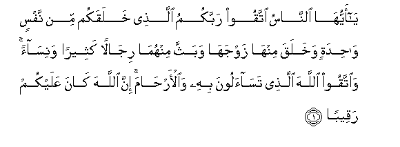
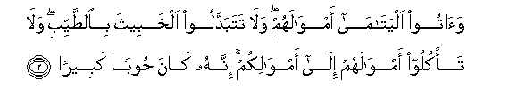
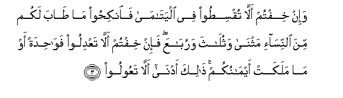
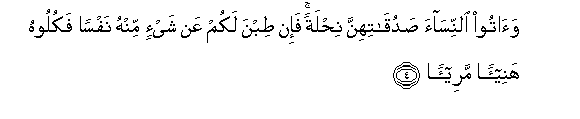
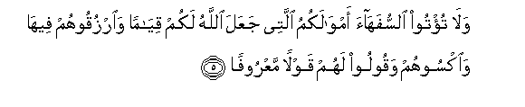
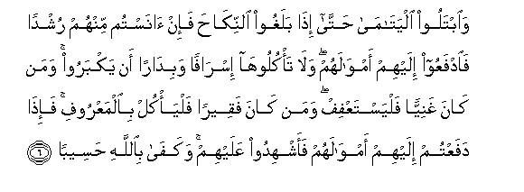
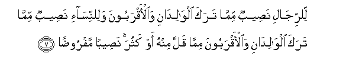
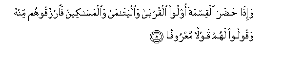
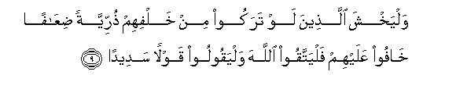
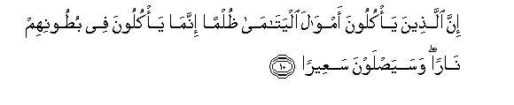

  
[Intangible Textual Heritage](../../index)  [Islam](../index) 
[Index](index)   
[Hypertext Qur'an](../htq/index)  [Unicode](../uq/004.htm#004_001) 
[Palmer](../sbe06/004)  [Pickthall](../pick/004.htm#004_001)  [Yusuf Ali
English](../yaq/yaq004)  [Rodwell](../qr/004)   
  
[Sūra IV.: Nisāa, or The Women. Index](004)  
  [Previous](00320)  [Next](00402) 

------------------------------------------------------------------------

  
*The Holy Quran*, tr. by Yusuf Ali, \[1934\], at Intangible Textual
Heritage

------------------------------------------------------------------------

# Sūra IV.: Nisāa, or The Women.

### Section 1

1. Y<u>a</u> ayyuh<u>a</u> a**l**nn<u>a</u>su ittaqoo rabbakumu
alla<u>th</u>ee khalaqakum min nafsin w<u>ah</u>idatin wakhalaqa
minh<u>a</u> zawjah<u>a</u> wabaththa minhum<u>a</u> rij<u>a</u>lan
katheeran wanis<u>a</u>an wa**i**ttaqoo All<u>a</u>ha alla<u>th</u>ee
tas<u>a</u>aloona bihi wa**a**l-ar<u>ha</u>ma inna All<u>a</u>ha
k<u>a</u>na AAalaykum raqeeb**an**

1\. O mankind! reverence  
Your Guardian-Lord,  
Who created you  
From a single Person,  
Created, of like nature,  
His mate, and from them twain  
Scattered (like seeds)  
Countless men and women;—  
Reverence God, through Whom  
Ye demand your mutual (rights),  
And (reverence) the wombs  
(That bore you): for God  
Ever watches over you.

------------------------------------------------------------------------

2. Wa<u>a</u>too alyat<u>a</u>m<u>a</u> amw<u>a</u>lahum wal<u>a</u>
tatabaddaloo alkhabeetha bi**al**<u>tt</u>ayyibi wal<u>a</u> ta/kuloo
amw<u>a</u>lahum il<u>a</u> amw<u>a</u>likum innahu k<u>a</u>na
<u>h</u>ooban kabeer<u>a</u>**n**

2\. To orphans restore their property  
(When they reach their age),  
Nor substitute (your) worthless things  
For (their) good ones; and devour not  
Their substance (by mixing it up)  
With your own. For this is  
I ndeed a great sin.

------------------------------------------------------------------------

3. Wa-in khiftum all<u>a</u> tuqsi<u>t</u>oo fee alyat<u>a</u>m<u>a</u>
fa**i**nki<u>h</u>oo m<u>a</u> <u>ta</u>ba lakum mina
a**l**nnis<u>a</u>-i mathn<u>a</u> wathul<u>a</u>tha warub<u>a</u>AAa
fa-in khiftum all<u>a</u> taAAdiloo faw<u>ah</u>idatan aw m<u>a</u>
malakat aym<u>a</u>nukum <u>tha</u>lika adn<u>a</u> all<u>a</u>
taAAooloo

3\. If ye fear that ye shall not  
Be able to deal justly  
With the orphans,  
Marry women of your choice,  
Two, or three, or four;  
But if ye fear that ye shall not  
Be able to deal justly (with them),  
Then only one, or (a captive)  
That your right hands possess.  
That will be more suitable,  
To prevent you  
From doing injustice.

------------------------------------------------------------------------

4. Wa<u>a</u>too a**l**nnis<u>a</u>a <u>s</u>aduq<u>a</u>tihinna
ni<u>h</u>latan fa-in <u>t</u>ibna lakum AAan shay-in minhu nafsan
fakuloohu hanee-an maree-<u>a</u>**n**

4\. And give the women  
(On marriage) their dower  
As a free gift; but if they,  
Of their own good pleasure,  
Remit any part of it to you,  
Take it and enjoy it  
With right good cheer.

------------------------------------------------------------------------

5. Wal<u>a</u> tu/too a**l**ssufah<u>a</u>a amw<u>a</u>lakumu allatee
jaAAala All<u>a</u>hu lakum qiy<u>a</u>man wa**o**rzuqoohum feeh<u>a</u>
wa**o**ksoohum waqooloo lahum qawlan maAAroof<u>a</u>**n**

5\. To those weak of understanding  
Make not over your property,  
Which God hath made  
A means of support for you,  
But feed and clothe them  
Therewith, and speak to them  
Words of kindness and justice.

------------------------------------------------------------------------

6. Wa**i**btaloo alyat<u>a</u>m<u>a</u> <u>h</u>att<u>a</u> i<u>tha</u>
balaghoo a**l**nnik<u>ah</u>a fa-in <u>a</u>nastum minhum rushdan
fa**i**dfaAAoo ilayhim amw<u>a</u>lahum wal<u>a</u> ta/kulooh<u>a</u>
isr<u>a</u>fan wabid<u>a</u>ran an yakbaroo waman k<u>a</u>na ghaniyyan
falyastaAAfif waman k<u>a</u>na faqeeran falya/kul bi**a**lmaAAroofi
fa-i<u>tha</u> dafaAAtum ilayhim amw<u>a</u>lahum faashhidoo AAalayhim
wakaf<u>a</u> bi**A**ll<u>a</u>hi <u>h</u>aseeb<u>a</u>**n**

6\. Make trial of orphans  
Until they reach the age  
Of marriage; if then ye find  
Sound judgment in them,  
Release their property to them;  
But consume it not wastefully,  
Nor in haste against their growing up.  
If the guardian is well-off,  
Let him claim no remuneration,  
But if he is poor, let him  
Have for himself what is  
Just and reasonable.  
When ye release their property  
To them, take witnesses  
In their presence:  
But all-sufficient  
Is God in taking account.

------------------------------------------------------------------------

7. Li**l**rrij<u>a</u>li na<u>s</u>eebun mimm<u>a</u> taraka
alw<u>a</u>lid<u>a</u>ni wa**a**l-aqraboona wali**l**nnis<u>a</u>-i
na<u>s</u>eebun mimm<u>a</u> taraka alw<u>a</u>lid<u>a</u>ni
wa**a**l-aqraboona mimm<u>a</u> qalla minhu aw kathura na<u>s</u>eeban
mafroo<u>da</u>**n**

7\. From what is left by parents  
And those nearest relateds,  
There is a share for men  
And a share for women,  
Whether the property be small  
Or large,—a determinate share.

------------------------------------------------------------------------

8. Wa-i<u>tha</u> <u>h</u>a<u>d</u>ara alqismata oloo alqurb<u>a</u>
wa**a**lyat<u>a</u>m<u>a</u> wa**a**lmas<u>a</u>keenu fa**o**rzuqoohum
minhu waqooloo lahum qawlan maAAroof<u>a</u>**n**

8\. But if at the time of division  
Other relatives, or orphans,  
Or poor, are present,  
Feed them out of the (property),  
And speak to them  
Words of kindness and justice.

------------------------------------------------------------------------

9. Walyakhsha alla<u>th</u>eena law tarakoo min khalfihim
<u>th</u>urriyyatan <u>d</u>iAA<u>a</u>fan kh<u>a</u>foo AAalayhim
falyattaqoo All<u>a</u>ha walyaqooloo qawlan sadeed<u>a</u>**n**

9\. Let those (disposing of an estate)  
Have the same fear in their minds  
As they would have for their own  
If they had left a helpless family behind:  
Let them fear God, and speak  
Words of appropriate (comfort),

------------------------------------------------------------------------

10. Inna alla<u>th</u>eena ya/kuloona amw<u>a</u>la
alyat<u>a</u>m<u>a</u> *<u>th</u>*ulman innam<u>a</u> ya/kuloona fee
bu<u>t</u>oonihim n<u>a</u>ran wasaya<u>s</u>lawna saAAeer<u>a</u>**n**

10\. Those who unjustly  
Eat up the property  
Of orphans, eat up  
A Fire into their own  
Bodies: they will soon  
Be enduring a blazing Fire!

------------------------------------------------------------------------

[Next: Section 2 (11-14)](00402)

