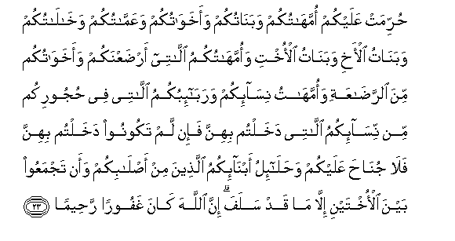
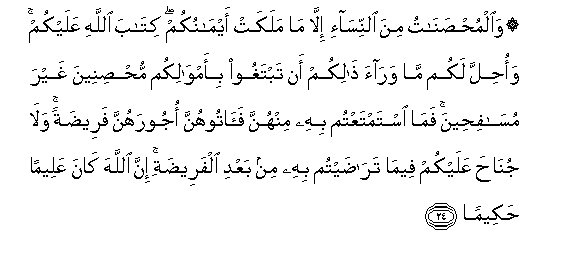
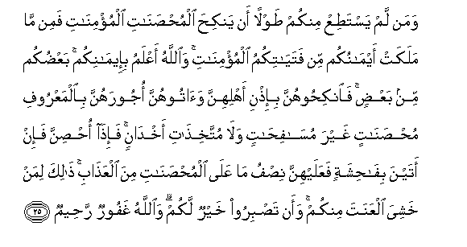

  
[Intangible Textual Heritage](../../index)  [Islam](../index.md) 
[Index](index.md)   
[Hypertext Qur'an](../htq/index)  [Unicode](../uq/004.htm#004_023.md) 
[Palmer](../sbe06/004)  [Pickthall](../pick/004.htm#004_023.md)  [Yusuf Ali
English](../yaq/yaq004)  [Rodwell](../qr/004.md)   
  
[Sūra IV.: Nisāa, or The Women. Index](004.md)  
  [Previous](00403)  [Next](00405.md) 

------------------------------------------------------------------------

  
*The Holy Quran*, tr. by Yusuf Ali, \[1934\], at Intangible Textual
Heritage

------------------------------------------------------------------------

# Sūra IV.: Nisāa, or The Women.

### Section 4

------------------------------------------------------------------------

23. <u>H</u>urrimat AAalaykum ommah<u>a</u>tukum waban<u>a</u>tukum
waakhaw<u>a</u>tukum waAAamm<u>a</u>tukum wakh<u>a</u>l<u>a</u>tukum
waban<u>a</u>tu al-akhi waban<u>a</u>tu al-okhti waommah<u>a</u>tukumu
all<u>a</u>tee ar<u>d</u>aAAnakum waakhaw<u>a</u>tukum mina
a**l**rra<u>da</u>AAati waommah<u>a</u>tu nis<u>a</u>-ikum
warab<u>a</u>-ibukumu all<u>a</u>tee fee <u>h</u>ujoorikum min
nis<u>a</u>-ikumu all<u>a</u>tee dakhaltum bihinna fa-in lam takoonoo
dakhaltum bihinna fal<u>a</u> jun<u>ah</u>a AAalaykum
wa<u>h</u>al<u>a</u>-ilu abn<u>a</u>-ikumu alla<u>th</u>eena min
a<u>s</u>l<u>a</u>bikum waan tajmaAAoo bayna al-okhtayni ill<u>a</u>
m<u>a</u> qad salafa inna All<u>a</u>ha k<u>a</u>na ghafooran
ra<u>h</u>eem<u>a</u>**n**

23\. Prohibited to you  
(For marriage) are:—  
Your mothers, daughters,  
Sisters; father's sisters,  
Mother's sisters; brother's daughters,  
Sister's daugters; foster-mothers  
(Who gave you suck), foster-sisters;  
Your wives’ mothers;  
Your step-daughters under your  
Guardianship, born of your wives  
To whom ye have gone in,  
No prohibition if ye have not gone in;—  
(Those who have been)  
Wives of your sons proceeding  
From your loins;  
And two sisters in wedlock  
At one and the same time,  
Except for what is past;  
For God is Oft-forgiving,  
Most Merciful;—

------------------------------------------------------------------------

24. Wa**a**lmu<u>hs</u>an<u>a</u>tu mina a**l**nnis<u>a</u>-i
ill<u>a</u> m<u>a</u> malakat aym<u>a</u>nukum kit<u>a</u>ba
All<u>a</u>hi AAalaykum wao<u>h</u>illa lakum m<u>a</u> war<u>a</u>a
<u>tha</u>likum an tabtaghoo bi-amw<u>a</u>likum mu<u>hs</u>ineena
ghayra mus<u>a</u>fi<u>h</u>eena fam<u>a</u> istamtaAAtum bihi minhunna
fa<u>a</u>toohunna ojoorahunna faree<u>d</u>atan wal<u>a</u>
jun<u>ah</u>a AAalaykum feem<u>a</u> tar<u>ad</u>aytum bihi min baAAdi
alfaree<u>d</u>ati inna All<u>a</u>ha k<u>a</u>na AAaleeman
<u>h</u>akeem<u>a</u>**n**

24\. Also (prohibited are)  
Women already married,  
Except those  
Whom your right hands possess:  
Thus hath God ordained  
(Prohibitions) against you:  
Except for these, all others  
Are lawful, provided  
Ye seek (them in marriage)  
With gifts from your property,—  
Desiring chastity, not lust.  
Seeing that ye derive  
Benefit from them, give them  
Their dowers (at least)  
As prescribed; but if,  
After a dower is prescribed, ye agree  
Mutually (to vary it),  
There is no blame on you,  
And God is All-knowing  
All-wise.

------------------------------------------------------------------------

25. Waman lam yasta<u>t</u>iAA minkum <u>t</u>awlan an yanki<u>h</u>a
almu<u>hs</u>an<u>a</u>ti almu/min<u>a</u>ti famin m<u>a</u> malakat
aym<u>a</u>nukum min fatay<u>a</u>tikumu almu/min<u>a</u>ti
wa**A**ll<u>a</u>hu aAAlamu bi-eem<u>a</u>nikum baAA<u>d</u>ukum min
baAA<u>d</u>in fa**i**nki<u>h</u>oohunna bi-i<u>th</u>ni ahlihinna
wa<u>a</u>toohunna ojoorahunna bi**a**lmaAAroofi
mu<u>hs</u>an<u>a</u>tin ghayra mas<u>a</u>fi<u>ha</u>tin wal<u>a</u>
muttakhi<u>tha</u>ti akhd<u>a</u>nin fa-i<u>tha</u> o<u>hs</u>inna fa-in
atayna bif<u>ah</u>ishatin faAAalayhinna ni<u>s</u>fu m<u>a</u>
AAal<u>a</u> almu<u>hs</u>an<u>a</u>ti mina alAAa<u>tha</u>bi
<u>tha</u>lika liman khashiya alAAanata minkum waan ta<u>s</u>biroo
khayrun lakum wa**A**ll<u>a</u>hu ghafoorun ra<u>h</u>eem**un**

25\. If any of you have not  
The means wherewith  
To wed free believing women,  
They may wed believing  
Girls from among those  
Whom your right hands possess:  
God hath full knowledge  
About your Faith.  
Ye are one from another:  
Wed them with the leave  
Of their owners, and give them  
Their dowers, according to what  
Is reasonable: they should be  
Chaste, not lustful, nor taking  
Paramours: when they  
Are taken in wedlock,  
If they fall into shame,  
Their punishment is half  
That for free women.  
This (permission) is for those  
Among you who fear sin;  
But it is better for you  
That ye practise self-restraint.  
And God is Oft-forgiving,  
Most Merciful.

------------------------------------------------------------------------

[Next: Section 5 (26-33)](00405.md)

