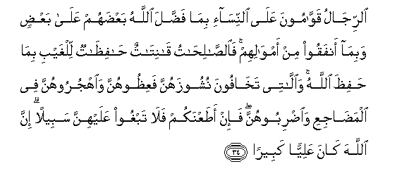

  
[Intangible Textual Heritage](../../index)  [Islam](../index.md) 
[Index](index.md)   
[Hypertext Qur'an](../htq/index)  [Unicode](../uq/004.htm#004_034.md) 
[Palmer](../sbe06/004)  [Pickthall](../pick/004.htm#004_034.md)  [Yusuf Ali
English](../yaq/yaq004)  [Rodwell](../qr/004.md)   
  
[Sūra IV.: Nisāa, or The Women. Index](004.md)  
  [Previous](00405)  [Next](00407.md) 

------------------------------------------------------------------------

  
*The Holy Quran*, tr. by Yusuf Ali, \[1934\], at Intangible Textual
Heritage

------------------------------------------------------------------------

# Sūra IV.: Nisāa, or The Women.

### Section 6

------------------------------------------------------------------------

34. A**l**rrij<u>a</u>lu qaww<u>a</u>moona AAal<u>a</u>
a**l**nnis<u>a</u>-i bim<u>a</u> fa<u>dd</u>ala All<u>a</u>hu
baAA<u>d</u>ahum AAal<u>a</u> baAA<u>d</u>in wabim<u>a</u> anfaqoo min
amw<u>a</u>lihim fa**al**<u>ssa</u>li<u>ha</u>tu q<u>a</u>nit<u>a</u>tun
<u>ha</u>fi*<u>th</u>*<u>a</u>tun lilghaybi bim<u>a</u>
<u>h</u>afi*<u>th</u>*a All<u>a</u>hu wa**a**ll<u>a</u>tee
takh<u>a</u>foona nushoozahunna faAAi*<u>th</u>*oohunna
wa**o**hjuroohunna fee alma<u>da</u>jiAAi wa**i**<u>d</u>riboohunna
fa-in a<u>t</u>aAAnakum fal<u>a</u> tabghoo AAalayhinna sabeelan inna
All<u>a</u>ha k<u>a</u>na AAaliyyan kabeer<u>a</u>**n**

34\. Men are the protectors  
And maintainers of women,  
Because God has given  
The one more (strength)  
Than the other, and because  
They support them  
From their means.  
Therefore the righteous women  
Are devoutly obedient, and guard  
In (the husband's) absence  
What God would have them guard.  
As to those women  
On whose part ye fear  
Disloyalty and ill-conduct,  
Admonish them (first),  
(Next), refuse to share their beds,  
(And last) beat them (lightly);  
But if they return to obedience,  
Seek not against them  
Means (of annoyance):  
For God is Most High,  
Great (above you all).

------------------------------------------------------------------------

35. Wa-in khiftum shiq<u>a</u>qa baynihim<u>a</u> fa**i**bAAathoo
<u>h</u>akaman min ahlihi wa<u>h</u>akaman min ahlih<u>a</u> in
yureed<u>a</u> i<u>s</u>l<u>ah</u>an yuwaffiqi All<u>a</u>hu
baynahum<u>a</u> inna All<u>a</u>ha k<u>a</u>na AAaleeman
khabeer<u>a</u>**n**

35\. If ye fear a breach  
Between them twain,  
Appoint (two) arbiters,  
One from his family,  
And the other from hers;  
If they wish for peace,  
God will cause  
Their reconciliation:  
For God hath full knowledge,  
And is acquainted  
With all things.

------------------------------------------------------------------------

36. Wa**o**AAbudoo All<u>a</u>ha wal<u>a</u> tushrikoo bihi shay-an
wabi**a**lw<u>a</u>lidayni i<u>h</u>s<u>a</u>nan wabi<u>th</u>ee
alqurb<u>a</u> wa**a**lyat<u>a</u>m<u>a</u> wa**a**lmas<u>a</u>keeni
wa**a**lj<u>a</u>ri <u>th</u>ee alqurb<u>a</u> wa**a**lj<u>a</u>ri
aljunubi wa**al**<u>ssah</u>ibi bi**a**ljanbi wa**i**bni a**l**ssabeeli
wam<u>a</u> malakat aym<u>a</u>nukum inna All<u>a</u>ha l<u>a</u>
yu<u>h</u>ibbu man k<u>a</u>na mukht<u>a</u>lan fakhoor<u>a</u>**n**

36\. serve God, and join not  
Any partners with Him;  
And do good  
To parents, kinsfolk,  
Orphans, those in need,  
Neighbours who are near,  
Neighbours who are strangers,  
The Companion by your side,  
The way-farer (ye meet),  
And what your right hands possess:  
For God loveth not  
The arrogant, the vainglorious;—

------------------------------------------------------------------------

37. Alla<u>th</u>eena yabkhaloona waya/muroona a**l**nn<u>a</u>sa
bi**a**lbukhli wayaktumoona m<u>a</u> <u>a</u>t<u>a</u>humu
All<u>a</u>hu min fa<u>d</u>lihi waaAAtadn<u>a</u> lilk<u>a</u>fireena
AAa<u>tha</u>ban muheen<u>a</u>**n**

37\. (Nor) those who are niggardly  
Or enjoin niggardliness on others,  
Or hide the bounties  
Which God hath bestowed  
On them; for We have prepared,  
For those who resist Faith,  
A Punishment that steeps  
Them in contempt;—

------------------------------------------------------------------------

38. Wa**a**lla<u>th</u>eena yunfiqoona amw<u>a</u>lahum ri-<u>a</u>a
a**l**nn<u>a</u>si wal<u>a</u> yu/minoona bi**A**ll<u>a</u>hi
wal<u>a</u> bi**a**lyawmi al-<u>a</u>khiri waman yakuni
a**l**shshay<u>ta</u>nu lahu qareenan fas<u>a</u>a qareen<u>a</u>**n**

38\. Not those who spend  
Of their substance, to be seen  
Of men, but have no faith  
In God and the Last Day:  
If any take the Evil One  
For their intimate,  
What a dreadful intimate he is!

------------------------------------------------------------------------

39. Wam<u>atha</u> AAalayhim law <u>a</u>manoo bi**A**ll<u>a</u>hi
wa**a**lyawmi al-<u>a</u>khiri waanfaqoo mimm<u>a</u> razaqahumu
All<u>a</u>hu wak<u>a</u>na All<u>a</u>hu bihim AAaleem<u>a</u>**n**

39\. And what burden  
Were it on them if they  
Had faith in God  
And in the Last Day,  
And they spent  
Out of what God hath  
Given them for sustenance?  
For God hath full  
Knowledge of them.

------------------------------------------------------------------------

40. Inna All<u>a</u>ha l<u>a</u> ya*<u>th</u>*limu mithq<u>a</u>la
<u>th</u>arratin wa-in taku <u>h</u>asanatan yu<u>da</u>AAifh<u>a</u>
wayu/ti min ladunhu ajran AAa*<u>th</u>*eem<u>a</u>**n**

40\. God is never unjust  
In the least degree:  
If there is any good (done),  
He doubleth it,  
And giveth from His own  
Presence a great reward.

------------------------------------------------------------------------

41. Fakayfa i<u>tha</u> ji/n<u>a</u> min kulli ommatin bishaheedin
waji/n<u>a</u> bika AAal<u>a</u> h<u>a</u>ol<u>a</u>-i
shaheed<u>a</u>**n**

41\. How then if We brought  
From each People a witness,  
And We brought thee  
As a witness against  
These People!

------------------------------------------------------------------------

42. Yawma-i<u>th</u>in yawaddu alla<u>th</u>eena kafaroo
waAAa<u>s</u>awoo a**l**rrasoola law tusaww<u>a</u> bihimu
al-ar<u>d</u>u wal<u>a</u> yaktumoona All<u>a</u>ha
<u>h</u>adeeth<u>a</u>**n**

42\. On that day  
Those who reject Faith  
And disobey the Apostle  
Will wish that the earth  
Were made one with them:  
But never will they hide  
A single fact from God!

------------------------------------------------------------------------

[Next: Section 7 (43-50)](00407.md)

