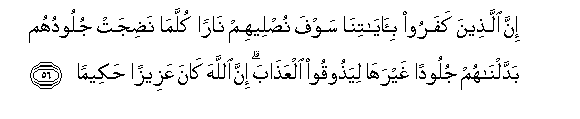

  
[Intangible Textual Heritage](../../index)  [Islam](../index) 
[Index](index)   
[Hypertext Qur'an](../htq/index)  [Unicode](../uq/004.htm#004_051) 
[Palmer](../sbe06/004)  [Pickthall](../pick/004.htm#004_051)  [Yusuf Ali
English](../yaq/yaq004)  [Rodwell](../qr/004)   
  
[Sūra IV.: Nisāa, or The Women. Index](004)  
  [Previous](00407)  [Next](00409) 

------------------------------------------------------------------------

  
*The Holy Quran*, tr. by Yusuf Ali, \[1934\], at Intangible Textual
Heritage

------------------------------------------------------------------------

# Sūra IV.: Nisāa, or The Women.

### Section 8

------------------------------------------------------------------------

51. Alam tara il<u>a</u> alla<u>th</u>eena ootoo na<u>s</u>eeban mina
alkit<u>a</u>bi yu/minoona bi**a**ljibti wa**al**<u>tta</u>ghooti
wayaqooloona lilla<u>th</u>eena kafaroo h<u>a</u>ol<u>a</u>-i
ahd<u>a</u> mina alla<u>th</u>eena <u>a</u>manoo sabeel<u>a</u>**n**

51\. Hast thou not turned  
Thy vision to those  
Who were given a portion  
Of the Book? They believe  
In Sorcery and Evil,  
And say to the Unbelievers  
That they are better guided  
In the (right) way  
Than the Believers!

------------------------------------------------------------------------

52. Ol<u>a</u>-ika alla<u>th</u>eena laAAanahumu All<u>a</u>hu waman
yalAAani All<u>a</u>hu falan tajida lahu na<u>s</u>eer<u>a</u>**n**

52\. They are (men) whom  
God hath cursed:  
And those whom God  
Hath cursed, thou wilt find,  
Have no one to help.

------------------------------------------------------------------------

53. Am lahum na<u>s</u>eebun mina almulki fa-i<u>th</u>an l<u>a</u>
yu/toona a**l**nn<u>a</u>sa naqeer<u>a</u>**n**

53\. Have they a share  
In dominion or power?  
Behold, they give not a farthing  
To their fellow-men?

------------------------------------------------------------------------

54. Am ya<u>h</u>sudoona a**l**nn<u>a</u>sa AAal<u>a</u> m<u>a</u>
<u>a</u>t<u>a</u>humu All<u>a</u>hu min fa<u>d</u>lihi faqad
<u>a</u>tayn<u>a</u> <u>a</u>la ibr<u>a</u>heema alkit<u>a</u>ba
wa**a**l<u>h</u>ikmata wa<u>a</u>tayn<u>a</u>hum mulkan
AAa*<u>th</u>*eem<u>a</u>**n**

54\. Or do they envy mankind  
For what God hath given them  
Of his bounty? But We  
Had already given the people  
Of Abraham the Book  
And Wisdom, and conferred  
Upon them a great kingdom.

------------------------------------------------------------------------

55. Faminhum man <u>a</u>mana bihi waminhum man <u>s</u>adda AAanhu
wakaf<u>a</u> bijahannama saAAeer<u>a</u>**n**

55\. Some of them believed,  
And some of them averted  
Their faces from him: and enough  
Is Hell for a burning fire.

------------------------------------------------------------------------

56. Inna alla<u>th</u>eena kafaroo bi-<u>a</u>y<u>a</u>tin<u>a</u> sawfa
nu<u>s</u>leehim n<u>a</u>ran kullam<u>a</u> na<u>d</u>ijat julooduhum
baddaln<u>a</u>hum juloodan ghayrah<u>a</u> liya<u>th</u>ooqoo
alAAa<u>tha</u>ba inna All<u>a</u>ha k<u>a</u>na AAazeezan
<u>h</u>akeem<u>a</u>**n**

56\. Those who reject  
Our Signs, We shall soon  
Cast into the Fire:  
As often as their skins  
Are roasted through,  
We shall change them  
For fresh skins,  
That they may taste  
The Penalty: for God  
Is Exalted in Power, Wise.

------------------------------------------------------------------------

57. Wa**a**lla<u>th</u>eena <u>a</u>manoo waAAamiloo
a**l**<u>ssa</u>li<u>ha</u>ti sanudkhiluhum jann<u>a</u>tin tajree min
ta<u>h</u>tih<u>a</u> al-anh<u>a</u>ru kh<u>a</u>lideena feeh<u>a</u>
abadan lahum feeh<u>a</u> azw<u>a</u>jun mu<u>t</u>ahharatun
wanudkhiluhum *<u>th</u>*illan *<u>th</u>*aleel<u>a</u>**n**

57\. But those who believe  
And do deeds of righteousness,  
We shall soon admit to Gardens,  
With rivers flowing beneath,—  
Their eternal home:  
Therein shall they have  
Companions pure and holy: ye  
We shall admit them  
To shades, cool and ever deepening.

------------------------------------------------------------------------

58. Inna All<u>a</u>ha ya/murukum an tu-addoo al-am<u>a</u>n<u>a</u>ti
il<u>a</u> ahlih<u>a</u> wa-i<u>tha</u> <u>h</u>akamtum bayna
a**l**nn<u>a</u>si an ta<u>h</u>kumoo bi**a**lAAadli inna All<u>a</u>ha
niAAimm<u>a</u> yaAAi*<u>th</u>*ukum bihi inna All<u>a</u>ha k<u>a</u>na
sameeAAan ba<u>s</u>eer<u>a</u>**n**

58\. God doth command you  
To render back your Trusts  
To those to whom they are due;  
And when ye judge  
Between man and man,  
That ye judge with justice:  
Verily how excellent  
Is the teaching which He giveth you!  
For God is He Who heareth  
And seeth all things.

------------------------------------------------------------------------

59. Y<u>a</u> ayyuh<u>a</u> alla<u>th</u>eena <u>a</u>manoo
a<u>t</u>eeAAoo All<u>a</u>ha waa<u>t</u>eeAAoo a**l**rrasoola waolee
al-amri minkum fa-in tan<u>a</u>zaAAtum fee shay-in faruddoohu
il<u>a</u> All<u>a</u>hi wa**al**rrasooli in kuntum tu/minoona
bi**A**ll<u>a</u>hi wa**a**lyawmi al-<u>a</u>khiri <u>tha</u>lika
khayrun waa<u>h</u>sanu ta/weel<u>a</u>**n**

59\. O ye who believe!  
Obey God, and obey the Apostle,  
And those charged  
With authority among you.  
If ye differ in anything  
Among yourselves, refer it  
To God and His Apostle,  
If ye do believe in God  
And the Last Day:  
That is best, and most suitable  
For final determination.

------------------------------------------------------------------------

[Next: Section 9 (60-70)](00409)

