

  
[Intangible Textual Heritage](../../index)  [Islam](../index) 
[Index](index)   
[Hypertext Qur'an](../htq/index)  [Unicode](../uq/004.htm#004_077) 
[Palmer](../sbe06/004)  [Pickthall](../pick/004.htm#004_077)  [Yusuf Ali
English](../yaq/yaq004)  [Rodwell](../qr/004)   
  
[Sūra IV.: Nisāa, or The Women. Index](004)  
  [Previous](00410)  [Next](00412) 

------------------------------------------------------------------------

  
*The Holy Quran*, tr. by Yusuf Ali, \[1934\], at Intangible Textual
Heritage

------------------------------------------------------------------------

# Sūra IV.: Nisāa, or The Women.

### Section 11

------------------------------------------------------------------------

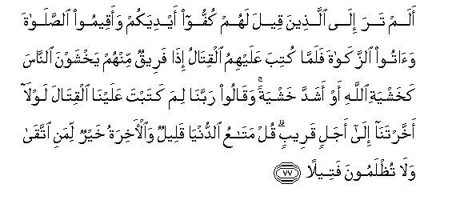

77. Alam tara il<u>a</u> alla<u>th</u>eena qeela lahum kuffoo aydiyakum
waaqeemoo a**l**<u>ss</u>al<u>a</u>ta wa<u>a</u>too a**l**zzak<u>a</u>ta
falamm<u>a</u> kutiba AAalayhimu alqit<u>a</u>lu i<u>tha</u> fareequn
minhum yakhshawna a**l**nn<u>a</u>sa kakhashyati All<u>a</u>hi aw
ashadda khashyatan waq<u>a</u>loo rabban<u>a</u> lima katabta
AAalayn<u>a</u> alqit<u>a</u>la lawl<u>a</u> akhkhartan<u>a</u>
il<u>a</u> ajalin qareebin qul mat<u>a</u>AAu a**l**dduny<u>a</u>
qaleelun wa**a**l-<u>a</u>khiratu khayrun limani ittaq<u>a</u>
wal<u>a</u> tu*<u>th</u>*lamoona fateel<u>a</u>**n**

77\. Hast thou not turned  
Thy vision to those  
Who were told to hold back  
Their hands (from fight)  
But establish regular prayers  
And spend in regular Charity?  
When (at length) the order  
For fighting was issued to them,  
Behold! a section of them  
Feared men as  
Or even more than  
They should have feared God:  
They said: "Our Lord!  
Why hast Thou ordered us  
To fight? Wouldst Thou not  
Grant us respite  
To our (natural) term,  
Near (enough)?" Say: "Short  
Is the enjoyment of this world:  
The Hereafter is the best  
For those who do right:  
Never will ye be  
Dealt with unjustly  
In the very least!

------------------------------------------------------------------------

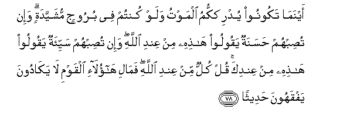

78. Aynam<u>a</u> takoonoo yudrikkumu almawtu walaw kuntum fee buroojin
mushayyadatin wa-in tu<u>s</u>ibhum <u>h</u>asanatun yaqooloo
h<u>ath</u>ihi min AAindi All<u>a</u>hi wa-in tu<u>s</u>ibhum sayyi-atun
yaqooloo h<u>ath</u>ihi min AAindika qul kullun min AAindi All<u>a</u>hi
fam<u>a</u>li h<u>a</u>ol<u>a</u>-i alqawmi l<u>a</u> yak<u>a</u>doona
yafqahoona <u>h</u>adeeth<u>a</u>**n**

78\. "Wherever ye are,  
Death will find you out,  
Even if ye are in towers  
Built up strong and high!"  
If some good befalls them,  
They say, "This is from God";  
But if evil, they say,  
"This is from thee" (O Prophet).  
Say: "All things are from God."  
But what hath come  
To these people,  
That they fail  
To understand  
A single fact?

------------------------------------------------------------------------

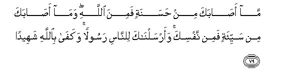

79. M<u>a</u> a<u>sa</u>baka min <u>h</u>asanatin famina All<u>a</u>hi
wam<u>a</u> a<u>sa</u>baka min sayyi-atin famin nafsika
waarsaln<u>a</u>ka li**l**nn<u>a</u>si rasoolan wakaf<u>a</u>
bi**A**ll<u>a</u>hi shaheedan

79\. Whatever good, (O man!)  
Happens to thee, is from God;  
But whatever evil happens  
To thee, is from thy (own) soul.  
And We have sent thee  
As an Apostle  
To (instruct) mankind.  
And enough is God  
For a witness.

------------------------------------------------------------------------

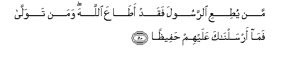

80. Man yu<u>t</u>iAAi a**l**rrasoola faqad a<u>ta</u>AAa All<u>a</u>ha
waman tawall<u>a</u> fam<u>a</u> arsaln<u>a</u>ka AAalayhim
<u>h</u>afee*<u>th</u>*<u>a</u>**n**

80\.

------------------------------------------------------------------------

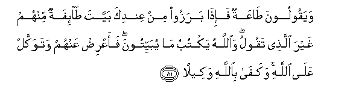

81. Wayaqooloona <u>ta</u>AAatun fa-i<u>tha</u> barazoo min AAindika
bayyata <u>ta</u>-ifatun minhum ghayra alla<u>th</u>ee taqoolu
wa**A**ll<u>a</u>hu yaktubu m<u>a</u> yubayyitoona faaAAri<u>d</u>
AAanhum watawakkal AAal<u>a</u> All<u>a</u>hi wakaf<u>a</u>
bi**A**ll<u>a</u>hi wakeel<u>a</u>**n**

81\. They have "Obedience"  
On their lips; but  
When they leave thee,  
A section of them  
Meditate all night  
On things very different  
From what thou tellest them.  
But God records  
Their nightly (plots):  
So keep clear of them,  
And put thy trust in God,  
And enough is God  
As a disposer of affairs.

------------------------------------------------------------------------

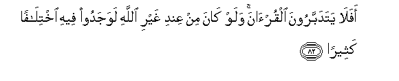

82. Afal<u>a</u> yatadabbaroona alqur-<u>a</u>na walaw k<u>a</u>na min
AAindi ghayri All<u>a</u>hi lawajadoo feehi ikhtil<u>a</u>fan
katheer<u>a</u>**n**

82\. Do they not consider  
The Qur-ān (with care)?  
Had it been from other  
Than God, they would surely  
Have found therein  
Much discrepancy.

------------------------------------------------------------------------

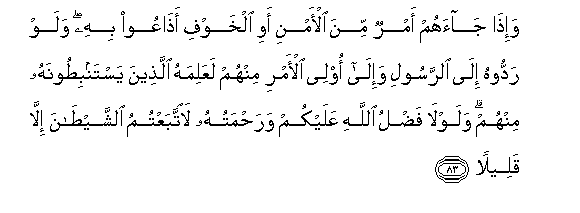

83. Wa-i<u>tha</u> j<u>a</u>ahum amrun mina al-amni awi alkhawfi
a<u>tha</u>AAoo bihi walaw raddoohu il<u>a</u> a**l**rrasooli
wa-il<u>a</u> olee al-amri minhum laAAalimahu alla<u>th</u>eena
yastanbi<u>t</u>oonahu minhum walawl<u>a</u> fa<u>d</u>lu All<u>a</u>hi
AAalaykum wara<u>h</u>matuhu la**i**ttabaAAtumu a**l**shshay<u>ta</u>na
ill<u>a</u> qaleel<u>a</u>**n**

83\. When there comes to them  
Some matter touching  
(Public) safety or fear,  
They divulge it.  
If they had only referred it  
To the Apostle, or to those  
Charged with authority  
Among them, the proper  
Investigators would have  
Tested it from them (direct).  
Were it not for the Grace  
And Mercy of God unto you,  
All but a few of you  
Would have fallen  
Into the clutches of Satan.

------------------------------------------------------------------------

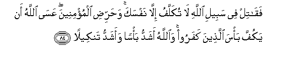

84. Faq<u>a</u>til fee sabeeli All<u>a</u>hi l<u>a</u> tukallafu
ill<u>a</u> nafsaka wa<u>h</u>arri<u>d</u>i almu/mineena AAas<u>a</u>
All<u>a</u>hu an yakuffa ba/sa alla<u>th</u>eena kafaroo
wa**A**ll<u>a</u>hu ashaddu ba/san waashaddu tankeel<u>a</u>**n**

84\. Then fight in God's cause—  
Thou art held responsible  
Only for thyself—  
And rouse the Believers.  
It may be that God  
Will restrain the fury  
Of the Unbelievers;  
For God is the strongest  
In might and in punishment.

------------------------------------------------------------------------

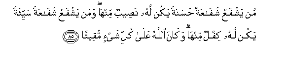

85. Man yashfaAA shaf<u>a</u>AAatan <u>h</u>asanatan yakun lahu
na<u>s</u>eebun minh<u>a</u> waman yashfaAA shaf<u>a</u>AAatan
sayyi-atan yakun lahu kiflun minh<u>a</u> wak<u>a</u>na All<u>a</u>hu
AAal<u>a</u> kulli shay-in muqeet<u>a</u>**n**

85\. Whoever recommends  
And helps a good cause  
Becomes a partner therein:  
And whoever recommends  
And helps an evil cause,  
Shares in its burden:  
And God hath power  
Over all things.

------------------------------------------------------------------------

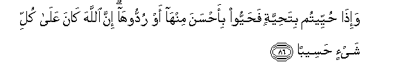

86. Wa-i<u>tha</u> <u>h</u>uyyeetum bita<u>h</u>iyyatin fa<u>h</u>ayyoo
bi-a<u>h</u>sana minh<u>a</u> aw ruddooh<u>a</u> inna All<u>a</u>ha
k<u>a</u>na AAal<u>a</u> kulli shay-in <u>h</u>aseeb<u>a</u>**n**

86\. When a (courteous) greeting  
Is offered you, meet it  
With a greeting still more  
Courteous, or (at least)  
Of equal courtesy.  
God takes careful account  
Of all things.

------------------------------------------------------------------------

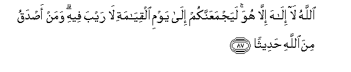

87. All<u>a</u>hu l<u>a</u> il<u>a</u>ha ill<u>a</u> huwa
layajmaAAannakum il<u>a</u> yawmi alqiy<u>a</u>mati l<u>a</u> rayba
feehi waman a<u>s</u>daqu mina All<u>a</u>hi <u>h</u>adeeth<u>a</u>**n**

87\. God! There is no god  
But He: of a surety  
He will gather you together  
Against the Day of Judgment,  
About which there is no doubt.  
And whose word can be  
Truer than God's?

------------------------------------------------------------------------

[Next: Section 12 (88-91)](00412)

