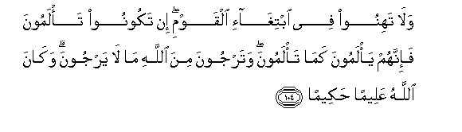

  
[Intangible Textual Heritage](../../index)  [Islam](../index) 
[Index](index)   
[Hypertext Qur'an](../htq/index)  [Unicode](../uq/004.htm#004_101) 
[Palmer](../sbe06/004)  [Pickthall](../pick/004.htm#004_101)  [Yusuf Ali
English](../yaq/yaq004)  [Rodwell](../qr/004)   
  
[Sūra IV.: Nisāa, or The Women. Index](004)  
  [Previous](00414)  [Next](00416) 

------------------------------------------------------------------------

  
*The Holy Quran*, tr. by Yusuf Ali, \[1934\], at Intangible Textual
Heritage

------------------------------------------------------------------------

# Sūra IV.: Nisāa, or The Women.

### Section 15

------------------------------------------------------------------------

101. Wa-i<u>tha</u> <u>d</u>arabtum fee al-ar<u>d</u>i falaysa AAalaykum
jun<u>ah</u>un an taq<u>s</u>uroo mina a**l**<u>ss</u>al<u>a</u>ti in
khiftum an yaftinakumu alla<u>th</u>eena kafaroo inna alk<u>a</u>fireena
k<u>a</u>noo lakum AAaduwwan mubeen<u>a</u>**n**

101\. When ye travel  
Through the earth,  
There is no blame on you  
If ye shorten your prayers,  
For fear the Unbelievers  
May attack you:  
For the Unbelievers are  
Unto you open enemies.

------------------------------------------------------------------------

102. Wa-i<u>tha</u> kunta feehim faaqamta lahumu
a**l**<u>ss</u>al<u>a</u>ta faltaqum <u>ta</u>-ifatun minhum maAAaka
walya/khu<u>th</u>oo asli<u>h</u>atahum fa-i<u>tha</u> sajadoo
falyakoonoo min war<u>a</u>-ikum walta/ti <u>ta</u>-ifatun okhr<u>a</u>
lam yu<u>s</u>alloo falyu<u>s</u>alloo maAAaka walya/khu<u>th</u>oo
<u>h</u>i<u>th</u>rahum waasli<u>h</u>atahum wadda alla<u>th</u>eena
kafaroo law taghfuloona AAan asli<u>h</u>atikum waamtiAAatikum
fayameeloona AAalaykum maylatan w<u>ah</u>idatan wal<u>a</u>
jun<u>ah</u>a AAalaykum in k<u>a</u>na bikum a<u>th</u>an min
ma<u>t</u>arin aw kuntum mar<u>da</u> an ta<u>d</u>aAAoo
asli<u>h</u>atakum wakhu<u>th</u>oo <u>h</u>i<u>th</u>rakum inna
All<u>a</u>ha aAAadda lilk<u>a</u>fireena AAa<u>tha</u>ban
muheen<u>a</u>**n**

102\. When thou (O Apostle)  
Art with them, and standest  
To lead them in prayer,  
Let one party of them  
Stand up (in prayer) with thee,  
Taking their arms with them:  
When they finish  
Their prostrations, let them  
Take their position in the rear.  
And let the other party come up  
Which hath not yet prayed—  
And let them pray with thee,  
Taking all precautions,  
And bearing arms:  
The Unbelievers wish,  
If ye were negligent  
Of your arms and your baggage,  
To assault you in a single rush.  
But there is no blame on you  
If ye put away your arms  
Because of the inconvenience  
Of rain or because ye are ill;  
But take (every) precaution  
For yourselves. For the  
Unbelievers  
God hath prepared  
A humiliating punishment.

------------------------------------------------------------------------

103. Fa-i<u>tha</u> qa<u>d</u>aytumu a**l**<u>ss</u>al<u>a</u>ta
fa**o**<u>th</u>kuroo All<u>a</u>ha qiy<u>a</u>man waquAAoodan
waAAal<u>a</u> junoobikum fa-i<u>tha</u> i<u>t</u>ma/nantum faaqeemoo
a**l**<u>ss</u>al<u>a</u>ta inna a**l**<u>ss</u>al<u>a</u>ta
k<u>a</u>nat AAal<u>a</u> almu/mineena kit<u>a</u>ban
mawqoot<u>a</u>**n**

103\. When ye pass  
(Congregational) prayers,  
Celebrate God's praises,  
Standing, sitting down,  
Or lying down on your sides;  
But when ye are free  
From danger, set up  
Regular Prayers:  
For such prayers  
Are enjoined on Believers  
At stated times.

------------------------------------------------------------------------

104. Wal<u>a</u> tahinoo fee ibtigh<u>a</u>-i alqawmi in takoonoo
ta/lamoona fa-innahum ya/lamoona kam<u>a</u> ta/lamoona watarjoona mina
All<u>a</u>hi m<u>a</u> l<u>a</u> yarjoona wak<u>a</u>na All<u>a</u>hu
AAaleeman <u>h</u>akeem<u>a</u>**n**

104\. And slacken not  
In following up the enemy:  
If ye are suffering hardships,  
They are suffering similar  
Hardships; but ye have  
Hope from God, while they  
Have none. And God  
Is full of knowledge and wisdom.

------------------------------------------------------------------------

[Next: Section 16 (105-112)](00416)

