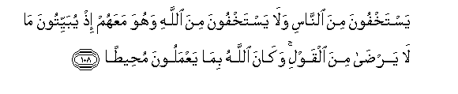
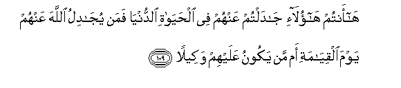
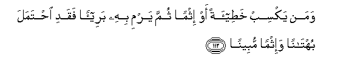

  
[Intangible Textual Heritage](../../index)  [Islam](../index) 
[Index](index)   
[Hypertext Qur'an](../htq/index)  [Unicode](../uq/004.htm#004_105) 
[Palmer](../sbe06/004)  [Pickthall](../pick/004.htm#004_105)  [Yusuf Ali
English](../yaq/yaq004)  [Rodwell](../qr/004)   
  
[Sūra IV.: Nisāa, or The Women. Index](004)  
  [Previous](00415)  [Next](00417) 

------------------------------------------------------------------------

  
*The Holy Quran*, tr. by Yusuf Ali, \[1934\], at Intangible Textual
Heritage

------------------------------------------------------------------------

# Sūra IV.: Nisāa, or The Women.

### Section 16

------------------------------------------------------------------------

105. Inn<u>a</u> anzaln<u>a</u> ilayka alkit<u>a</u>ba
bi**a**l<u>h</u>aqqi lita<u>h</u>kuma bayna a**l**nn<u>a</u>si
bim<u>a</u> ar<u>a</u>ka All<u>a</u>hu wal<u>a</u> takun
lilkh<u>a</u>-ineena kha<u>s</u>eem<u>a</u>**n**

105\. We have sent down  
To thee the Book in truth,  
That thou might test judge  
Between men, as guided  
By God: so be not (used)  
As an advocate by those  
Who betray their trust;

------------------------------------------------------------------------

106. Wa**i**staghfiri All<u>a</u>ha inna All<u>a</u>ha k<u>a</u>na
ghafooran ra<u>h</u>eem<u>a</u>**n**

106\. But seek the forgiveness  
Of God; for God is  
Oft-forgiving, Most Merciful.

------------------------------------------------------------------------

107. Wal<u>a</u> tuj<u>a</u>dil AAani alla<u>th</u>eena
yakht<u>a</u>noona anfusahum inna All<u>a</u>ha l<u>a</u> yu<u>h</u>ibbu
man k<u>a</u>na khaww<u>a</u>nan atheem<u>a</u>**n**

107\. Contend not on behalf  
Of such as betray  
Their own souls;  
For God loveth not  
One given to perfidy  
And crime;

------------------------------------------------------------------------

108. Yastakhfoona mina a**l**nn<u>a</u>si wal<u>a</u> yastakhfoona mina
All<u>a</u>hi wahuwa maAAahum i<u>th</u> yubayyitoona m<u>a</u>
l<u>a</u> yar<u>da</u> mina alqawli wak<u>a</u>na All<u>a</u>hu
bim<u>a</u> yaAAmaloona mu<u>h</u>ee<u>ta</u>**n**

108\. They may hide  
(Their crimes) from men,  
But they cannot hide  
(Them) from God, seeing that  
He is in their midst  
When they plot by night,  
In words that He cannot  
Approve: and God  
Doth compass round  
All that they do.

------------------------------------------------------------------------

109. H<u>a</u>antum h<u>a</u>ol<u>a</u>-i j<u>a</u>daltum AAanhum fee
al<u>h</u>ay<u>a</u>ti a**l**dduny<u>a</u> faman yuj<u>a</u>dilu
All<u>a</u>ha AAanhum yawma alqiy<u>a</u>mati am man yakoonu AAalayhim
wakeel<u>a</u>**n**

109\. Ah! these are the sort  
Of men on whose behalf  
Ye may contend in this world;  
But who will contend with God  
On their behalf on the Day  
Of Judgment, or who  
Will carry their affairs through?

------------------------------------------------------------------------

110. Waman yaAAmal soo-an aw ya*<u>th</u>*lim nafsahu thumma yastaghfiri
All<u>a</u>ha yajidi All<u>a</u>ha ghafooran ra<u>h</u>eem<u>a</u>**n**

110\. If any one does evil  
Or wrongs his own soul  
But afterwards seeks  
God's forgiveness, he will find  
God Oft-forgiving,  
Most Merciful.

------------------------------------------------------------------------

111. Waman yaksib ithman fa-innam<u>a</u> yaksibuhu AAal<u>a</u> nafsihi
wak<u>a</u>na All<u>a</u>hu AAaleeman <u>h</u>akeem<u>a</u>**n**

111\. And if any one earns  
Sin, he earns it against  
His own soul: for God  
Is full of knowledge and wisdom.

------------------------------------------------------------------------

112. Waman yaksib kha<u>t</u>ee-atan aw ithman thumma yarmi bihi
baree-an faqadi i<u>h</u>tamala buht<u>a</u>nan wa-ithman
mubeen<u>a</u>**n**

112\. But if any one earns  
A fault or a sin  
And throws it on to one  
That is innocent,  
He carries (on himself)  
(Both) a falsehood  
And a flagrant sin.

------------------------------------------------------------------------

[Next: Section 17 (113-115)](00417)

