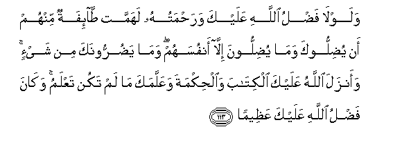
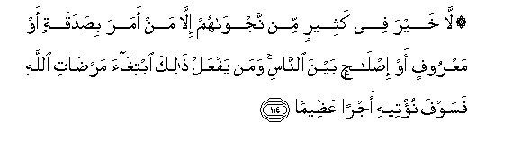

  
[Intangible Textual Heritage](../../index)  [Islam](../index.md) 
[Index](index.md)   
[Hypertext Qur'an](../htq/index)  [Unicode](../uq/004.htm#004_113.md) 
[Palmer](../sbe06/004)  [Pickthall](../pick/004.htm#004_113.md)  [Yusuf Ali
English](../yaq/yaq004)  [Rodwell](../qr/004.md)   
  
[Sūra IV.: Nisāa, or The Women. Index](004.md)  
  [Previous](00416)  [Next](00418.md) 

------------------------------------------------------------------------

  
*The Holy Quran*, tr. by Yusuf Ali, \[1934\], at Intangible Textual
Heritage

------------------------------------------------------------------------

# Sūra IV.: Nisāa, or The Women.

### Section 17

------------------------------------------------------------------------

113. Walawl<u>a</u> fa<u>d</u>lu All<u>a</u>hi AAalayka
wara<u>h</u>matuhu lahammat <u>ta</u>-ifatun minhum an yu<u>d</u>illooka
wam<u>a</u> yu<u>d</u>illoona ill<u>a</u> anfusahum wam<u>a</u>
ya<u>d</u>urroonaka min shay-in waanzala All<u>a</u>hu AAalayka
alkit<u>a</u>ba wa**a**l<u>h</u>ikmata waAAallamaka m<u>a</u> lam takun
taAAlamu wak<u>a</u>na fa<u>d</u>lu All<u>a</u>hi AAalayka
AAa*<u>th</u>*eem<u>a</u>**n**

113\. But for the Grace of God  
To thee and His Mercy,  
A party of them would  
Certainly have plotted  
To lead thee astray.  
But (in fact) they will only  
Lead their own souls astray,  
And to thee they can do  
No harm in the least.  
For God hath sent down  
To thee the Book and Wisdom  
And taught thee what thou  
Knewest not (before):  
And great is the Grace  
Of God unto thee.

------------------------------------------------------------------------

114. L<u>a</u> khayra fee katheerin min najw<u>a</u>hum ill<u>a</u> man
amara bi<u>s</u>adaqatin aw maAAroofin aw i<u>s</u>l<u>ah</u>in bayna
a**l**nn<u>a</u>si waman yafAAal <u>tha</u>lika ibtigh<u>a</u>a
mar<u>da</u>ti All<u>a</u>hi fasawfa nu/teehi ajran
AAa*<u>th</u>*eem<u>a</u>**n**

114\. In most of their secret talks  
There is no good: but if  
One exhorts to a deed  
Of charity or justice  
Or conciliation between men,  
(Secrecy is permissible):  
To him who does this,  
Seeking the good pleasure  
Of God, We shall soon give  
A reward of the highest (value).

------------------------------------------------------------------------

115. Waman yush<u>a</u>qiqi a**l**rrasoola min baAAdi m<u>a</u>
tabayyana lahu alhud<u>a</u> wayattabiAA ghayra sabeeli almu/mineena
nuwallihi m<u>a</u> tawall<u>a</u> wanu<u>s</u>lihi jahannama
was<u>a</u>at ma<u>s</u>eer<u>a</u>**n**

115\. If anyone contends with  
The Apostle even after  
Guidance has been plainly  
Conveyed to him, and follows  
A path other than that  
Becoming to men of Faith,  
We shall leave him  
In the path he has chosen,  
And land him in Hell,—  
What an evil refuge!

------------------------------------------------------------------------

[Next: Section 18 (116-126)](00418.md)

