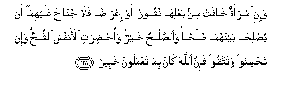

  
[Intangible Textual Heritage](../../index)  [Islam](../index.md) 
[Index](index.md)   
[Hypertext Qur'an](../htq/index)  [Unicode](../uq/004.htm#004_127.md) 
[Palmer](../sbe06/004)  [Pickthall](../pick/004.htm#004_127.md)  [Yusuf Ali
English](../yaq/yaq004)  [Rodwell](../qr/004.md)   
  
[Sūra IV.: Nisāa, or The Women. Index](004.md)  
  [Previous](00418)  [Next](00420.md) 

------------------------------------------------------------------------

  
*The Holy Quran*, tr. by Yusuf Ali, \[1934\], at Intangible Textual
Heritage

------------------------------------------------------------------------

# Sūra IV.: Nisāa, or The Women.

### Section 19

------------------------------------------------------------------------

127. Wayastaftoonaka fee a**l**nnis<u>a</u>-i quli All<u>a</u>hu
yufteekum feehinna wam<u>a</u> yutl<u>a</u> AAalaykum fee
alkit<u>a</u>bi fee yat<u>a</u>m<u>a</u> a**l**nnis<u>a</u>-i
all<u>a</u>tee l<u>a</u> tu/toonahunna m<u>a</u> kutiba lahunna
watarghaboona an tanki<u>h</u>oohunna wa**a**lmusta<u>d</u>AAafeena mina
alwild<u>a</u>ni waan taqoomoo lilyat<u>a</u>m<u>a</u>
bi**a**lqis<u>t</u>i wam<u>a</u> tafAAaloo min khayrin fa-inna
All<u>a</u>ha k<u>a</u>na bihi AAaleem<u>a</u>**n**

127\. They ask thy instruction  
Concerning the Women  
Say: God doth  
Instruct you about them:  
And (remember) what hath  
Been rehearsed unto you  
In the Book, concerning  
The orphans of women to whom  
Ye give not the portions  
Prescribed, and yet whom ye  
Desire to marry, as also  
Concerning the children  
Who are weak and oppressed:  
That ye stand firm  
For justice to orphans.  
There is not a good deed  
Which ye do, but God  
Is well-acquainted therewith.

------------------------------------------------------------------------

128. Wa-ini imraatun kh<u>a</u>fat min baAAlih<u>a</u> nushoozan aw
iAAr<u>ad</u>an fal<u>a</u> jun<u>ah</u>a AAalayhim<u>a</u> an
yu<u>s</u>li<u>ha</u> baynahum<u>a</u> <u>s</u>ul<u>h</u>an
wa**al**<u>ss</u>ul<u>h</u>u khayrun wao<u>hd</u>irati al-anfusu
a**l**shshu<u>hh</u>a wa-in tu<u>h</u>sinoo watattaqoo fa-inna
All<u>a</u>ha k<u>a</u>na bim<u>a</u> taAAmaloona khabeer<u>a</u>**n**

128\. If a wife fears  
Cruelty or desertion  
On her husband's part,  
There is no blame on them  
If they arrange  
An amicable settlement  
Between themselves;  
And such settlement is best;  
Even though men's souls  
Are swayed by greed.  
But if ye do good  
And practise self-restraint,  
God is well-acquainted  
With all that ye do.

------------------------------------------------------------------------

129. Walan tasta<u>t</u>eeAAoo an taAAdiloo bayna a**l**nnis<u>a</u>-i
walaw <u>h</u>ara<u>s</u>tum fal<u>a</u> tameeloo kulla almayli
fata<u>th</u>arooh<u>a</u> ka**a**lmuAAallaqati wa-in
tu<u>s</u>li<u>h</u>oo watattaqoo fa-inna All<u>a</u>ha k<u>a</u>na
ghafooran ra<u>h</u>eem<u>a</u>**n**

129\. Ye are never able  
To be fair and just  
As between women,  
Even if it is  
Your ardent desire:  
But turn not away  
(From a woman) altogether,  
So as to leave her (as it were)  
Hanging (in the air).  
If ye come to a friendly  
Understanding, and practise  
Self-restraint, God is  
Oft-forgiving, Most Merciful.

------------------------------------------------------------------------

130. Wa-in yatafarraq<u>a</u> yughni All<u>a</u>hu kullan min saAAatihi
wak<u>a</u>na All<u>a</u>hu w<u>a</u>siAAan <u>h</u>akeem<u>a</u>**n**

130\. But if they disagree  
(And must part), God  
Will provide abundance  
For all from His  
All-reaching bounty:  
For God is He  
That careth for all  
And is Wise.

------------------------------------------------------------------------

131. Walill<u>a</u>hi m<u>a</u> fee a**l**ssam<u>a</u>w<u>a</u>ti
wam<u>a</u> fee al-ar<u>d</u>i walaqad wa<u>ss</u>ayn<u>a</u>
alla<u>th</u>eena ootoo alkit<u>a</u>ba min qablikum wa-iyy<u>a</u>kum
ani ittaqoo All<u>a</u>ha wa-in takfuroo fa-inna lill<u>a</u>hi
m<u>a</u> fee a**l**ssam<u>a</u>w<u>a</u>ti wam<u>a</u> fee
al-ar<u>d</u>i wak<u>a</u>na All<u>a</u>hu ghaniyyan
<u>h</u>ameed<u>a</u>**n**

131\. To God belong all things  
In the heavens and on earth.  
Verily We have directed  
The People of the Book  
Before you, and you (O Muslims).  
To fear God. But if ye  
Deny Him, to! unto God  
Belong all things  
In the heavens and on earth,  
And God is free  
Of all wants, worthy  
Of all praise.

------------------------------------------------------------------------

132. Walill<u>a</u>hi m<u>a</u> fee a**l**ssam<u>a</u>w<u>a</u>ti
wam<u>a</u> fee al-ar<u>d</u>i wakaf<u>a</u> bi**A**ll<u>a</u>hi
wakeel<u>a</u>**n**

132\. Yea, unto God belong  
All things in the heavens  
And on earth, and enough  
Is God to carry through  
All affairs.

------------------------------------------------------------------------

133. In yasha/ yu<u>th</u>hibkum ayyuh<u>a</u> a**l**nn<u>a</u>su
waya/ti bi-<u>a</u>khareena wak<u>a</u>na All<u>a</u>hu AAal<u>a</u>
<u>tha</u>lika qadeer<u>a</u>**n**

133\. If it were His Will,  
He could destroy you,  
O mankind, and create  
Another race; for He  
Hath power this to do.

------------------------------------------------------------------------

134. Man k<u>a</u>na yureedu thaw<u>a</u>ba a**l**dduny<u>a</u> faAAinda
All<u>a</u>hi thaw<u>a</u>bu a**l**dduny<u>a</u>
wa**a**l-<u>a</u>khirati wak<u>a</u>na All<u>a</u>hu sameeAAan
ba<u>s</u>eer<u>a</u>**n**

134\. If any one desires  
A reward in this life,  
In God's (gift) is the reward  
(Both) of this life  
And of the Hereafter:  
For God is He that heareth  
And seeth (all things).

------------------------------------------------------------------------

[Next: Section 20 (135-141)](00420.md)

