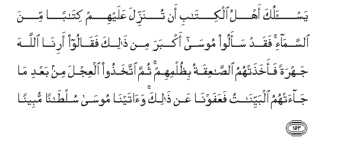
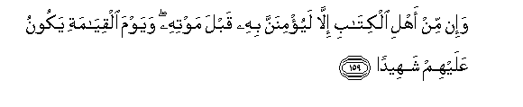
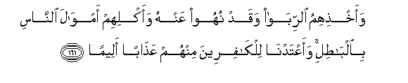

  
[Intangible Textual Heritage](../../index)  [Islam](../index.md) 
[Index](index.md)   
[Hypertext Qur'an](../htq/index)  [Unicode](../uq/004.htm#004_153.md) 
[Palmer](../sbe06/004)  [Pickthall](../pick/004.htm#004_153.md)  [Yusuf Ali
English](../yaq/yaq004)  [Rodwell](../qr/004.md)   
  
[Sūra IV.: Nisāa, or The Women. Index](004.md)  
  [Previous](00421)  [Next](00423.md) 

------------------------------------------------------------------------

  
*The Holy Quran*, tr. by Yusuf Ali, \[1934\], at Intangible Textual
Heritage

------------------------------------------------------------------------

# Sūra IV.: Nisāa, or The Women.

### Section 22

------------------------------------------------------------------------

153. Yas-aluka ahlu alkit<u>a</u>bi an tunazzila AAalayhim
kit<u>a</u>ban mina a**l**ssam<u>a</u>-i faqad saaloo moos<u>a</u>
akbara min <u>tha</u>lika faq<u>a</u>loo arin<u>a</u> All<u>a</u>ha
jahratan faakha<u>th</u>at-humu a**l**<u>ssa</u>AAiqatu
bi*<u>th</u>*ulmihim thumma ittakha<u>th</u>oo alAAijla min baAAdi
m<u>a</u> j<u>a</u>at-humu albayyin<u>a</u>tu faAAafawn<u>a</u> AAan
<u>tha</u>lika wa<u>a</u>tayn<u>a</u> moos<u>a</u> sul<u>ta</u>nan
mubeen<u>a</u>**n**

153\. The People of the Book  
Ask thee to cause  
A book to descend to them  
From heaven: indeed  
They asked Moses  
For an even greater  
(Miracle), for they said:  
"Show us God in public,"  
But they were dazed  
For their presumption,  
With thunder and lightning.  
Yet they worshipped the calf  
Even after Clear Signs  
Had come to them;  
Even so We forgave them;  
And gave Moses manifest  
Proofs of authority.

------------------------------------------------------------------------

154. WarafaAAn<u>a</u> fawqahumu a**l**<u>tt</u>oora
bimeeth<u>a</u>qihim waquln<u>a</u> lahumu odkhuloo alb<u>a</u>ba
sujjadan waquln<u>a</u> lahum l<u>a</u> taAAdoo fee a**l**ssabti
waakha<u>th</u>n<u>a</u> minhum meeth<u>a</u>qan
ghalee*<u>th</u>*<u>a</u>**n**

154\. And for their Covenant  
We raised over them  
(The towering height)  
Of Mount (Sinai);  
And (on another occasion)  
We said: "Enter the gate  
With humility"; and (once again)  
We commanded them:  
"Transgress not in the matter  
Of the Sabbath."  
And We took from them  
A solemn Covenant.

------------------------------------------------------------------------

155. Fabim<u>a</u> naq<u>d</u>ihim meeth<u>a</u>qahum wakufrihim
bi-<u>a</u>y<u>a</u>ti All<u>a</u>hi waqatlihimu al-anbiy<u>a</u>a
bighayri <u>h</u>aqqin waqawlihim quloobun<u>a</u> ghulfun bal
<u>t</u>abaAAa All<u>a</u>hu AAalayh<u>a</u> bikufrihim fal<u>a</u>
yu/minoona ill<u>a</u> qaleel<u>a</u>**n**

155\. (They have incurred divine  
Displeasure): in that they  
Broke their Covenant;  
That they rejected the Signs  
Of God; that they slew  
The Messengers in defiance  
Of right; that they said,  
"Our hearts are the wrappings  
(Which preserve God's Word;  
We need no more)";—nay,  
God hath set the seal on their hearts  
For their blasphemy,  
And little is it they believe;—

------------------------------------------------------------------------

156. Wabikufrihim waqawlihim AAal<u>a</u> maryama buht<u>a</u>nan
AAa*<u>th</u>*eem<u>a</u>**n**

156\. That they rejected Faith;  
That they uttered against Mary  
A grave false charge;

------------------------------------------------------------------------

157. Waqawlihim inn<u>a</u> qataln<u>a</u> almasee<u>h</u>a
AAees<u>a</u> ibna maryama rasoola All<u>a</u>hi wam<u>a</u> qataloohu
wam<u>a</u> <u>s</u>alaboohu wal<u>a</u>kin shubbiha lahum wa-inna
alla<u>th</u>eena ikhtalafoo feehi lafee shakkin minhu m<u>a</u> lahum
bihi min AAilmin ill<u>a</u> ittib<u>a</u>AAa a**l***<u>thth</u>*anni
wam<u>a</u> qataloohu yaqeen<u>a</u>**n**

157\. That they said (in boast),  
"We killed Christ Jesus  
The son of Mary,  
The Apostle of God";—  
But they killed him not,  
Nor crucified him,  
But so it was made  
To appear to them,  
And those who differ  
Therein are full of doubts,  
With no (certain) knowledge,  
But only conjecture to follow,  
For of a surety  
They killed him not:—

------------------------------------------------------------------------

158. Bal rafaAAahu All<u>a</u>hu ilayhi wak<u>a</u>na All<u>a</u>hu
AAazeezan <u>h</u>akeem<u>a</u>**n**

158\. Nay, God raised him up  
Unto Himself; and God  
Is Exalted in Power, Wise;—

------------------------------------------------------------------------

159. Wa-in min ahli alkit<u>a</u>bi ill<u>a</u> layu/minanna bihi qabla
mawtihi wayawma alqiy<u>a</u>mati yakoonu AAalayhim shaheed<u>a</u>**n**

159\. And there is none  
Of the People of the Book  
But must believe in him  
Before his death;  
And on the Day of Judgment  
He will be a witness  
Against them;—

------------------------------------------------------------------------

160. Fabi*<u>th</u>*ulmin mina alla<u>th</u>eena h<u>a</u>doo
<u>h</u>arramn<u>a</u> AAalayhim <u>t</u>ayyib<u>a</u>tin o<u>h</u>illat
lahum wabi<u>s</u>addihim AAan sabeeli All<u>a</u>hi
katheer<u>a</u>**n**

160\. For the iniquity of the Jews  
We made unlawful for them  
Certain (foods) good and wholesome  
Which had been lawful for them;—  
In that they hindered many  
From God's Way;—

------------------------------------------------------------------------

161. Waakh<u>th</u>ihimu a**l**rrib<u>a</u> waqad nuhoo AAanhu waaklihim
amw<u>a</u>la a**l**nn<u>a</u>si bi**a**lb<u>at</u>ili waaAAtadn<u>a</u>
lilk<u>a</u>fireena minhum AAa<u>tha</u>ban aleem<u>a</u>**n**

161\. That they took usury,  
Though they were forbidden;  
And that they devoured  
Men's substance wrongfully;—  
We have prepared for those  
Among them who reject Faith  
A grievous punishment.

------------------------------------------------------------------------

162. L<u>a</u>kini a**l**rr<u>a</u>sikhoona fee alAAilmi minhum
wa**a**lmu/minoona yu/minoona bim<u>a</u> onzila ilayka wam<u>a</u>
onzila min qablika wa**a**lmuqeemeena a**l**<u>ss</u>al<u>a</u>ta
wa**a**lmu/toona a**l**zzak<u>a</u>ta wa**a**lmu/minoona
bi**A**ll<u>a</u>hi wa**a**lyawmi al-<u>a</u>khiri ol<u>a</u>-ika
sanu/teehim ajran AAa*<u>th</u>*eem<u>a</u>**n**

162\. But those among them  
Who are well-grounded in knowledge,  
And the Believers,  
Believe in what hath been  
Revealed to thee and what was  
Revealed before thee:  
And (especially) those  
Who establish regular prayer  
And practise regular charity  
And believe in God  
And in the Last Day:  
To them shall We soon  
Give a great reward.

------------------------------------------------------------------------

[Next: Section 23 (163-171)](00423.md)

