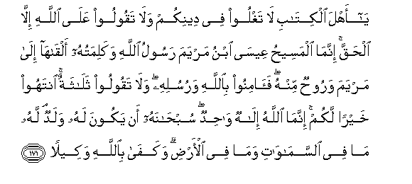

  
[Intangible Textual Heritage](../../index)  [Islam](../index) 
[Index](index)   
[Hypertext Qur'an](../htq/index)  [Unicode](../uq/004.htm#004_163) 
[Palmer](../sbe06/004)  [Pickthall](../pick/004.htm#004_163)  [Yusuf Ali
English](../yaq/yaq004)  [Rodwell](../qr/004)   
  
[Sūra IV.: Nisāa, or The Women. Index](004)  
  [Previous](00422)  [Next](00424) 

------------------------------------------------------------------------

  
*The Holy Quran*, tr. by Yusuf Ali, \[1934\], at Intangible Textual
Heritage

------------------------------------------------------------------------

# Sūra IV.: Nisāa, or The Women.

### Section 23

------------------------------------------------------------------------

163. Inn<u>a</u> aw<u>h</u>ayn<u>a</u> ilayka kam<u>a</u>
aw<u>h</u>ayn<u>a</u> il<u>a</u> noo<u>h</u>in wa**al**nnabiyyeena min
baAAdihi waaw<u>h</u>ayn<u>a</u> il<u>a</u> ibr<u>a</u>heema
wa-ism<u>a</u>AAeela wa-is<u>ha</u>qa wayaAAqooba wa**a**l-asb<u>at</u>i
waAAees<u>a</u> waayyooba wayoonusa wah<u>a</u>roona wasulaym<u>a</u>na
wa<u>a</u>tayn<u>a</u> d<u>a</u>wooda zaboor<u>a</u>**n**

163\. We have sent thee  
Inspiration, as We sent it  
To Noah and the Messengers  
After him: We sent  
Inspiration to Abraham,  
Ismail, Isaac, Jacob  
And the Tribes, to Jesus,  
Job, Jonah, Aaron, and Solomon,  
And to David We gave  
The Psalms.

------------------------------------------------------------------------

164. Warusulan qad qa<u>s</u>a<u>s</u>n<u>a</u>hum AAalayka min qablu
warusulan lam naq<u>s</u>u<u>s</u>hum AAalayka wakallama All<u>a</u>hu
moos<u>a</u> takleem<u>a</u>**n**

164\. Of some apostles We have  
Already told thee the story;  
Of others we have not;—  
And to Moses God spoke direct;—

------------------------------------------------------------------------

165. Rusulan mubashshireena wamun<u>th</u>ireena li-all<u>a</u> yakoona
li**l**nn<u>a</u>si AAal<u>a</u> All<u>a</u>hi <u>h</u>ujjatun baAAda
a**l**rrusuli wak<u>a</u>na All<u>a</u>hu AAazeezan
<u>h</u>akeem<u>a</u>**n**

165\. Apostles who gave good news  
As well as warning,  
That mankind, after (the coming)  
Of the apostles, should have  
No plea against God:  
For God is Exalted in Power,  
Wise.

------------------------------------------------------------------------

166. L<u>a</u>kini All<u>a</u>hu yashhadu bim<u>a</u> anzala ilayka
anzalahu biAAilmihi wa**a**lmal<u>a</u>-ikatu yashhadoona wakaf<u>a</u>
bi**A**ll<u>a</u>hi shaheed<u>a</u>**n**

166\. But God beareth witness  
That what He hath sent  
Unto thee He hath sent  
From His (own) knowledge,  
And the angels bear witness:  
But enough is God for a witness.

------------------------------------------------------------------------

167. Inna alla<u>th</u>eena kafaroo wa<u>s</u>addoo AAan sabeeli
All<u>a</u>hi qad <u>d</u>alloo <u>d</u>al<u>a</u>lan
baAAeed<u>a</u>**n**

167\. Those who reject Faith  
And keep off (men)  
From the Way of God,  
Have verily strayed far,  
Far away from the Path.

------------------------------------------------------------------------

168. Inna alla<u>th</u>eena kafaroo wa*<u>th</u>*alamoo lam yakuni
All<u>a</u>hu liyaghfira lahum wal<u>a</u> liyahdiyahum
<u>t</u>areeq<u>a</u>**n**

168\. Those who reject Faith  
And do wrong,—God  
Will not forgive them  
Nor guide them  
To any way—

------------------------------------------------------------------------

169. Ill<u>a</u> <u>t</u>areeqa jahannama kh<u>a</u>lideena feeh<u>a</u>
abadan wak<u>a</u>na <u>tha</u>lika AAal<u>a</u> All<u>a</u>hi
yaseer<u>a</u>**n**

169\. Except the way of Hell,  
To dwell therein for ever.  
And this to God is easy.

------------------------------------------------------------------------

170. Y<u>a</u> ayyuh<u>a</u> a**l**nn<u>a</u>su qad j<u>a</u>akumu
a**l**rrasoolu bi**a**l<u>h</u>aqqi min rabbikum fa<u>a</u>minoo khayran
lakum wa-in takfuroo fa-inna lill<u>a</u>hi m<u>a</u> fee
a**l**ssam<u>a</u>w<u>a</u>ti wa**a**l-ar<u>d</u>i wak<u>a</u>na
All<u>a</u>hu AAaleeman <u>h</u>akeem<u>a</u>**n**

170\. O mankind! the Apostle  
Hath come to you in truth  
From God: believe in him:  
It is best for you. But if  
Ye reject Faith, to God  
Belong all things in the heavens  
And on earth: and God  
Is All-knowing, All-wise.

------------------------------------------------------------------------

171. Y<u>a</u> ahla alkit<u>a</u>bi l<u>a</u> taghloo fee deenikum
wal<u>a</u> taqooloo AAal<u>a</u> All<u>a</u>hi ill<u>a</u>
al<u>h</u>aqqa innam<u>a</u> almasee<u>h</u>u AAees<u>a</u> ibnu maryama
rasoolu All<u>a</u>hi wakalimatuhu alq<u>a</u>h<u>a</u> il<u>a</u>
maryama waroo<u>h</u>un minhu fa<u>a</u>minoo bi**A**ll<u>a</u>hi
warusulihi wal<u>a</u> taqooloo thal<u>a</u>thatun intahoo khayran lakum
innam<u>a</u> All<u>a</u>hu il<u>a</u>hun w<u>ah</u>idun
sub<u>ha</u>nahu an yakoona lahu waladun lahu m<u>a</u> fee
a**l**ssam<u>a</u>w<u>a</u>ti wam<u>a</u> fee al-ar<u>d</u>i
wakaf<u>a</u> bi**A**ll<u>a</u>hi wakeel<u>a</u>**n**

171\. O People of the Book!  
Commit no excesses  
In your religion: nor say  
Of God aught but the truth.  
Christ Jesus the son of Mary  
Was (no more than)  
An apostle of God,  
And His Word,  
Which He bestowed on Mary,  
And a Spirit proceeding  
From Him: so believe  
In God and His apostles.  
Say not "Trinity": desist:  
It will be better for you:  
For God is One God:  
Glory be to Him:  
(Far Exalted is He) above  
Having a son, To Him  
Belong all things in the heavens  
And on earth. And enough  
Is God as a Disposer of affairs.

------------------------------------------------------------------------

[Next: Section 24 (172-176)](00424)

