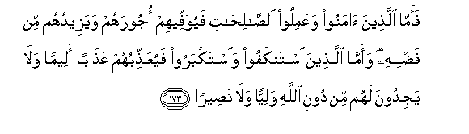
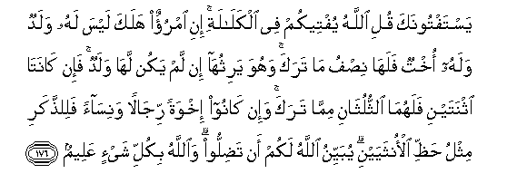

  
[Intangible Textual Heritage](../../index)  [Islam](../index.md) 
[Index](index.md)   
[Hypertext Qur'an](../htq/index)  [Unicode](../uq/004.htm#004_172.md) 
[Palmer](../sbe06/004)  [Pickthall](../pick/004.htm#004_172.md)  [Yusuf Ali
English](../yaq/yaq004)  [Rodwell](../qr/004.md)   
  
[Sūra IV.: Nisāa, or The Women. Index](004.md)  
  [Previous](00423)  [Next](00501.md) 

------------------------------------------------------------------------

  
*The Holy Quran*, tr. by Yusuf Ali, \[1934\], at Intangible Textual
Heritage

------------------------------------------------------------------------

# Sūra IV.: Nisāa, or The Women.

### Section 24

------------------------------------------------------------------------

172. Lan yastankifa almasee<u>h</u>u an yakoona AAabdan lill<u>a</u>hi
wal<u>a</u> almal<u>a</u>-ikatu almuqarraboona waman yastankif AAan
AAib<u>a</u>datihi wayastakbir fasaya<u>h</u>shuruhum ilayhi
jameeAA<u>a</u>**n**

172\. Christ disdaineth not  
To serve and worship God,  
Nor do the angels, those  
Nearest (to God):  
Those who disdain  
His worship and are arrogant,—  
He will gather them all  
Together unto Himself  
To (answer).

------------------------------------------------------------------------

173. Faamm<u>a</u> alla<u>th</u>eena <u>a</u>manoo waAAamiloo
a**l**<u>ssa</u>li<u>ha</u>ti fayuwaffeehim ojoorahum wayazeeduhum min
fa<u>d</u>lihi waamm<u>a</u> alla<u>th</u>eena istankafoo
wa**i**stakbaroo fayuAAa<u>thth</u>ibuhum AAa<u>tha</u>ban aleeman
wal<u>a</u> yajidoona lahum min dooni All<u>a</u>hi waliyyan wal<u>a</u>
na<u>s</u>eer<u>a</u>**n**

173\. But to those who believe  
And do deeds of righteousness,  
He will give their (due)  
Rewards,—and more,  
Out of His bounty:  
But those who are  
Disdainful and arrogant,  
He will punish  
With a grievous penalty;  
Nor will they find,  
Besides God, any  
To protect or help them.

------------------------------------------------------------------------

174. Y<u>a</u> ayyuh<u>a</u> a**l**nn<u>a</u>su qad j<u>a</u>akum
burh<u>a</u>nun min rabbikum waanzaln<u>a</u> ilaykum nooran
mubeen<u>a</u>**n**

174\. O mankind! Verily  
There hath come to you  
A convincing proof  
From your Lord:  
For We have sent unto you  
A light (that is) manifest.

------------------------------------------------------------------------

175. Faamm<u>a</u> alla<u>th</u>eena <u>a</u>manoo bi**A**ll<u>a</u>hi
wa**i**AAta<u>s</u>amoo bihi fasayudkhiluhum fee ra<u>h</u>matin minhu
wafa<u>d</u>lin wayahdeehim ilayhi <u>s</u>ir<u>at</u>an
mustaqeem<u>a</u>**n**

175\. Then those who believe  
In God, and hold fast  
To Him,—soon will He  
Admit them to Mercy  
And Grace from Himself,  
And guide them to Himself  
By a straight Way.

------------------------------------------------------------------------

176. Yastaftoonaka quli All<u>a</u>hu yufteekum fee alkal<u>a</u>lati
ini imruon halaka laysa lahu waladun walahu okhtun falah<u>a</u>
ni<u>s</u>fu m<u>a</u> taraka wahuwa yarithuh<u>a</u> in lam yakun
lah<u>a</u> waladun fa-in k<u>a</u>nat<u>a</u> ithnatayni
falahum<u>a</u> a**l**ththuluth<u>a</u>ni mimm<u>a</u> taraka wa-in
k<u>a</u>noo ikhwatan rij<u>a</u>lan wanis<u>a</u>an
fali**l**<u>thth</u>akari mithlu <u>h</u>a*<u>thth</u>*i alonthayayni
yubayyinu All<u>a</u>hu lakum an ta<u>d</u>illoo wa**A**ll<u>a</u>hu
bikulli shay-in AAaleem**un**

176\. They ask thee  
For a legal decision.  
Say: God directs (thus)  
About those who leave  
No descendants or ascendants  
As heirs. If it is a man  
That dies, leaving a sister  
But no child, she shall  
Have half the inheritance:  
If (such a deceased was)  
A woman, who left no child,  
Her brother takes her inheritance:  
If there are two sisters,  
They shall have two-thirds  
Of the inheritance  
(Between them): if there are  
Brothers and sisters, (they share),  
The male having twice  
The share of the female.  
Thus doth God make clear  
To you (His law), lest  
Ye err. And God  
Hath knowledge of all things.

------------------------------------------------------------------------

[Next: Section 1 (1-5)](00501.md)

