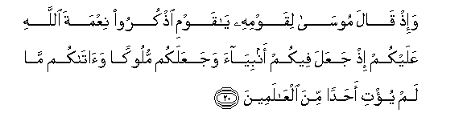
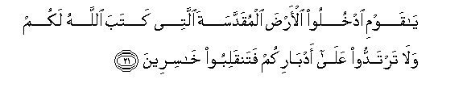

  
[Intangible Textual Heritage](../../index)  [Islam](../index) 
[Index](index)   
[Hypertext Qur'an](../htq/index)  [Unicode](../uq/005.htm#005_020) 
[Palmer](../sbe06/005)  [Pickthall](../pick/005.htm#005_020)  [Yusuf Ali
English](../yaq/yaq005)  [Rodwell](../qr/005)   
  
[Sūra V.: Māïda, or The Table Spread. Index](005)  
  [Previous](00503)  [Next](00505) 

------------------------------------------------------------------------

  
*The Holy Quran*, tr. by Yusuf Ali, \[1934\], at Intangible Textual
Heritage

------------------------------------------------------------------------

# Sūra V.: Māïda, or The Table Spread.

### Section 4

------------------------------------------------------------------------

20. Wa-i<u>th</u> q<u>a</u>la moos<u>a</u> liqawmihi y<u>a</u> qawmi
o<u>th</u>kuroo niAAmata All<u>a</u>hi AAalaykum i<u>th</u> jaAAala
feekum anbiy<u>a</u>a wajaAAalakum mulookan wa<u>a</u>t<u>a</u>kum
m<u>a</u> lam yu/ti a<u>h</u>adan mina alAA<u>a</u>lameen**a**

20\. 22 Remember Moses said  
To his people: "O my People!  
Call in remembrance the favour  
Of God unto you, when He  
Produced prophets among you,  
Made you kings, and gave  
You what He had not given  
To any other among the peoples.

------------------------------------------------------------------------

21. Y<u>a</u> qawmi odkhuloo al-ar<u>d</u>a almuqaddasata allatee kataba
All<u>a</u>hu lakum wal<u>a</u> tartaddoo AAal<u>a</u> adb<u>a</u>rikum
fatanqaliboo kh<u>a</u>sireen**a**

21\. 23 "O my people! enter  
The holy land which  
God hath assigned unto you,  
And turn not back  
Ignominiously, for then  
Will ye be overthrown,  
To your own ruin."

------------------------------------------------------------------------

22. Q<u>a</u>loo y<u>a</u> moos<u>a</u> inna feeh<u>a</u> qawman
jabb<u>a</u>reena wa-inn<u>a</u> lan nadkhulah<u>a</u>
<u>h</u>att<u>a</u> yakhrujoo minh<u>a</u> fa-in yakhrujoo minh<u>a</u>
fa-inn<u>a</u> d<u>a</u>khiloon**a**

22\. 24 They said: "O Moses!  
In this land are a people  
Of exceeding strength:  
Never shall we enter it  
Until they leave it:  
If (once) they leave,  
Then shall we enter."

------------------------------------------------------------------------

23. Q<u>a</u>la rajul<u>a</u>ni mina alla<u>th</u>eena yakh<u>a</u>foona
anAAama All<u>a</u>hu AAalayhim<u>a</u> odkhuloo AAalayhimu
alb<u>a</u>ba fa-i<u>tha</u> dakhaltumoohu fa-innakum gh<u>a</u>liboona
waAAal<u>a</u> All<u>a</u>hi fatawakkaloo in kuntum mu/mineen**a**

23\. 25 (But) among (their) God-fearing
men  
Were two on whom  
God had bestowed His grace:  
They said: "Assault them  
At the (proper) Gate:  
When once ye are in,  
Victory will be yours;  
26 But on God put your trust  
If ye have faith."

------------------------------------------------------------------------

24. Q<u>a</u>loo y<u>a</u> moos<u>a</u> inn<u>a</u> lan
nadkhulah<u>a</u> abadan m<u>a</u> d<u>a</u>moo feeh<u>a</u>
fa-i<u>th</u>hab anta warabbuka faq<u>a</u>til<u>a</u> inn<u>a</u>
h<u>a</u>hun<u>a</u> q<u>a</u>AAidoon**a**

24\. 27 They said: "O Moses!  
While they remain there,  
Never shall we be able  
To enter, to the end of time.  
Go thou, and thy Lord,  
And fight ye two,  
While we sit here"  
(And watch)."

------------------------------------------------------------------------

25. Q<u>a</u>la rabbi innee l<u>a</u> amliku ill<u>a</u> nafsee waakhee
fa**o**fruq baynan<u>a</u> wabayna alqawmi alf<u>a</u>siqeen**a**

25\. 28 He said: "O my Lord!  
I have power only  
Over myself and my brother:  
So separate us from this  
Rebellious people!"

------------------------------------------------------------------------

26. Q<u>a</u>la fa-innah<u>a</u> mu<u>h</u>arramatun AAalayhim
arbaAAeena sanatan yateehoona fee al-ar<u>d</u>i fal<u>a</u> ta/sa
AAal<u>a</u> alqawmi alf<u>a</u>siqeen**a**

26\. 29 God said: "Therefore  
Will the land be out  
Of their reach for forty years:  
In distraction will they  
Wander through the land:  
But sorrow thou not  
Over these rebellious people.

------------------------------------------------------------------------

[Next: Section 5 (27-34)](00505)

