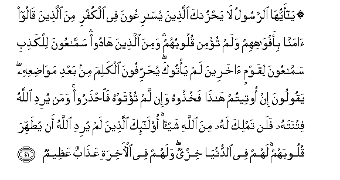

  
[Intangible Textual Heritage](../../index)  [Islam](../index) 
[Index](index)   
[Hypertext Qur'an](../htq/index)  [Unicode](../uq/005.htm#005_035) 
[Palmer](../sbe06/005)  [Pickthall](../pick/005.htm#005_035)  [Yusuf Ali
English](../yaq/yaq005)  [Rodwell](../qr/005)   
  
[Sūra V.: Māïda, or The Table Spread. Index](005)  
  [Previous](00505)  [Next](00507) 

------------------------------------------------------------------------

  
*The Holy Quran*, tr. by Yusuf Ali, \[1934\], at Intangible Textual
Heritage

------------------------------------------------------------------------

# Sūra V.: Māïda, or The Table Spread.

### Section 6

------------------------------------------------------------------------

35. Y<u>a</u> ayyuh<u>a</u> alla<u>th</u>eena <u>a</u>manoo ittaqoo
All<u>a</u>ha wa**i**btaghoo ilayhi alwaseelata waj<u>a</u>hidoo fee
sabeelihi laAAallakum tufli<u>h</u>oon**a**

35\. 38 O ye who believe!  
Do your duty to God,  
Seek the means  
Of approach unto Him,  
And strive with might  
And main in His cause:  
That ye may presper.

------------------------------------------------------------------------

36. Inna alla<u>th</u>eena kafaroo law anna lahum m<u>a</u> fee
al-ar<u>d</u>i jameeAAan wamithlahu maAAahu liyaftadoo bihi min
AAa<u>tha</u>bi yawmi alqiy<u>a</u>mati m<u>a</u> tuqubbila minhum
walahum AAa<u>tha</u>bun aleem**un**

36\. 39 As to those who reject  
Faith,—if they had  
Everything on earth,  
And twice repeated,  
To give as ransom  
For the penalty of the Day  
Of Judgment, it would  
Never be accepted of them.  
Theirs would be  
A grievous Penalty.

------------------------------------------------------------------------

37. Yureedoona an yakhrujoo mina a**l**nn<u>a</u>ri wam<u>a</u> hum
bikh<u>a</u>rijeena minh<u>a</u> walahum AAa<u>tha</u>bun muqeem**un**

37\. 40 Their wish will be  
To get out of the Fire,  
But never will they  
Get out therefrom:  
Their Penalty will be  
One that endures.

------------------------------------------------------------------------

38. Wa**al**ss<u>a</u>riqu wa**al**ss<u>a</u>riqatu
fa**i**q<u>t</u>aAAoo aydiyahum<u>a</u> jaz<u>a</u>an bim<u>a</u>
kasab<u>a</u> nak<u>a</u>lan mina All<u>a</u>hi wa**A**ll<u>a</u>hu
AAazeezun <u>h</u>akeem**un**

38\. 41 As to the thief,  
Male or female,  
Cut off his or her hands:  
A punishment by way  
Of example, from God,  
For their crime:  
And God is Exalted in Power.

------------------------------------------------------------------------

39. Faman t<u>a</u>ba min baAAdi *<u>th</u>*ulmihi
waa<u>s</u>la<u>h</u>a fa-inna All<u>a</u>ha yatoobu AAalayhi inna
All<u>a</u>ha ghafoorun ra<u>h</u>eem**un**

39\. 42 But if the thief repent  
After his crime,  
And amend his conduct,  
God turneth to him  
In forgiveness; for God  
Is Oft-forgiving, Most Merciful.

------------------------------------------------------------------------

40. Alam taAAlam anna All<u>a</u>ha lahu mulku
a**l**ssam<u>a</u>w<u>a</u>ti wa**a**l-ar<u>d</u>i yuAAa<u>thth</u>ibu
man yash<u>a</u>o wayaghfiru liman yash<u>a</u>o wa**A**ll<u>a</u>hu
AAal<u>a</u> kulli shay-in qadeer**un**

40\. 43 Knowest thou not  
That to God (alone)  
Belongeth the dominion  
Of the heavens and the earth?  
He punisheth whom He pleaseth,  
And He forgiveth whom He pleaseth:  
And God hath power  
Over all things.

------------------------------------------------------------------------

41. Y<u>a</u> ayyuh<u>a</u> a**l**rrasoolu l<u>a</u> ya<u>h</u>zunka
alla<u>th</u>eena yus<u>a</u>riAAoona fee alkufri mina alla<u>th</u>eena
q<u>a</u>loo <u>a</u>mann<u>a</u> bi-afw<u>a</u>hihim walam tu/min
quloobuhum wamina alla<u>th</u>eena h<u>a</u>doo samm<u>a</u>AAoona
lilka<u>th</u>ibi samm<u>a</u>AAoona liqawmin <u>a</u>khareena lam
ya/tooka yu<u>h</u>arrifoona alkalima min baAAdi maw<u>ad</u>iAAihi
yaqooloona in ooteetum h<u>atha</u> fakhu<u>th</u>oohu wa-in lam
tu/tawhu fa**i**<u>hth</u>aroo waman yuridi All<u>a</u>hu fitnatahu
falan tamlika lahu mina All<u>a</u>hi shay-an ol<u>a</u>-ika
alla<u>th</u>eena lam yuridi All<u>a</u>hu an yu<u>t</u>ahhira
quloobahum lahum fee a**l**dduny<u>a</u> khizyun walahum fee
al-<u>a</u>khirati AAa<u>tha</u>bun AAa*<u>th</u>*eem**un**

41\. 44 O Apostle! let not  
Those grieve thee, who race  
Each other into Unbelief:  
(Whether it be) among those  
Who say "We believe"  
With their lips but  
Whose hearts have no faith;  
Or it be among the Jews,—  
Men who will listen  
To any lie,—will listen  
Even to others who have  
Never so much as come  
To thee. They change the words  
From their (right) times  
And places; they say,  
"If ye are given this,  
Take it, but if not,  
Beware!" If any one's trial  
Is intended by God, thou hast  
No authority in the least  
For him against God.  
For such—it is not  
God's will to purify  
Their hearts. For them  
There is disgrace  
In this world, and  
In the Hereafter  
A heavy punishment.

------------------------------------------------------------------------

42. Samm<u>a</u>AAoona lilka<u>th</u>ibi akk<u>a</u>loona
li**l**ssu<u>h</u>ti fa-in j<u>a</u>ooka fa**o**<u>h</u>kum baynahum aw
aAAri<u>d</u> AAanhum wa-in tuAAri<u>d</u> AAanhum falan
ya<u>d</u>urrooka shay-an wa-in <u>h</u>akamta fa**o**<u>h</u>kum
baynahum bi**a**lqis<u>t</u>i inna All<u>a</u>ha yu<u>h</u>ibbu
almuqsi<u>t</u>een**a**

42\. 45 (They are fond of) listening  
To falsehood, of devouring  
Anything forbidden.  
If they do come to thee,  
Either judge between them,  
Or decline to interfere.  
If thou decline, they cannot  
Hurt thee in the least.  
If thou judge, judge  
In equity between them.  
For God loveth those  
Who judge in equity.

------------------------------------------------------------------------

43. Wakayfa yu<u>h</u>akkimoonaka waAAindahumu a**l**ttawr<u>a</u>tu
feeh<u>a</u> <u>h</u>ukmu All<u>a</u>hi thumma yatawallawna min baAAdi
<u>tha</u>lika wam<u>a</u> ol<u>a</u>-ika bi**a**lmu/mineen**a**

43\. 46 But why do they come  
To thee for decision,  
When they have (their own)  
Law before them?  
Therein is the (plain)  
Command of God; yet  
Even after that, they would  
Turn away. For they  
Are not (really)  
People of Faith.

------------------------------------------------------------------------

[Next: Section 7 (44-50)](00507)

