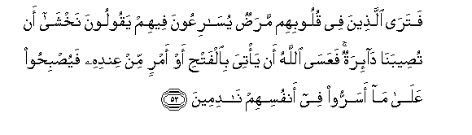
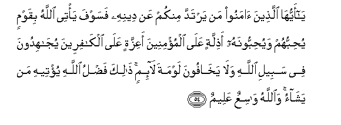

  
[Intangible Textual Heritage](../../index)  [Islam](../index) 
[Index](index)   
[Hypertext Qur'an](../htq/index)  [Unicode](../uq/005.htm#005_051) 
[Palmer](../sbe06/005)  [Pickthall](../pick/005.htm#005_051)  [Yusuf Ali
English](../yaq/yaq005)  [Rodwell](../qr/005)   
  
[Sūra V.: Māïda, or The Table Spread. Index](005)  
  [Previous](00507)  [Next](00509) 

------------------------------------------------------------------------

  
*The Holy Quran*, tr. by Yusuf Ali, \[1934\], at Intangible Textual
Heritage

------------------------------------------------------------------------

# Sūra V.: Māïda, or The Table Spread.

### Section 8

------------------------------------------------------------------------

51. Y<u>a</u> ayyuh<u>a</u> alla<u>th</u>eena <u>a</u>manoo l<u>a</u>
tattakhi<u>th</u>oo alyahooda wa**al**nna<u>sa</u>r<u>a</u>
awliy<u>a</u>a baAA<u>d</u>uhum awliy<u>a</u>o baAA<u>d</u>in waman
yatawallahum minkum fa-innahu minhum inna All<u>a</u>ha l<u>a</u> yahdee
alqawma a**l***<u>thth</u>*<u>a</u>limeen**a**

51\. 54 O ye who believe!  
Take not the Jews  
And the Christians  
For your friends and protectors:  
They are but friends and protectors)  
To each other. And he  
Amongst you that turns to them  
(For friendship) is of them.  
Verily God guideth not  
A people unjust.

------------------------------------------------------------------------

52. Fatar<u>a</u> alla<u>th</u>eena fee quloobihim mara<u>d</u>un
yus<u>a</u>riAAoona feehim yaqooloona nakhsh<u>a</u> an
tu<u>s</u>eeban<u>a</u> d<u>a</u>-iratun faAAas<u>a</u> All<u>a</u>hu an
ya/tiya bi**a**lfat<u>h</u>i aw amrin min AAindihi
fayu<u>s</u>bi<u>h</u>oo AAal<u>a</u> m<u>a</u> asarroo fee anfusihim
n<u>a</u>dimeen**a**

52\. 55 Those in whose hearts  
Is a disease—thou seest  
How eagerly they run about  
Amongst them, saying:  
"We do fear lest a change  
Of fortune bring us disaster."  
Ah! perhaps God will give  
(Thee) victory, or a decision  
According to His Will.  
Then will they repent  
Of the thoughts which they secretly  
Harboured in their hearts.

------------------------------------------------------------------------

53. Wayaqoolu alla<u>th</u>eena <u>a</u>manoo ah<u>a</u>ol<u>a</u>-i
alla<u>th</u>eena aqsamoo bi**A**ll<u>a</u>hi jahda aym<u>a</u>nihim
innahum lamaAAakum <u>h</u>abi<u>t</u>at aAAm<u>a</u>luhum
faa<u>s</u>ba<u>h</u>oo kh<u>a</u>sireen**a**

53\. 56 And those who believe  
Will say: "Are these  
The men who swore  
Their strongest oaths by God,  
That they were with you?"  
All that they do  
Will be in vain,  
And they will fall  
Into (nothing but) ruin.

------------------------------------------------------------------------

54. Y<u>a</u> ayyuh<u>a</u> alla<u>th</u>eena <u>a</u>manoo man yartadda
minkum AAan deenihi fasawfa ya/tee All<u>a</u>hu biqawmin
yu<u>h</u>ibbuhum wayu<u>h</u>ibboonahu a<u>th</u>illatin AAal<u>a</u>
almu/mineena aAAizzatin AAal<u>a</u> alk<u>a</u>fireena
yuj<u>a</u>hidoona fee sabeeli All<u>a</u>hi wal<u>a</u>
yakh<u>a</u>foona lawmata l<u>a</u>-imin <u>tha</u>lika fa<u>d</u>lu
All<u>a</u>hi yu/teehi man yash<u>a</u>o wa**A**ll<u>a</u>hu
w<u>a</u>siAAun AAaleem**un**

54\. 57 O ye who believe!  
If any from among you  
Turn back from his Faith,  
Soon will God produce  
A people whom He will love  
As they will love Him,—  
Lowly with the Believers,  
Mighty against the Rejecters,  
Fighting in the Way of God,  
And never afraid  
Of the reproaches  
Of such as find fault.  
That is the Grace of God,  
Which He will bestow  
On whom He pleaseth.  
And God encompasseth all,  
And He knoweth all things.

------------------------------------------------------------------------

55. Innam<u>a</u> waliyyukumu All<u>a</u>hu warasooluhu
wa**a**lla<u>th</u>eena <u>a</u>manoo alla<u>th</u>eena yuqeemoona
a**l**<u>ss</u>al<u>a</u>ta wayu/toona a**l**zzak<u>a</u>ta wahum
r<u>a</u>kiAAoon**a**

55\. 58 Your (real) friends are  
(No less than) God,  
His Apostle, and the (Fellowship  
Of) Believers,—those who  
Establish regular prayers  
And regular charity,  
And they bow  
Down humbly (in worship).

------------------------------------------------------------------------

56. Waman yatawalla All<u>a</u>ha warasoolahu wa**a**lla<u>th</u>eena
<u>a</u>manoo fa-inna <u>h</u>izba All<u>a</u>hi humu
algh<u>a</u>liboon**a**

56\. 59 As to those who turn  
(For friendship) to God,  
His Apostle, and the (Fellowship  
Of) Believers,—it is  
The Fellowship of God  
That must certainly triumph.

------------------------------------------------------------------------

[Next: Section 9 (57-66)](00509)

