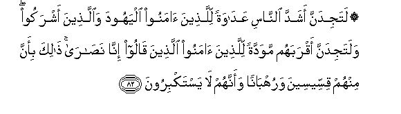

  
[Intangible Textual Heritage](../../index)  [Islam](../index) 
[Index](index)   
[Hypertext Qur'an](../htq/index)  [Unicode](../uq/005.htm#005_078) 
[Palmer](../sbe06/005)  [Pickthall](../pick/005.htm#005_078)  [Yusuf Ali
English](../yaq/yaq005)  [Rodwell](../qr/005)   
  
[Sūra V.: Māïda, or The Table Spread. Index](005)  
  [Previous](00510)  [Next](00512) 

------------------------------------------------------------------------

  
*The Holy Quran*, tr. by Yusuf Ali, \[1934\], at Intangible Textual
Heritage

------------------------------------------------------------------------

# Sūra V.: Māïda, or The Table Spread.

### Section 11

------------------------------------------------------------------------

78. LuAAina alla<u>th</u>eena kafaroo min banee isr<u>a</u>-eela
AAal<u>a</u> lis<u>a</u>ni d<u>a</u>wooda waAAees<u>a</u> ibni maryama
<u>tha</u>lika bim<u>a</u> AAa<u>s</u>aw wak<u>a</u>noo yaAAtadoon**a**

78\. 81 Curses were pronounced  
On those among the Children  
Of Israel who rejected Faith,  
By the tongue of David  
And of Jesus the son of Mary:  
Because they disobeyed  
And persisted in Excesses.

------------------------------------------------------------------------

79. K<u>a</u>noo l<u>a</u> yatan<u>a</u>hawna AAan munkarin faAAaloohu
labi/sa m<u>a</u> k<u>a</u>noo yafAAaloon**a**

79\. 82 Nor did they (usually)  
Forbid one another  
The iniquities which they  
Committed: evil indeed  
Were the deeds which they did.

------------------------------------------------------------------------

80. Tar<u>a</u> katheeran minhum yatawallawna alla<u>th</u>eena kafaroo
labi/sa m<u>a</u> qaddamat lahum anfusuhum an sakhi<u>t</u>a
All<u>a</u>hu AAalayhim wafee alAAa<u>tha</u>bi hum
kh<u>a</u>lidoon**a**

80\. 83 Thou seest many of them  
Turning in friendship  
To the Unbelievers.  
Evil indeed are (the works) which  
Their souls have sent forward  
Before them (with the result),  
That God's wrath  
Is on them,  
And in torment  
Will they abide.

------------------------------------------------------------------------

81. Walaw k<u>a</u>noo yu/minoona bi**A**ll<u>a</u>hi wa**al**nnabiyyi
wam<u>a</u> onzila ilayhi m<u>a</u> ittakha<u>th</u>oohum awliy<u>a</u>a
wal<u>a</u>kinna katheeran minhum f<u>a</u>siqoon**a**

81\. 84 If only they had believed  
In God, in the Apostle,  
And in what hath been  
Revealed to him, never  
Would they have taken  
Them for friends and protectors,  
But most of them are  
Rebellious wrong-doers.

------------------------------------------------------------------------

82. Latajidanna ashadda a**l**nn<u>a</u>si AAad<u>a</u>watan
lilla<u>th</u>eena <u>a</u>manoo alyahooda wa**a**lla<u>th</u>eena
ashrakoo walatajidanna aqrabahum mawaddatan lilla<u>th</u>eena
<u>a</u>manoo alla<u>th</u>eena q<u>a</u>loo inn<u>a</u>
na<u>sa</u>r<u>a</u> <u>tha</u>lika bi-anna minhum qisseeseena
waruhb<u>a</u>nan waannahum l<u>a</u> yastakbiroon**a**

82\. 85 Strongest among men in enmity  
To the Believers wilt thou  
Find the Jews and Pagans;  
And nearest among them in love  
To the Believers wilt thou  
Find those who say,  
"We are Christians":  
Because amongst these are  
Men devoted to learning  
And men who have renounced  
The world, and they  
Are not arrogant.

------------------------------------------------------------------------

83. Wa-i<u>tha</u> samiAAoo m<u>a</u> onzila il<u>a</u> a**l**rrasooli
tar<u>a</u> aAAyunahum tafee<u>d</u>u mina a**l**ddamAAi mimm<u>a</u>
AAarafoo mina al<u>h</u>aqqi yaqooloona rabban<u>a</u>
<u>a</u>mann<u>a</u> fa**o**ktubn<u>a</u> maAAa
a**l**shsh<u>a</u>hideen**a**

83\. 86 And when they listen  
To the revelation received  
By the Apostle, thou wilt  
See their eyes overflowing  
With tears, for they  
Recognise the truth:  
They pray: "Our Lord!  
We believe; write us  
Down among the witnesses.

------------------------------------------------------------------------

84. Wam<u>a</u> lan<u>a</u> l<u>a</u> nu/minu bi**A**ll<u>a</u>hi
wam<u>a</u> j<u>a</u>an<u>a</u> mina al<u>h</u>aqqi wana<u>t</u>maAAu an
yudkhilan<u>a</u> rabbun<u>a</u> maAAa alqawmi
a**l**<u>ssa</u>li<u>h</u>een**a**

84\. 87 "What cause can we have  
Not to believe in God  
And the truth which has  
Come to us, seeing that  
We long for our Lord  
To admit us to the company  
Of the righteous?"

------------------------------------------------------------------------

85. Faath<u>a</u>bahumu All<u>a</u>hu bim<u>a</u> q<u>a</u>loo
jann<u>a</u>tin tajree min ta<u>h</u>tih<u>a</u> al-anh<u>a</u>ru
kh<u>a</u>lideena feeh<u>a</u> wa<u>tha</u>lika jaz<u>a</u>o
almu<u>h</u>sineen**a**

85\. 88 And for this their prayer  
Hath God rewarded them  
With Gardens, with rivers  
Flowing underneath,—their eternal  
Home. Such is the recompense  
Of those who do good.

------------------------------------------------------------------------

86. Wa**a**lla<u>th</u>eena kafaroo waka<u>thth</u>aboo
bi-<u>a</u>y<u>a</u>tin<u>a</u> ol<u>a</u>-ika a<u>s</u>-<u>ha</u>bu
alja<u>h</u>eem**i**

86\. 89 But those who reject Faith  
And belie Our Signs,—  
They shall be Companions  
Of Hell-fire.

------------------------------------------------------------------------

[Next: Section 12 (87-93)](00512)

