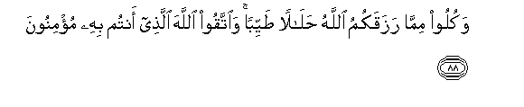

  
[Intangible Textual Heritage](../../index)  [Islam](../index.md) 
[Index](index.md)   
[Hypertext Qur'an](../htq/index)  [Unicode](../uq/005.htm#005_087.md) 
[Palmer](../sbe06/005)  [Pickthall](../pick/005.htm#005_087.md)  [Yusuf Ali
English](../yaq/yaq005)  [Rodwell](../qr/005.md)   
  
[Sūra V.: Māïda, or The Table Spread. Index](005.md)  
  [Previous](00511)  [Next](00513.md) 

------------------------------------------------------------------------

  
*The Holy Quran*, tr. by Yusuf Ali, \[1934\], at Intangible Textual
Heritage

------------------------------------------------------------------------

# Sūra V.: Māïda, or The Table Spread.

### Section 12

------------------------------------------------------------------------

87. Y<u>a</u> ayyuh<u>a</u> alla<u>th</u>eena <u>a</u>manoo l<u>a</u>
tu<u>h</u>arrimoo <u>t</u>ayyib<u>a</u>ti m<u>a</u> a<u>h</u>alla
All<u>a</u>hu lakum wal<u>a</u> taAAtadoo inna All<u>a</u>ha l<u>a</u>
yu<u>h</u>ibbu almuAAtadeen**a**

87\. 90 O ye who believe!  
Make not unlawful  
The good things which God  
Hath made lawful for you,  
But commit no excess:  
For God loveth not  
Those given to excess.

------------------------------------------------------------------------

88. Wakuloo mimm<u>a</u> razaqakumu All<u>a</u>hu <u>h</u>al<u>a</u>lan
<u>t</u>ayyiban wa**i**ttaqoo All<u>a</u>ha alla<u>th</u>ee antum bihi
mu/minoon**a**

88\. 91 Eat of the things which  
God hath provided for you,  
Lawful and good; but fear  
God, in Whom ye believe.

------------------------------------------------------------------------

89. L<u>a</u> yu-<u>a</u>khi<u>th</u>ukumu All<u>a</u>hu bi**a**llaghwi
fee aym<u>a</u>nikum wal<u>a</u>kin yu-<u>a</u>khi<u>th</u>ukum
bim<u>a</u> AAaqqadtumu al-aym<u>a</u>na fakaff<u>a</u>ratuhu
i<u>t</u>AA<u>a</u>mu AAasharati mas<u>a</u>keena min awsa<u>t</u>i
m<u>a</u> tu<u>t</u>AAimoona ahleekum aw kiswatuhum aw ta<u>h</u>reeru
raqabatin faman lam yajid fa<u>s</u>iy<u>a</u>mu thal<u>a</u>thati
ayy<u>a</u>min <u>tha</u>lika kaff<u>a</u>ratu aym<u>a</u>nikum
i<u>tha</u> <u>h</u>alaftum wa**i**<u>h</u>fa*<u>th</u>*oo
aym<u>a</u>nakum ka<u>tha</u>lika yubayyinu All<u>a</u>hu lakum
<u>a</u>y<u>a</u>tihi laAAallakum tashkuroon**a**

89\. 92 God will not call you  
To account for what is  
Futile in your oaths,  
But He will call you  
To account for your deliberate  
Oaths: for expiation, feed  
Ten indigent persons,  
On a scale of the average  
For the food of your families;  
Or clothe them; or give  
A slave his freedom.  
If that is beyond your means,  
Fast for three days.  
That is the expiation  
For the oaths ye have sworn.  
But keep to your oaths.  
Thus doth God make clear  
To you His Signs, that ye  
May be grateful.

------------------------------------------------------------------------

90. Y<u>a</u> ayyuh<u>a</u> alla<u>th</u>eena <u>a</u>manoo
innam<u>a</u> alkhamru wa**a**lmaysiru wa**a**l-an<u>sa</u>bu
wa**a**l-azl<u>a</u>mu rijsun min AAamali a**l**shshay<u>ta</u>ni
fa**i**jtaniboohu laAAallakum tufli<u>h</u>oon**a**

90\. 93 O ye who believe!  
Intoxicants and gambling,  
(Dedication of) stones,  
And (divination by) arrows,  
Are an abomination,—  
Of Satan's handiwork:  
Eschew such (abomination),  
That ye may prosper.

------------------------------------------------------------------------

91. Innam<u>a</u> yureedu a**l**shshay<u>ta</u>nu an yooqiAAa baynakumu
alAAad<u>a</u>wata wa**a**lbagh<u>da</u>a fee alkhamri wa**a**lmaysiri
waya<u>s</u>uddakum AAan <u>th</u>ikri All<u>a</u>hi waAAani
a**l**<u>ss</u>al<u>a</u>ti fahal antum muntahoon**a**

91\. 94 Satan's plan is (but)  
To excite enmity and hatred  
Between you, with intoxicants  
And gambling, and hinder you  
From the remembrance  
Of God, and from prayer:  
Will ye not then abstain?

------------------------------------------------------------------------

92. Waa<u>t</u>eeAAoo All<u>a</u>ha waa<u>t</u>eeAAoo a**l**rrasoola
wa**i**<u>hth</u>aroo fa-in tawallaytum fa**i**AAlamoo annam<u>a</u>
AAal<u>a</u> rasoolin<u>a</u> albal<u>a</u>ghu almubeen**u**

92\. 95 Obey God, and obey the Apostle,  
And beware (of evil):  
If ye do turn back,  
Know ye that it is  
Our Apostle's duty  
To proclaim (the Message)  
In the clearest manner.

------------------------------------------------------------------------

93. Laysa AAal<u>a</u> alla<u>th</u>eena <u>a</u>manoo waAAamiloo
a**l**<u>ssa</u>li<u>ha</u>ti jun<u>ah</u>un feem<u>a</u>
<u>t</u>aAAimoo i<u>tha</u> m<u>a</u> ittaqaw wa<u>a</u>manoo waAAamiloo
a**l**<u>ssa</u>li<u>ha</u>ti thumma ittaqaw wa<u>a</u>manoo thumma
ittaqaw waa<u>h</u>sanoo wa**A**ll<u>a</u>hu yu<u>h</u>ibbu
almu<u>h</u>sineen**a**

93\. 96 On those who believe  
And do deeds of righteousness  
There is no blame  
For what they ate (in the past),  
When they guard themselves  
From evil, and believe,  
And do deeds of righteousness,—  
(Or) again, guard themselves  
From evil and believe,—  
(Or) again, guard themselves  
From evil and do good.  
For God loveth those  
Who do good.

------------------------------------------------------------------------

[Next: Section 13 (94-100)](00513.md)

