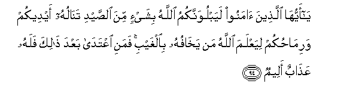
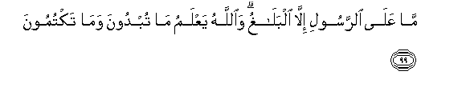
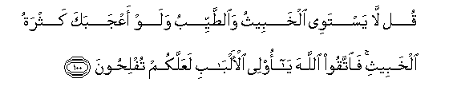

  
[Intangible Textual Heritage](../../index)  [Islam](../index.md) 
[Index](index.md)   
[Hypertext Qur'an](../htq/index)  [Unicode](../uq/005.htm#005_094.md) 
[Palmer](../sbe06/005)  [Pickthall](../pick/005.htm#005_094.md)  [Yusuf Ali
English](../yaq/yaq005)  [Rodwell](../qr/005.md)   
  
[Sūra V.: Māïda, or The Table Spread. Index](005.md)  
  [Previous](00512)  [Next](00514.md) 

------------------------------------------------------------------------

  
*The Holy Quran*, tr. by Yusuf Ali, \[1934\], at Intangible Textual
Heritage

------------------------------------------------------------------------

# Sūra V.: Māïda, or The Table Spread.

### Section 13

------------------------------------------------------------------------

94. Y<u>a</u> ayyuh<u>a</u> alla<u>th</u>eena <u>a</u>manoo
layabluwannakumu All<u>a</u>hu bishay-in mina a**l**<u>ss</u>aydi
tan<u>a</u>luhu aydeekum warim<u>ah</u>ukum liyaAAlama All<u>a</u>hu man
yakh<u>a</u>fuhu bi**a**lghaybi famani iAAtad<u>a</u> baAAda
<u>tha</u>lika falahu AAa<u>tha</u>bun aleem**un**

94\. 97 O ye who believe!  
God doth but make a trial of you  
In a little matter  
Of game well within reach  
Of your hands and your lances,  
That He may test  
Who feareth Him unseen:  
Any who transgress  
Thereafter, will have  
A grievous penalty.

------------------------------------------------------------------------

95. Y<u>a</u> ayyuh<u>a</u> alla<u>th</u>eena <u>a</u>manoo l<u>a</u>
taqtuloo a**l**<u>ss</u>ayda waantum <u>h</u>urumun waman qatalahu
minkum mutaAAammidan fajaz<u>a</u>on mithlu m<u>a</u> qatala mina
a**l**nnaAAami ya<u>h</u>kumu bihi <u>th</u>aw<u>a</u> AAadlin minkum
hadyan b<u>a</u>ligha alkaAAbati aw kaff<u>a</u>ratun
<u>t</u>aAA<u>a</u>mu mas<u>a</u>keena aw AAadlu <u>tha</u>lika
<u>s</u>iy<u>a</u>man liya<u>th</u>ooqa wab<u>a</u>la amrihi
AAaf<u>a</u> All<u>a</u>hu AAamm<u>a</u> salafa waman AA<u>a</u>da
fayantaqimu All<u>a</u>hu minhu wa**A**ll<u>a</u>hu AAazeezun
<u>th</u>oo intiq<u>a</u>m**in**

95\. 98 O ye who believe!  
Kill not game  
While in the Sacred  
Precincts or in pilgrim garb.  
If any of you doth so  
Intentionally, the compensation  
Is an offering, brought  
To the Ka’ba, of a domestic animal  
Equivalent to the one he killed,  
As adjudged by two just men  
Among you; or by way  
Of atonement, the feeding  
Of the indigent; or its  
Equivalent in fasts: that he  
May taste of the penalty  
Of his deed. God  
Forgives what is past:  
For repetition God will  
Exact from him the penalty.  
For God is Exalted,  
And Lord of Retribution.

------------------------------------------------------------------------

96. O<u>h</u>illa lakum <u>s</u>aydu alba<u>h</u>ri
wa<u>t</u>aAA<u>a</u>muhu mat<u>a</u>AAan lakum
wali**l**ssayy<u>a</u>rati wa<u>h</u>urrima AAalaykum <u>s</u>aydu
albarri m<u>a</u> dumtum <u>h</u>uruman wa**i**ttaqoo All<u>a</u>ha
alla<u>th</u>ee ilayhi tu<u>h</u>sharoon**a**

96\. 99 Lawful to you is the pursuit  
Of water-game and its use  
For food,—for the benefit  
Of yourselves and those who  
Travel; but forbidden  
Is the pursuit of land-game;—  
As long as ye are  
In the Sacred Precincts  
Or in pilgrim garb.  
And fear God, to Whom  
Ye shall be gathered back.

------------------------------------------------------------------------

97. JaAAala All<u>a</u>hu alkaAAbata albayta al<u>h</u>ar<u>a</u>ma
qiy<u>a</u>man li**l**nn<u>a</u>si wa**al**shshahra
al<u>h</u>ar<u>a</u>ma wa**a**lhadya wa**a**lqal<u>a</u>-ida
<u>tha</u>lika litaAAlamoo anna All<u>a</u>ha yaAAlamu m<u>a</u> fee
a**l**ssam<u>a</u>w<u>a</u>ti wam<u>a</u> fee al-ar<u>d</u>i waanna
All<u>a</u>ha bikulli shay-in AAaleem**un**

97\. 100 God made the Ka’ba,  
The Sacred House, an asylum  
Of security for men, as  
Also the Sacred Months,  
The animals for offerings,  
And the garlands that mark them:  
That ye may know  
That God hath knowledge  
Of what is in the heavens  
And on earth and that God  
Is well acquainted  
With all things.

------------------------------------------------------------------------

98. IAAlamoo anna All<u>a</u>ha shadeedu alAAiq<u>a</u>bi waanna
All<u>a</u>ha ghafoorun ra<u>h</u>eem**un**

98\. 101 Know ye that God  
Is strict in punishment  
And that God is  
Oft-forgiving, Most Merciful.

------------------------------------------------------------------------

99. M<u>a</u> AAal<u>a</u> a**l**rrasooli ill<u>a</u> albal<u>a</u>ghu
wa**A**ll<u>a</u>hu yaAAlamu m<u>a</u> tubdoona wam<u>a</u>
taktumoon**a**

99\. 102 The Apostle's duty is  
But to proclaim (the Message).  
But God knoweth all  
That ye reveal and ye conceal.

------------------------------------------------------------------------

100. Qul l<u>a</u> yastawee alkhabeethu wa**al**<u>tt</u>ayyibu walaw
aAAjabaka kathratu alkhabeethi fa**i**ttaqoo All<u>a</u>ha y<u>a</u>
olee al-alb<u>a</u>bi laAAallakum tufli<u>h</u>oon**a**

100\. 103 Say: "Not equal are things  
That are bad and things  
That are good, even though  
The abundance of the bad  
May dazzle thee;  
So fear God, O ye  
That understand;  
That (so) ye may prosper."

------------------------------------------------------------------------

[Next: Section 14 (101-108)](00514.md)

