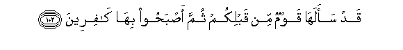
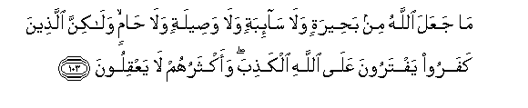
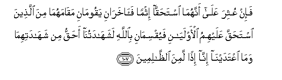

  
[Intangible Textual Heritage](../../index)  [Islam](../index.md) 
[Index](index.md)   
[Hypertext Qur'an](../htq/index)  [Unicode](../uq/005.htm#005_101.md) 
[Palmer](../sbe06/005)  [Pickthall](../pick/005.htm#005_101.md)  [Yusuf Ali
English](../yaq/yaq005)  [Rodwell](../qr/005.md)   
  
[Sūra V.: Māïda, or The Table Spread. Index](005.md)  
  [Previous](00513)  [Next](00515.md) 

------------------------------------------------------------------------

  
*The Holy Quran*, tr. by Yusuf Ali, \[1934\], at Intangible Textual
Heritage

------------------------------------------------------------------------

# Sūra V.: Māïda, or The Table Spread.

### Section 14

------------------------------------------------------------------------

101. Y<u>a</u> ayyuh<u>a</u> alla<u>th</u>eena <u>a</u>manoo l<u>a</u>
tas-aloo AAan ashy<u>a</u>a in tubda lakum tasu/kum wa-in tas-aloo
AAanh<u>a</u> <u>h</u>eena yunazzalu alqur-<u>a</u>nu tubda lakum
AAaf<u>a</u> All<u>a</u>hu AAanh<u>a</u> wa**A**ll<u>a</u>hu ghafoorun
<u>h</u>aleem**un**

101\. 104 O ye who believe!  
Ask not questions  
About things which,  
If made plain to you,  
May cause you trouble.  
But if ye ask about things  
When the Qur-ān is being  
Revealed, they will be  
Made plain to you,  
God will forgive those:  
For God is Oft-forgiving,  
Most Forbearing.

------------------------------------------------------------------------

102. Qad saalah<u>a</u> qawmun min qablikum thumma a<u>s</u>ba<u>h</u>oo
bih<u>a</u> k<u>a</u>fireen**a**

102\. 105 Some people before you  
Did ask such questions,  
And on that account  
Lost their faith.

------------------------------------------------------------------------

103. M<u>a</u> jaAAala All<u>a</u>hu min ba<u>h</u>eeratin wal<u>a</u>
s<u>a</u>-ibatin wal<u>a</u> wa<u>s</u>eelatin wal<u>a</u> <u>ha</u>min
wal<u>a</u>kinna alla<u>th</u>eena kafaroo yaftaroona AAal<u>a</u>
All<u>a</u>hi alka<u>th</u>iba waaktharuhum l<u>a</u> yaAAqiloon**a**

103\. 106 It was not God  
Who instituted (superstitions  
Like those of) a slit-ear  
She-camel, or a she-camel  
Let loose for free pasture,  
Or idol sacrifices for  
Twin-births in animals,  
Or stallion-camels  
Freed from work  
It is blasphemers  
Who Invent a lie  
Against God; but most  
Of them lack wisdom.

------------------------------------------------------------------------

104. Wa-i<u>tha</u> qeela lahum taAA<u>a</u>law il<u>a</u> m<u>a</u>
anzala All<u>a</u>hu wa-il<u>a</u> a**l**rrasooli q<u>a</u>loo
<u>h</u>asbun<u>a</u> m<u>a</u> wajadn<u>a</u> AAalayhi
<u>a</u>b<u>a</u>an<u>a</u> awa law k<u>a</u>na <u>a</u>b<u>a</u>ohum
l<u>a</u> yaAAlamoona shay-an wal<u>a</u> yahtadoon**a**

104\. 107 When it is said to them:  
"Come to what God  
Hath revealed; come  
To the Apostle":  
They say: "Enough for us  
Are the ways we found  
Our fathers following."  
What! even though their fathers  
Were void of knowledge  
And guidance?

------------------------------------------------------------------------

105. Y<u>a</u> ayyuh<u>a</u> alla<u>th</u>eena <u>a</u>manoo AAalaykum
anfusakum l<u>a</u> ya<u>d</u>urrukum man <u>d</u>alla i<u>th</u>a
ihtadaytum il<u>a</u> All<u>a</u>hi marjiAAukum jameeAAan fayunabbi-okum
bim<u>a</u> kuntum taAAmaloon**a**

105\. 108 O ye who believe!  
Guard your own souls:  
If ye follow (right) guidance,  
No hurt can come to you  
From those who stray.  
The goal of you all  
Is to God: it is He  
That will show you  
The truth of all  
That ye do.

------------------------------------------------------------------------

106. Y<u>a</u> ayyuh<u>a</u> alla<u>th</u>eena <u>a</u>manoo
shah<u>a</u>datu baynikum i<u>tha</u> <u>h</u>a<u>d</u>ara
a<u>h</u>adakumu almawtu <u>h</u>eena alwa<u>s</u>iyyati ithn<u>a</u>ni
<u>th</u>aw<u>a</u> AAadlin minkum aw <u>a</u>khar<u>a</u>ni min
ghayrikum in antum <u>d</u>arabtum fee al-ar<u>d</u>i faa<u>sa</u>batkum
mu<u>s</u>eebatu almawti ta<u>h</u>bisoonahum<u>a</u> min baAAdi
a**l**<u>ss</u>al<u>a</u>ti fayuqsim<u>a</u>ni bi**A**ll<u>a</u>hi ini
irtabtum l<u>a</u> nashtaree bihi thamanan walaw k<u>a</u>na <u>tha</u>
qurb<u>a</u> wal<u>a</u> naktumu shah<u>a</u>data All<u>a</u>hi
inn<u>a</u> i<u>th</u>an lamina al-<u>a</u>thimeen**a**

106\. 109 O ye who believe!  
When death approaches  
Any of you, (take) witnesses  
Among yourselves when making  
Bequests,—two just men  
Of your own (brotherhood)  
Or others from outside  
If ye are journeying  
Through the earth,  
And the chance of death  
Befalls you (thus).  
If ye doubt (their truth),  
Detain them both  
After prayer, and let them both  
Swear by God:  
"We wish not in this  
For any worldly gain,  
Even though the (beneficiary)  
Be our near relation:  
We shall hide not  
The evidence before God:  
If we do, then behold!  
The sin be upon us!"

------------------------------------------------------------------------

107. Fa-in AAuthira AAal<u>a</u> annahum<u>a</u> ista<u>h</u>aqq<u>a</u>
ithman fa<u>a</u>khara<u>n</u>i yaqoom<u>a</u>ni
maq<u>a</u>mahum<u>a</u> mina alla<u>th</u>eena ista<u>h</u>aqqa
AAalayhimu al-awlay<u>a</u>ni fayuqsim<u>a</u>ni bi**A**ll<u>a</u>hi
lashah<u>a</u>datun<u>a</u> a<u>h</u>aqqu min
shah<u>a</u>datihim<u>a</u> wam<u>a</u> iAAtadayn<u>a</u> inn<u>a</u>
i<u>th</u>an lamina a**l***<u>thth</u>*<u>a</u>limeen**a**

107\. 110 But if it gets known  
That these two were guilty  
Of the sin (of perjury),  
Let two others stand forth  
In their places,—nearest  
In kin from among those  
Who claim a lawful right:  
Let them swear by God:  
"We affirm that our witness  
Is truer than that  
Of those two, and that we  
Have not trespassed (beyond  
The truth): if we did,  
Behold! the wrong be  
Upon us!"

------------------------------------------------------------------------

108. <u>Tha</u>lika adn<u>a</u> an ya/too bi**al**shshah<u>a</u>dati
AAal<u>a</u> wajhih<u>a</u> aw yakh<u>a</u>foo an turadda aym<u>a</u>nun
baAAda aym<u>a</u>nihim wa**i**ttaqoo All<u>a</u>ha wa**i**smaAAoo
wa**A**ll<u>a</u>hu l<u>a</u> yahdee alqawma alf<u>a</u>siqeen**a**

108\. 111 That is most suitable:  
That they may give the evidence  
In its true nature and shape,  
Or else they would fear  
That other oaths would be  
Taken after their oaths.  
Hut fear God, and listen  
(To His counsel): for God  
Guideth not a rebellious people:

------------------------------------------------------------------------

[Next: Section 15 (109-115)](00515.md)

