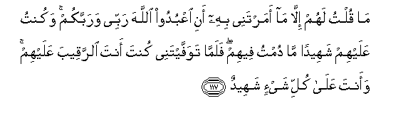

  
[Intangible Textual Heritage](../../index)  [Islam](../index) 
[Index](index)   
[Hypertext Qur'an](../htq/index)  [Unicode](../uq/005.htm#005_116) 
[Palmer](../sbe06/005)  [Pickthall](../pick/005.htm#005_116)  [Yusuf Ali
English](../yaq/yaq005)  [Rodwell](../qr/005)   
  
[Sūra V.: Māïda, or The Table Spread. Index](005)  
  [Previous](00515)  [Next](00601) 

------------------------------------------------------------------------

  
*The Holy Quran*, tr. by Yusuf Ali, \[1934\], at Intangible Textual
Heritage

------------------------------------------------------------------------

# Sūra V.: Māïda, or The Table Spread.

### Section 16

------------------------------------------------------------------------

116. Wa-i<u>th</u> q<u>a</u>la All<u>a</u>hu y<u>a</u> AAees<u>a</u>
ibna maryama aanta qulta li**l**nn<u>a</u>si ittakhi<u>th</u>oonee
waommiya il<u>a</u>hayni min dooni All<u>a</u>hi q<u>a</u>la
sub<u>ha</u>naka m<u>a</u> yakoonu lee an aqoola m<u>a</u> laysa lee
bi<u>h</u>aqqin in kuntu qultuhu faqad AAalimtahu taAAlamu m<u>a</u> fee
nafsee wal<u>a</u> aAAlamu m<u>a</u> fee nafsika innaka anta
AAall<u>a</u>mu alghuyoob**i**

116\. 119 And behold! God will say:  
"O Jesus the son of Mary!  
Didst thou say unto men,  
Worship me and my mother  
As gods in derogation of God'?"  
He will say: "Glory to Thee!  
Never could I say  
What I had no right  
(To say). Had I said  
Such a thing, Thou wouldst  
Indeed have known it.  
Thou knowest what is  
In my heart, though I  
Know not what is  
In Thine. For Thou  
Knowest in full  
All that is hidden.

------------------------------------------------------------------------

117. M<u>a</u> qultu lahum ill<u>a</u> m<u>a</u> amartanee bihi ani
oAAbudoo All<u>a</u>ha rabbee warabbakum wakuntu AAalayhim shaheedan
m<u>a</u> dumtu feehim falamm<u>a</u> tawaffaytanee kunta anta
a**l**rraqeeba AAalayhim waanta AAal<u>a</u> kulli shay-in shaheed**un**

117\. 120 "Never said I to them  
Aught except what Thou  
Didst command me  
To say, to wit, 'Worship  
God, my Lord and your Lord';  
And I was a witness  
Over them whilst I dwelt  
Amongst them; when thou  
Didst take me up  
Thou wast the Watcher  
Over them, and Thou  
Art a witness to all things.

------------------------------------------------------------------------

118. In tuAAa<u>thth</u>ibhum fa-innahum AAib<u>a</u>duka wa-in taghfir
lahum fa-innaka anta alAAazeezu al<u>h</u>akeem**u**

118\. 121 "If Thou dost punish them,  
They are Thy servants:  
If Thou dost forgive them,  
Thou art the Exalted in power,  
The Wise."

------------------------------------------------------------------------

119. Q<u>a</u>la All<u>a</u>hu h<u>atha</u> yawmu yanfaAAu
a**l**<u>ssa</u>diqeena <u>s</u>idquhum lahum jann<u>a</u>tun tajree min
ta<u>h</u>tih<u>a</u> al-anh<u>a</u>ru kh<u>a</u>lideena feeh<u>a</u>
abadan ra<u>d</u>iya All<u>a</u>hu AAanhum wara<u>d</u>oo AAanhu
<u>tha</u>lika alfawzu alAAa*<u>th</u>*eem**u**

119\. 122 God will say: "This is  
A day on which  
The truthful will profit  
From their truth: theirs  
Are Gardens, with rivers  
Flowing beneath,—their eternal  
Home: God well-pleased  
With them, and they with God:  
That is the great Salvation,  
(The fulfilment of all desires).

------------------------------------------------------------------------

120. Lill<u>a</u>hi mulku a**l**ssam<u>a</u>w<u>a</u>ti
wa**a**l-ar<u>d</u>i wam<u>a</u> feehinna wahuwa AAal<u>a</u> kulli
shay-in qadeer**un**

120\. 123 To God doth belong the
dominion  
Of the heavens and the earth,  
And all that is therein,  
And it is He who hath power  
Over all things.

------------------------------------------------------------------------

[Next: Section 1 (1-10)](00601)

