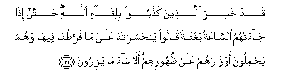
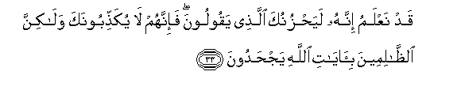
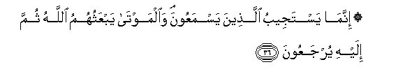
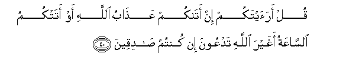

  
[Intangible Textual Heritage](../../index)  [Islam](../index.md) 
[Index](index.md)   
[Hypertext Qur'an](../htq/index)  [Unicode](../uq/006.htm#006_031.md) 
[Palmer](../sbe06/006)  [Pickthall](../pick/006.htm#006_031.md)  [Yusuf Ali
English](../yaq/yaq006)  [Rodwell](../qr/006.md)   
  
[Sūra VI.: An’ām, or Cattle. Index](006.md)  
  [Previous](00603)  [Next](00605.md) 

------------------------------------------------------------------------

  
*The Holy Quran*, tr. by Yusuf Ali, \[1934\], at Intangible Textual
Heritage

------------------------------------------------------------------------

# Sūra VI.: An’ām, or Cattle.

### Section 4

------------------------------------------------------------------------

31. Qad khasira alla<u>th</u>eena ka<u>thth</u>aboo biliq<u>a</u>-i
All<u>a</u>hi <u>h</u>att<u>a</u> i<u>tha</u> j<u>a</u>at-humu
a**l**ss<u>a</u>AAatu baghtatan q<u>a</u>loo y<u>a</u>
<u>h</u>asratan<u>a</u> AAal<u>a</u> m<u>a</u> farra<u>t</u>n<u>a</u>
feeh<u>a</u> wahum ya<u>h</u>miloona awz<u>a</u>rahum AAal<u>a</u>
*<u>th</u>*uhoorihim al<u>a</u> s<u>a</u>a m<u>a</u> yaziroon**a**

31\. Lost indeed are they  
Who treat it as a falsehood  
That they must meet God,  
Until on a sudden  
The hour is on them,  
And they say: "Ah! woe  
Unto us that we took  
No thought of it";  
For they bear their burdens  
On their backs,  
And evil indeed are  
The burdens that they bear?

------------------------------------------------------------------------

32. Wam<u>a</u> al<u>h</u>ay<u>a</u>tu a**l**dduny<u>a</u> ill<u>a</u>
laAAibun walahwun wala**l**dd<u>a</u>ru al-<u>a</u>khirati khayrun
lilla<u>th</u>eena yattaqoona afal<u>a</u> taAAqiloon**a**

32\. What is the life of this world  
But play and amusement? ess  
But best is the Home  
In the Hereafter, for those  
Who are righteous.  
Will ye not then understand?

------------------------------------------------------------------------

33. Qad naAAlamu innahu laya<u>h</u>zunuka alla<u>th</u>ee yaqooloona
fa-innahum l<u>a</u> yuka<u>thth</u>iboonaka wal<u>a</u>kinna
a**l***<u>thth</u>*<u>a</u>limeena bi-<u>a</u>y<u>a</u>ti All<u>a</u>hi
yaj<u>h</u>adoon**a**

33\. We know indeed the grief  
Which their words do cause thee:  
It is not thee they reject:  
It is the Signs of God,  
Which the wicked contemn.

------------------------------------------------------------------------

34. Walaqad ku<u>thth</u>ibat rusulun min qablika fa<u>s</u>abaroo
AAal<u>a</u> m<u>a</u> ku<u>thth</u>iboo waoo<u>th</u>oo
<u>h</u>att<u>a</u> at<u>a</u>hum na<u>s</u>run<u>a</u> wal<u>a</u>
mubaddila likalim<u>a</u>ti All<u>a</u>hi walaqad j<u>a</u>aka min
naba-i almursaleen**a**

34\. Rejected were the Apostles  
Before thee: with patience  
And constancy they bore  
Their rejection and their wrongs,  
Until Our aid did reach  
Them: there is none  
That can alter the Words  
(And Decrees) of God.  
Already hast thou received  
Some account of those Apostles.

------------------------------------------------------------------------

35. Wa-in k<u>a</u>na kabura AAalayka iAAr<u>ad</u>uhum fa-ini
ista<u>t</u>aAAta an tabtaghiya nafaqan fee al-ar<u>d</u>i aw sullaman
fee a**l**ssam<u>a</u>-i fata/tiyahum bi-<u>a</u>yatin walaw sh<u>a</u>a
All<u>a</u>hu lajamaAAahum AAal<u>a</u> alhud<u>a</u> fal<u>a</u>
takoonanna mina alj<u>a</u>hileen**a**

35\. If their spurning is hard  
On thy mind, yet if  
Thou wert able to seek  
A tunnel in the ground  
Or a ladder to the skies  
And bring them a Sign,—  
(What good?). If it were  
God's Will, He could  
Gather them together  
Unto true guidance:  
So be not thou  
Amongst those who are swayed  
By ignorance (and impatience)!

------------------------------------------------------------------------

36. Innam<u>a</u> yastajeebu alla<u>th</u>eena yasmaAAoona
wa**a**lmawt<u>a</u> yabAAathuhumu All<u>a</u>hu thumma ilayhi
yurjaAAoon**a**

36\. Those who listen (in truth),  
Be sure, will accept:  
As to the dead, God will  
Raise them up; then will they  
Be turned unto Him.

------------------------------------------------------------------------

37. Waq<u>a</u>loo lawl<u>a</u> nuzzila AAalayhi <u>a</u>yatun min
rabbihi qul inna All<u>a</u>ha q<u>a</u>dirun AAal<u>a</u> an yunazzila
<u>a</u>yatan wal<u>a</u>kinna aktharahum l<u>a</u> yaAAlamoon**a**

37\. Whey say: "Why is not  
A Sign sent down  
To him from his Lord?"  
Say: "God hath certainly  
Power to send down a Sign:  
But most of them  
Understand not."

------------------------------------------------------------------------

38. Wam<u>a</u> min d<u>a</u>bbatin fee al-ar<u>d</u>i wal<u>a</u>
<u>ta</u>-irin ya<u>t</u>eeru bijan<u>ah</u>ayhi ill<u>a</u> omamun
amth<u>a</u>lukum m<u>a</u> farra<u>t</u>n<u>a</u> fee alkit<u>a</u>bi
min shay-in thumma il<u>a</u> rabbihim yu<u>h</u>sharoon**a**

38\. There is not an animal  
(That lives) on the earth,  
Nor a being that flies  
On its wings, but (forms  
Part of) communities like you.  
Nothing have we omitted  
From the Book, and they (all)  
Shall be gathered to their Lord  
In the end.

------------------------------------------------------------------------

39. Wa**a**lla<u>th</u>eena ka<u>thth</u>aboo
bi-<u>a</u>y<u>a</u>tin<u>a</u> <u>s</u>ummun wabukmun fee
a**l***<u>thth</u>*ulum<u>a</u>ti man yasha-i All<u>a</u>hu
yu<u>d</u>lilhu waman yasha/ yajAAalhu AAal<u>a</u>
<u>s</u>ir<u>at</u>in mustaqeem**in**

39\. Those who reject our Signs  
Are deaf and dumb,—  
In the midst of darkness  
Profound: whom God willeth,  
He leaveth to wander:  
Whom He willeth, He placeth  
On the Way that is Straight.

------------------------------------------------------------------------

40. Qul araaytakum in at<u>a</u>kum AAa<u>tha</u>bu All<u>a</u>hi aw
atatkumu a**l**ss<u>a</u>AAatu aghayra All<u>a</u>hi tadAAoona in kuntum
<u>sa</u>diqeen**a**

40\. Say: "Think ye to yourselves,  
If there come upon you  
The Wrath of God,  
Or the Hour (that ye dread),  
Would ye then call upon  
Other than God?—  
(Reply) if ye are truthful!

------------------------------------------------------------------------

41. Bal iyy<u>a</u>hu tadAAoona fayakshifu m<u>a</u> tadAAoona ilayhi in
sh<u>a</u>a watansawna m<u>a</u> tushrikoon**a**

41\. "Nay,—On Him would ye  
Call, and if it be  
His Will, He would remove  
(The distress) which occasioned  
Your call upon Him,  
And ye would forget  
(The false gods) which ye  
Join with Him!"

------------------------------------------------------------------------

[Next: Section 5 (42-50)](00605.md)

