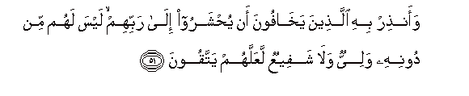
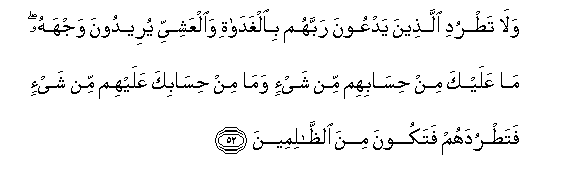
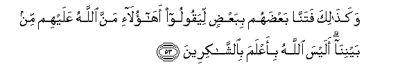
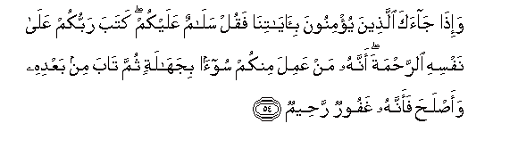

  
[Intangible Textual Heritage](../../index)  [Islam](../index.md) 
[Index](index.md)   
[Hypertext Qur'an](../htq/index)  [Unicode](../uq/006.htm#006_051.md) 
[Palmer](../sbe06/006)  [Pickthall](../pick/006.htm#006_051.md)  [Yusuf Ali
English](../yaq/yaq006)  [Rodwell](../qr/006.md)   
  
[Sūra VI.: An’ām, or Cattle. Index](006.md)  
  [Previous](00605)  [Next](00607.md) 

------------------------------------------------------------------------

  
*The Holy Quran*, tr. by Yusuf Ali, \[1934\], at Intangible Textual
Heritage

------------------------------------------------------------------------

# Sūra VI.: An’ām, or Cattle.

### Section 6

------------------------------------------------------------------------

51. Waan<u>th</u>ir bihi alla<u>th</u>eena yakh<u>a</u>foona an
yu<u>h</u>sharoo il<u>a</u> rabbihim laysa lahum min doonihi waliyyun
wal<u>a</u> shafeeAAun laAAallahum yattaqoon**a**

51\. Give this warning to those  
In whose (hearts) is the fear  
That they will be brought  
(To Judgment) before their Lord:  
Except for Him  
They will have no protector  
Nor intercessor:  
That they may guard  
(Against evil).

------------------------------------------------------------------------

52. Wal<u>a</u> ta<u>t</u>rudi alla<u>th</u>eena yadAAoona rabbahum
bi**a**lghad<u>a</u>ti wa**a**lAAashiyyi yureedoona wajhahu m<u>a</u>
AAalayka min <u>h</u>is<u>a</u>bihim min shay-in wam<u>a</u> min
<u>h</u>is<u>a</u>bika AAalayhim min shay-in fata<u>t</u>rudahum
fatakoona mina a**l***<u>thth</u>*<u>a</u>limeen**a**

52\. Send not away those  
Who call on their Lord  
Morning and evening,  
Seeking His Face.  
In naught art thou accountable  
For them, and in naught are they  
Accountable for thee,  
That thou shouldst turn  
Them away, and thus be  
(One) of the unjust.

------------------------------------------------------------------------

53. Waka<u>tha</u>lika fatann<u>a</u> baAA<u>d</u>ahum bibaAA<u>d</u>in
liyaqooloo ah<u>a</u>ol<u>a</u>-i manna All<u>a</u>hu AAalayhim min
baynin<u>a</u> alaysa All<u>a</u>hu bi-aAAlama
bi**al**shsh<u>a</u>kireen**a**

53\. Thus did We try  
Some of them by comparison  
With others, that they  
Should say:"Is it these  
Then that God hath  
Favoured from amongst us?"  
Doth not God know best  
Those who are grateful?

------------------------------------------------------------------------

54. Wa-i<u>tha</u> j<u>a</u>aka alla<u>th</u>eena yu/minoona
bi-<u>a</u>y<u>a</u>tin<u>a</u> faqul sal<u>a</u>mun AAalaykum kataba
rabbukum AAal<u>a</u> nafsihi a**l**rra<u>h</u>mata annahu man AAamila
minkum soo-an bijah<u>a</u>latin thumma t<u>a</u>ba min baAAdihi
waa<u>s</u>la<u>h</u>a faannahu ghafoorun ra<u>h</u>eem**un**

54\. When those come to thee  
Who believe in Our Signs,  
Say: "Peace be on you:  
Your Lord hath inscribed  
For Himself (the rule  
Of) Mercy: verily,  
If any of you did evil  
In ignorance, and thereafter  
Repented, and amended  
(His conduct), lo! He is  
Oft-forgiving, Most Merciful.

------------------------------------------------------------------------

55. Waka<u>tha</u>lika nufa<u>ss</u>ilu al-<u>a</u>y<u>a</u>ti
walitastabeena sabeelu almujrimeen**a**

55\. Thus do We explain  
The Signs in detail:  
That the way of the sinners  
May be shown up.

------------------------------------------------------------------------

[Next: Section 7 (56-60)](00607.md)

