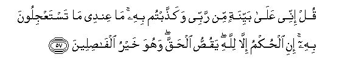
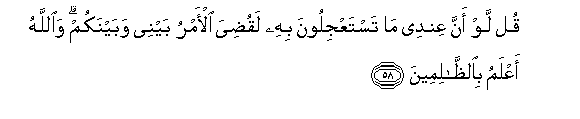

  
[Intangible Textual Heritage](../../index)  [Islam](../index.md) 
[Index](index.md)   
[Hypertext Qur'an](../htq/index)  [Unicode](../uq/006.htm#006_056.md) 
[Palmer](../sbe06/006)  [Pickthall](../pick/006.htm#006_056.md)  [Yusuf Ali
English](../yaq/yaq006)  [Rodwell](../qr/006.md)   
  
[Sūra VI.: An’ām, or Cattle. Index](006.md)  
  [Previous](00606)  [Next](00608.md) 

------------------------------------------------------------------------

  
*The Holy Quran*, tr. by Yusuf Ali, \[1934\], at Intangible Textual
Heritage

------------------------------------------------------------------------

# Sūra VI.: An’ām, or Cattle.

### Section 7

------------------------------------------------------------------------

56. Qul innee nuheetu an aAAbuda alla<u>th</u>eena tadAAoona min dooni
All<u>a</u>hi qul l<u>a</u> attabiAAu ahw<u>a</u>akum qad <u>d</u>alaltu
i<u>th</u>an wam<u>a</u> an<u>a</u> mina almuhtadeen**a**

56\. Say: "I am forbidden  
To worship those—others  
Than God—whom ye  
Call upon." Say: "I will  
Not follow your vain desires:  
If I did, I would stray  
From the path, and be not  
Of the company of those  
Who receive guidance."

------------------------------------------------------------------------

57. Qul innee AAal<u>a</u> bayyinatin min rabbee waka<u>thth</u>abtum
bihi m<u>a</u> AAindee m<u>a</u> tastaAAjiloona bihi ini al<u>h</u>ukmu
ill<u>a</u> lill<u>a</u>hi yaqu<u>ss</u>u al<u>h</u>aqqa wahuwa khayru
alf<u>as</u>ileen**a**

57\. Say; "For me, I (work)  
On a clear Sign from my Lord,  
But ye reject Him. What ye  
Would see hastened, is not  
In my power. The Command  
Rests with none but God:  
He declares the Truth,  
And He is the best of judges."

------------------------------------------------------------------------

58. Qul law anna AAindee m<u>a</u> tastaAAjiloona bihi laqu<u>d</u>iya
al-amru baynee wabaynakum wa**A**ll<u>a</u>hu aAAlamu
bi**al***<u>thth</u>*<u>a</u>limeen**a**

58\. Say: "If what ye would see  
Hastened were in my power,  
The matter would be settled  
At once between you and me.  
But God knoweth best  
Those who do wrong."

------------------------------------------------------------------------

59. WaAAindahu maf<u>a</u>ti<u>h</u>u alghaybi l<u>a</u>
yaAAlamuh<u>a</u> ill<u>a</u> huwa wayaAAlamu m<u>a</u> fee albarri
wa**a**lba<u>h</u>ri wam<u>a</u> tasqu<u>t</u>u min waraqatin
ill<u>a</u> yaAAlamuh<u>a</u> wal<u>a</u> <u>h</u>abbatin fee
*<u>th</u>*ulum<u>a</u>ti al-ar<u>d</u>i wal<u>a</u> ra<u>t</u>bin
wal<u>a</u> y<u>a</u>bisin ill<u>a</u> fee kit<u>a</u>bin mubeen**in**

59\. With Him are the keys  
Of the Unseen, the treasures  
That none knoweth but He.  
He knoweth whatever there is  
On the earth and in the sea.  
Not a leaf doth fall  
But with His knowledge:  
There is not a grain  
In the darkness (or depths)  
Of the earth, nor anything  
Fresh or dry (green or withered),  
But is (inscribed) in a Record  
Clear (to those who can read).

------------------------------------------------------------------------

60. Wahuwa alla<u>th</u>ee yatawaff<u>a</u>kum bi**a**llayli wayaAAlamu
m<u>a</u> jara<u>h</u>tum bi**al**nnah<u>a</u>ri thumma yabAAathukum
feehi liyuq<u>da</u> ajalun musamman thumma ilayhi marjiAAukum thumma
yunabbi-okum bim<u>a</u> kuntum taAAmaloon**a**

60\. It is He Who doth take  
Your souls by night,  
And hath knowledge of all  
That ye have done by day:  
By day doth He raise  
You up again; that a term  
Appointed be fulfilled;  
In the end unto Him  
Will be your return;  
Then will He show you  
The truth of all  
That ye did.

------------------------------------------------------------------------

[Next: Section 8 (61-70)](00608.md)

