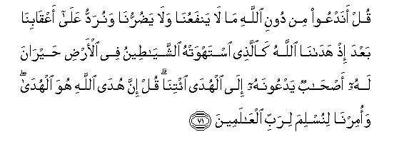
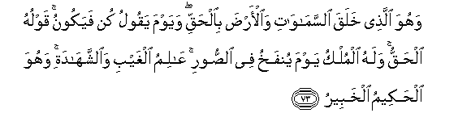
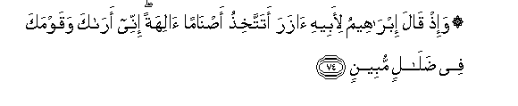
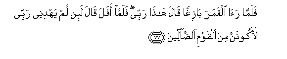
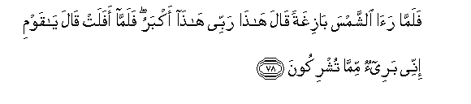
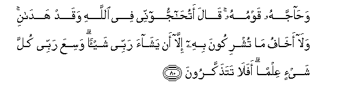
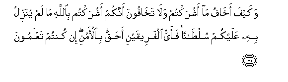
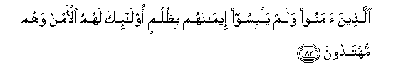

  
[Intangible Textual Heritage](../../index)  [Islam](../index.md) 
[Index](index.md)   
[Hypertext Qur'an](../htq/index)  [Unicode](../uq/006.htm#006_071.md) 
[Palmer](../sbe06/006)  [Pickthall](../pick/006.htm#006_071.md)  [Yusuf Ali
English](../yaq/yaq006)  [Rodwell](../qr/006.md)   
  
[Sūra VI.: An’ām, or Cattle. Index](006.md)  
  [Previous](00608)  [Next](00610.md) 

------------------------------------------------------------------------

  
*The Holy Quran*, tr. by Yusuf Ali, \[1934\], at Intangible Textual
Heritage

------------------------------------------------------------------------

# Sūra VI.: An’ām, or Cattle.

### Section 9

------------------------------------------------------------------------

71. Qul anadAAoo min dooni All<u>a</u>hi m<u>a</u> l<u>a</u>
yanfaAAun<u>a</u> wal<u>a</u> ya<u>d</u>urrun<u>a</u> wanuraddu
AAal<u>a</u> aAAq<u>a</u>bin<u>a</u> baAAda i<u>th</u>
had<u>a</u>n<u>a</u> All<u>a</u>hu ka**a**lla<u>th</u>ee istahwat-hu
a**l**shshay<u>at</u>eenu fee al-ar<u>d</u>i <u>h</u>ayr<u>a</u>na lahu
a<u>s</u>-<u>ha</u>bun yadAAoonahu il<u>a</u> alhud<u>a</u>
i/tin<u>a</u> qul inna hud<u>a</u> All<u>a</u>hi huwa alhud<u>a</u>
waomirn<u>a</u> linuslima lirabbi alAA<u>a</u>lameen**a**

71\. Say: "Shall we indeed  
Call on others besides God,  
Things that can do us  
Neither good nor harm,—  
And turn on our heels  
After receiving guidance  
From God?—like one  
Whom the evil ones  
Have made into a fool,  
Wandering bewildered  
Through the earth, his friends  
Calling 'Come to us',  
(Vainly) guiding him to the Path."  
Say: "God's guidance  
Is the (only) guidance,  
And we have been directed  
To submit ourselves  
To the Lord of the worlds;—

------------------------------------------------------------------------

72. Waan aqeemoo a**l**<u>ss</u>al<u>a</u>ta wa**i**ttaqoohu wahuwa
alla<u>th</u>ee ilayhi tu<u>h</u>sharoon**a**

72\. "To establish regular prayers  
And to fear God:  
For it is to Him  
That we shall be  
Gathered together."

------------------------------------------------------------------------

73. Wahuwa alla<u>th</u>ee khalaqa a**l**ssam<u>a</u>w<u>a</u>ti
wa**a**l-ar<u>d</u>a bi**a**l<u>h</u>aqqi wayawma yaqoolu kun fayakoonu
qawluhu al<u>h</u>aqqu walahu almulku yawma yunfakhu fee
a**l**<u>ss</u>oori AA<u>a</u>limu alghaybi wa**al**shshah<u>a</u>dati
wahuwa al<u>h</u>akeemu alkhabeer**u**

73\. It is He Who created  
The heavens and the earth  
In true (proportions):  
The day He saith, "Be,"  
Behold! it is. His Word  
Is the Truth. His will be  
The dominion the day  
The trumpet will be blown.  
He knoweth the Unseen  
As well as that which is  
Open. For He  
Is the Wise, well acquainted  
(With all things).

------------------------------------------------------------------------

74. Wa-i<u>th</u> q<u>a</u>la ibr<u>a</u>heemu li-abeehi <u>a</u>zara
atattakhi<u>th</u>u a<u>s</u>n<u>a</u>man <u>a</u>lihatan innee
ar<u>a</u>ka waqawmaka fee <u>d</u>al<u>a</u>lin mubeen**in**

74\. Lo! Abraham said  
To his father Āzar:  
"Takest thou idols for gods?  
For I see thee  
And thy people  
In manifest error."

------------------------------------------------------------------------

75. Waka<u>tha</u>lika nuree ibr<u>a</u>heema malakoota
a**l**ssam<u>a</u>w<u>a</u>ti wa**a**l-ar<u>d</u>i waliyakoona mina
almooqineen**a**

75\. So also did We show  
Abraham the power  
And the laws of the heavens  
And the earth, that he  
Might (with understanding)  
Have certitude.

------------------------------------------------------------------------

76. Falamm<u>a</u> janna AAalayhi allaylu ra<u>a</u> kawkaban
q<u>a</u>la h<u>atha</u> rabbee falamm<u>a</u> afala q<u>a</u>la
l<u>a</u> o<u>h</u>ibbu al-<u>a</u>fileen**a**

76\. When the night  
Covered him over,  
He saw a star:  
He said: "This is my Lord."  
But when it set,  
He said: "I love not  
Those that set."

------------------------------------------------------------------------

77. Falamm<u>a</u> ra<u>a</u> alqamara b<u>a</u>zighan q<u>a</u>la
h<u>atha</u> rabbee falamm<u>a</u> afala q<u>a</u>la la-in lam yahdinee
rabbee laakoonanna mina alqawmi a**l**<u>dda</u>lleen**a**

77\. When he saw the moon  
Rising in splendour,  
He said: "This is my Lord."  
But when the moon set,  
He said: "Unless my Lord  
Guide me, I shall surely  
Be among those  
Who go astray.

------------------------------------------------------------------------

78. Falamm<u>a</u> ra<u>a</u> a**l**shshamsa b<u>a</u>zighatan
q<u>a</u>la h<u>atha</u> rabbee h<u>atha</u> akbaru falamm<u>a</u>
afalat q<u>a</u>la y<u>a</u> qawmi innee baree-on mimm<u>a</u>
tushrikoon**a**

78\. When he saw the sun  
Rising in splendour,  
He said: "This is my Lord;  
This is the greatest (of all)."  
But when the sun set,  
He said: "O my people!  
I am indeed free  
From your (guilt)  
Of giving partners to God.

------------------------------------------------------------------------

79. Innee wajjahtu wajhiya lilla<u>th</u>ee fa<u>t</u>ara
a**l**ssam<u>a</u>w<u>a</u>ti wa**a**l-ar<u>d</u>a <u>h</u>aneefan
wam<u>a</u> an<u>a</u> mina almushrikeen**a**

79\. "For me, I have set  
My face, firmly and truly,  
Towards Him Who created  
The heavens and the earth,  
And never shall I give  
Partners to God."

------------------------------------------------------------------------

80. Wa<u>ha</u>jjahu qawmuhu q<u>a</u>la atu<u>ha</u>jjoonnee fee
All<u>a</u>hi waqad had<u>a</u>ni wal<u>a</u> akh<u>a</u>fu m<u>a</u>
tushrikoona bihi ill<u>a</u> an yash<u>a</u>a rabbee shay-an wasiAAa
rabbee kulla shay-in AAilman afal<u>a</u> tata<u>th</u>akkaroon**a**

80\. His people disputed  
With him. He said:  
"(Come) ye to dispute  
With me, about God,  
When He (Himself)  
Hath guided me?  
I fear not (the beings)  
Ye associate with God:  
Unless my Lord willeth,  
(Nothing can happen).  
My Lord comprehendeth  
In His knowledge all things.  
Will ye not (yourselves)  
Be admonished?

------------------------------------------------------------------------

81. Wakayfa akh<u>a</u>fu m<u>a</u> ashraktum wal<u>a</u>
takh<u>a</u>foona annakum ashraktum bi**A**ll<u>a</u>hi m<u>a</u> lam
yunazzil bihi AAalaykum sul<u>ta</u>nan faayyu alfareeqayni
a<u>h</u>aqqu bi**a**l-amni in kuntum taAAlamoon**a**

81\. "How should I fear  
(The beings) ye associate  
With God, when ye  
Fear not to give partners  
To God without any warrant  
Having been given to you?  
Which of (us) two parties  
Hath more right to security?  
(Tell me) if ye know.

------------------------------------------------------------------------

82. Alla<u>th</u>eena <u>a</u>manoo walam yalbisoo eem<u>a</u>nahum
bi*<u>th</u>*ulmin ol<u>a</u>-ika lahumu al-amnu wahum muhtadoon**a**

82\. "It is those who believe  
And confuse not their beliefs  
With wrong—that are  
(Truly) in security, for they  
Are on (right) guidance."

------------------------------------------------------------------------

[Next: Section 10 (83-90)](00610.md)

