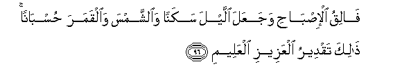
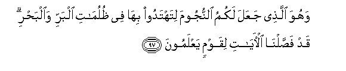
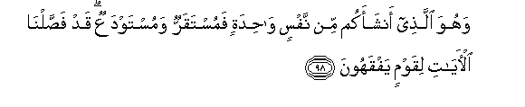
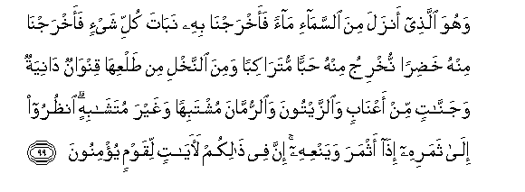
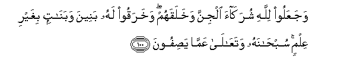

  
[Intangible Textual Heritage](../../index)  [Islam](../index) 
[Index](index)   
[Hypertext Qur'an](../htq/index)  [Unicode](../uq/006.htm#006_095) 
[Palmer](../sbe06/006)  [Pickthall](../pick/006.htm#006_095)  [Yusuf Ali
English](../yaq/yaq006)  [Rodwell](../qr/006)   
  
[Sūra VI.: An’ām, or Cattle. Index](006)  
  [Previous](00611)  [Next](00613) 

------------------------------------------------------------------------

  
*The Holy Quran*, tr. by Yusuf Ali, \[1934\], at Intangible Textual
Heritage

------------------------------------------------------------------------

# Sūra VI.: An’ām, or Cattle.

### Section 12

------------------------------------------------------------------------

95. Inna All<u>a</u>ha f<u>a</u>liqu al<u>h</u>abbi wa**al**nnaw<u>a</u>
yukhriju al<u>h</u>ayya mina almayyiti wamukhriju almayyiti mina
al<u>h</u>ayyi <u>tha</u>likumu All<u>a</u>hu faann<u>a</u>
tu/fakoon**a**

95\. It is God Who causeth  
The seed-grain  
And the date-stone  
To split and sprout.  
He causeth the living  
To issue from the dead,  
And He is the One  
To cause the dead  
To issue from the living.  
That is God: then how  
Are ye deluded  
Away from the truth?

------------------------------------------------------------------------

96. F<u>a</u>liqu al-i<u>s</u>b<u>ah</u>i wajaAAala allayla sakanan
wa**al**shshamsa wa**a**lqamara <u>h</u>usb<u>a</u>nan <u>tha</u>lika
taqdeeru alAAazeezi alAAaleem**i**

96\. He it is that cleaveth  
The day-break (from the dark):  
He makes the night  
For rest and tranquillity,  
And the sun and moon  
For the reckoning (of time):  
Such is the judgment  
And ordering of (Him),  
The Exalted in Power,  
The Omniscient.

------------------------------------------------------------------------

97. Wahuwa alla<u>th</u>ee jaAAala lakumu a**l**nnujooma litahtadoo
bih<u>a</u> fee *<u>th</u>*ulum<u>a</u>ti albarri wa**a**lba<u>h</u>ri
qad fa<u>ss</u>aln<u>a</u> al-<u>a</u>y<u>a</u>ti liqawmin
yaAAlamoon**a**

97\. It is He Who maketh  
The stars (as beacons) for you,  
That ye may guide yourselves,  
With their help,  
Through the dark spaces  
Of land and sea:  
We detail Our Signs  
For people who know.

------------------------------------------------------------------------

98. Wahuwa alla<u>th</u>ee anshaakum min nafsin w<u>ah</u>idatin
famustaqarrun wamustawdaAAun qad fa<u>ss</u>aln<u>a</u>
al-<u>a</u>y<u>a</u>ti liqawmin yafqahoon**a**

98\. It is He Who hath  
Produced you  
From a single person:  
Here is a place of sojourn  
And a place of departure:  
We detail Our signs  
For people who understand.

------------------------------------------------------------------------

99. Wahuwa alla<u>th</u>ee anzala mina a**l**ssam<u>a</u>-i m<u>a</u>an
faakhrajn<u>a</u> bihi nab<u>a</u>ta kulli shay-in faakhrajn<u>a</u>
minhu kha<u>d</u>iran nukhriju minhu <u>h</u>abban mutar<u>a</u>kiban
wamina a**l**nnakhli min <u>t</u>alAAih<u>a</u> qinw<u>a</u>nun
d<u>a</u>niyatun wajann<u>a</u>tin min aAAn<u>a</u>bin wa**al**zzaytoona
wa**al**rrumm<u>a</u>na mushtabihan waghayra mutash<u>a</u>bihin
on*<u>th</u>*uroo il<u>a</u> thamarihi i<u>tha</u> athmara wayanAAihi
inna fee <u>tha</u>likum la<u>a</u>y<u>a</u>tin liqawmin yu/minoon**a**

99\. It is He Who sendeth down  
Rain from the skies:  
With it We produce  
Vegetation of all kinds:  
From some We produce  
Green (crops), out of which  
We produce grain,  
Heaped up (at harvest);  
Out of the date-palm  
And its sheaths (or spathes)  
(Come) clusters of dates  
Hanging low and near:  
And (then there are) gardens  
Of grapes, and olives,  
And pomegranates,  
Each similar (in kind)  
Yet different (in variety):  
When they begin to bear fruit,  
Feast your eyes with the fruit  
And the ripeness thereof.  
Behold! in these things  
There are Signs for people  
Who believe.

------------------------------------------------------------------------

100. WajaAAaloo lill<u>a</u>hi shurak<u>a</u>a aljinna wakhalaqahum
wakharaqoo lahu baneena waban<u>a</u>tin bighayri AAilmin
sub<u>ha</u>nahu wataAA<u>a</u>l<u>a</u> AAamm<u>a</u>
ya<u>s</u>ifoon**a**

100\. Yet they make  
The Jinns equals  
With God, though God  
Did create the Jinns;  
And they falsely,  
Having no knowledge,  
Attribute to Him  
Sons and daughters.  
Praise and glory be  
To Him! (for He is) above  
What they attribute to Him!

------------------------------------------------------------------------

[Next: Section 13 (101-110)](00613)

