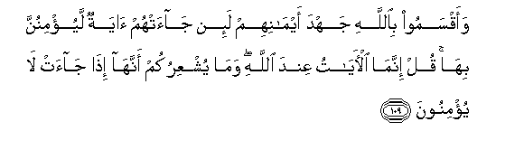

  
[Intangible Textual Heritage](../../index)  [Islam](../index) 
[Index](index)   
[Hypertext Qur'an](../htq/index)  [Unicode](../uq/006.htm#006_101) 
[Palmer](../sbe06/006)  [Pickthall](../pick/006.htm#006_101)  [Yusuf Ali
English](../yaq/yaq006)  [Rodwell](../qr/006)   
  
[Sūra VI.: An’ām, or Cattle. Index](006)  
  [Previous](00612)  [Next](00614) 

------------------------------------------------------------------------

  
*The Holy Quran*, tr. by Yusuf Ali, \[1934\], at Intangible Textual
Heritage

------------------------------------------------------------------------

# Sūra VI.: An’ām, or Cattle.

### Section 13

------------------------------------------------------------------------

101. BadeeAAu a**l**ssam<u>a</u>w<u>a</u>ti wa**a**l-ar<u>d</u>i
ann<u>a</u> yakoonu lahu waladun walam takun lahu <u>sah</u>ibatun
wakhalaqa kulla shay-in wahuwa bikulli shay-in AAaleem**un**

101\. To Him is due  
The primal origin  
Of the heavens and the earth:  
How can He have a son  
When He hath no consort?  
He created all things,  
And He hath full knowledge  
Of all things.

------------------------------------------------------------------------

102. <u>Tha</u>likumu All<u>a</u>hu rabbukum l<u>a</u> il<u>a</u>ha
ill<u>a</u> huwa kh<u>a</u>liqu kulli shay-in fa**o**AAbudoohu wahuwa
AAal<u>a</u> kulli shay-in wakeel**un**

102\. That is God, your Lord!  
There is no god but He,  
The Creator of all things:  
Then worship ye Him:  
And He hath power  
To dispose of all affairs.

------------------------------------------------------------------------

103. L<u>a</u> tudrikuhu al-ab<u>sa</u>ru wahuwa yudriku
al-ab<u>sa</u>ra wahuwa alla<u>t</u>eefu alkhabeer**u**

103\. No vision can grasp Him,  
But His grasp is over  
All vision: He is  
Above all comprehension,  
Yet is acquainted with all things.

------------------------------------------------------------------------

104. Qad j<u>a</u>akum ba<u>sa</u>-iru min rabbikum faman ab<u>s</u>ara
falinafsihi waman AAamiya faAAalayh<u>a</u> wam<u>a</u> an<u>a</u>
AAalaykum bi<u>h</u>afee*<u>th</u>***in**

104\. "Now have come to you,  
From your Lord, proofs  
(To open your eyes):  
If any will see,  
It will be for (the good  
Of) his own soul;  
If any will be blind,  
It will be to his own  
(Harm): I am not (here)  
To watch over your doings.

------------------------------------------------------------------------

105. Waka<u>tha</u>lika nu<u>s</u>arrifu al-<u>a</u>y<u>a</u>ti
waliyaqooloo darasta walinubayyinahu liqawmin yaAAlamoon**a**

105\. Thus do We explain  
The Signs by various (symbols):  
That they may say,  
"Thou hast taught (us) diligently,"  
And that We may make  
The matter clear  
To those who know.

------------------------------------------------------------------------

106. IttabiAA m<u>a</u> oo<u>h</u>iya ilayka min rabbika l<u>a</u>
il<u>a</u>ha ill<u>a</u> huwa waaAAri<u>d</u> AAani almushrikeen**a**

106\. Follow what thou art taught  
By inspiration from thy Lord:  
There is no god but He:  
And turn aside from those  
Who join gods with God.

------------------------------------------------------------------------

107. Walaw sh<u>a</u>a All<u>a</u>hu m<u>a</u> ashrakoo wam<u>a</u>
jaAAaln<u>a</u>ka AAalayhim <u>h</u>afee*<u>th</u>*an wam<u>a</u> anta
AAalayhim biwakeel**in**

107\. If it had been God's Plan,  
They would not have taken  
False gods: but We  
Made thee not one  
To watch over their doings,  
Nor art thou set  
Over them to dispose  
Of their affairs.

------------------------------------------------------------------------

108. Wal<u>a</u> tasubboo alla<u>th</u>eena yadAAoona min dooni
All<u>a</u>hi fayasubboo All<u>a</u>ha AAadwan bighayri AAilmin
ka<u>tha</u>lika zayyann<u>a</u> likulli ommatin AAamalahum thumma
il<u>a</u> rabbihim marjiAAuhum fayunabbi-ohum bim<u>a</u> k<u>a</u>noo
yaAAmaloon**a**

108\. Revile not ye  
Those whom they call upon  
Besides God, lest  
They out of spite  
Revile God  
In their ignorance.  
Thus have We made  
Alluring to each people'  
Its own doings.  
In the end will they  
Return to their Lord,  
And We shall then  
Tell them the truth  
Of all that they did.

------------------------------------------------------------------------

109. Waaqsamoo bi**A**ll<u>a</u>hi jahda aym<u>a</u>nihim la-in
j<u>a</u>at-hum <u>a</u>yatun layu/minunna bih<u>a</u> qul innam<u>a</u>
al-<u>a</u>y<u>a</u>tu AAinda All<u>a</u>hi wam<u>a</u> yushAAirukum
annah<u>a</u> i<u>tha</u> j<u>a</u>at l<u>a</u> yu/minoon**a**

109\. They swear their strongest  
Oaths by God, that if  
A (special) Sign came  
To them, by it they would  
Believe. Say: "Certainly  
(All) Signs are in the power  
Of God: but what will  
Make you (Muslims) realise  
That (even) if (special) Signs  
Came, they will not believe."?

------------------------------------------------------------------------

110. Wanuqallibu af-idatahum waab<u>sa</u>rahum kam<u>a</u> lam yu/minoo
bihi awwala marratin wana<u>th</u>aruhum fee <u>t</u>ughy<u>a</u>nihim
yaAAmahoon**a**

110\. We (too) shall turn  
To (confusion) their hearts  
And their eyes, even as they  
Refused to believe in this  
In the first instance:  
We shall leave them  
In their trespasses,  
To wander in distraction.

------------------------------------------------------------------------

[Next: Section 14 (111-121)](00614)

