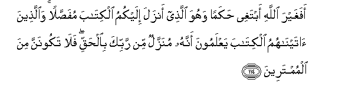
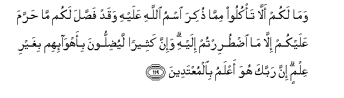
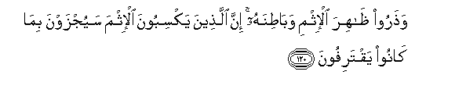

  
[Intangible Textual Heritage](../../index)  [Islam](../index.md) 
[Index](index.md)   
[Hypertext Qur'an](../htq/index)  [Unicode](../uq/006.htm#006_111.md) 
[Palmer](../sbe06/006)  [Pickthall](../pick/006.htm#006_111.md)  [Yusuf Ali
English](../yaq/yaq006)  [Rodwell](../qr/006.md)   
  
[Sūra VI.: An’ām, or Cattle. Index](006.md)  
  [Previous](00613)  [Next](00615.md) 

------------------------------------------------------------------------

  
*The Holy Quran*, tr. by Yusuf Ali, \[1934\], at Intangible Textual
Heritage

------------------------------------------------------------------------

# Sūra VI.: An’ām, or Cattle.

### Section 14

------------------------------------------------------------------------

111. Walaw annan<u>a</u> nazzaln<u>a</u> ilayhimu almal<u>a</u>-ikata
wakallamahumu almawt<u>a</u> wa<u>h</u>asharn<u>a</u> AAalayhim kulla
shay-in qubulan m<u>a</u> k<u>a</u>noo liyu/minoo ill<u>a</u> an
yash<u>a</u>a All<u>a</u>hu wal<u>a</u>kinna aktharahum yajhaloon**a**

111\. Even if We did send  
Unto them angels,  
And the dead did speak  
Unto them, and We gathered  
Together all things before  
Their very eyes, they are not  
The ones to believe,  
Unless it is in God's Plan.  
But most of them  
Ignore (the truth).

------------------------------------------------------------------------

112. Waka<u>tha</u>lika jaAAaln<u>a</u> likulli nabiyyin AAaduwwan
shay<u>at</u>eena al-insi wa**a**ljinni yoo<u>h</u>ee baAA<u>d</u>uhum
il<u>a</u> baAA<u>d</u>in zukhrufa alqawli ghurooran walaw sh<u>a</u>a
rabbuka m<u>a</u> faAAaloohu fa<u>th</u>arhum wam<u>a</u> yaftaroon**a**

112\. Likewise did We make  
For every Messenger  
An enemy,—evil ones  
Among men and Jinns,  
Inspiring each other  
With flowery discourses  
By way of deception.  
If thy Lord had so planned,  
They would not have  
Done it: so leave them  
And their inventions alone.

------------------------------------------------------------------------

113. Walita<u>s</u>gh<u>a</u> ilayhi af-idatu alla<u>th</u>eena
l<u>a</u> yu/minoona bi**a**l-<u>a</u>khirati waliyar<u>d</u>awhu
waliyaqtarifoo m<u>a</u> hum muqtarifoon**a**

113\. To such (deceit)  
Let the hearts of those  
Incline, who have no faith  
In the Hereafter: let them  
Delight in it, and let them  
Earn from it what they may

------------------------------------------------------------------------

114. Afaghayra All<u>a</u>hi abtaghee <u>h</u>akaman wahuwa
alla<u>th</u>ee anzala ilaykumu alkit<u>a</u>ba mufa<u>ss</u>alan
wa**a**lla<u>th</u>eena <u>a</u>tayn<u>a</u>humu alkit<u>a</u>ba
yaAAlamoona annahu munazzalun min rabbika bi**a**l<u>h</u>aqqi
fal<u>a</u> takoonanna mina almumtareen**a**

114\. Say: "Shall I seek  
For judge other than God?—  
When He it is  
Who hath sent unto you  
The Book, explained in detail."  
They know full well,  
To whom We have given  
The Book, that it hath been  
Sent down from thy Lord  
In truth. Never be then  
Of those who doubt.

------------------------------------------------------------------------

115. Watammat kalimatu rabbika <u>s</u>idqan waAAadlan l<u>a</u>
mubaddila likalim<u>a</u>tihi wahuwa a**l**ssameeAAu alAAaleem**u**

115\. The Word of thy Lord  
Doth find its fulfilment  
In truth and in justice:  
None can change His Words:  
For He is the one Who  
Heareth and knoweth all.

------------------------------------------------------------------------

116. Wa-in tu<u>t</u>iAA akthara man fee al-ar<u>d</u>i
yu<u>d</u>illooka AAan sabeeli All<u>a</u>hi in yattabiAAoona
ill<u>a</u> a**l***<u>thth</u>*anna wa-in hum ill<u>a</u>
yakhru<u>s</u>oon**a**

116\. Wert thou to follow  
The common run of those  
On earth, they will lead  
Thee away from the Way  
Of God. They follow  
Nothing but conjecture: they  
Do nothing but lie.

------------------------------------------------------------------------

117. Inna rabbaka huwa aAAlamu man ya<u>d</u>illu AAan sabeelihi wahuwa
aAAlamu bi**a**lmuhtadeen**a**

117\. Thy Lord knoweth best  
Who strayeth from His Way:  
He knoweth best  
Who they are that receive  
His guidance.

------------------------------------------------------------------------

118. Fakuloo mimm<u>a</u> <u>th</u>ukira ismu All<u>a</u>hi AAalayhi in
kuntum bi-<u>a</u>y<u>a</u>tihi mu/mineen**a**

118\. So eat of (meats)  
On which God's name  
Hath been pronounced,  
If ye have faith  
In His Signs.

------------------------------------------------------------------------

119. Wam<u>a</u> lakum all<u>a</u> ta/kuloo mimm<u>a</u> <u>th</u>ukira
ismu All<u>a</u>hi AAalayhi waqad fa<u>ss</u>ala lakum m<u>a</u>
<u>h</u>arrama AAalaykum ill<u>a</u> m<u>a</u> i<u>dt</u>urirtum ilayhi
wa-inna katheeran layu<u>d</u>illoona bi-ahw<u>a</u>-ihim bighayri
AAilmin inna rabbaka huwa aAAlamu bi**a**lmuAAtadeen**a**

119\. Why should ye not  
Eat of (meats) on which  
God's name hath been  
Pronounced, when He hath  
Explained to you in detail  
What is forbidden to you—  
Except under compulsion  
Of necessity?  
But many do mislead (men)  
By their appetites unchecked  
By knowledge. Thy Lord  
Knoweth best those who transgress

------------------------------------------------------------------------

120. Wa<u>th</u>aroo *<u>th</u>*<u>a</u>hira al-ithmi wab<u>at</u>inahu
inna alla<u>th</u>eena yaksiboona al-ithma sayujzawna bim<u>a</u>
k<u>a</u>noo yaqtarifoon**a**

120\. Eschew all sin,  
Open or secret:  
Those who earn sin  
Will get due recompense  
For their "earnings."

------------------------------------------------------------------------

121. Wal<u>a</u> ta/kuloo mimm<u>a</u> lam yu<u>th</u>kari ismu
All<u>a</u>hi AAalayhi wa-innahu lafisqun wa-inna
a**l**shshay<u>at</u>eena layoo<u>h</u>oona il<u>a</u>
awliy<u>a</u>-ihim liyuj<u>a</u>dilookum wa-in a<u>t</u>aAAtumoohum
innakum lamushrikoon**a**

121\. Eat not of (meats)  
On which God's name  
Hath not been pronounced:  
That would be impiety.  
But the evil ones  
Ever inspire their friends  
To contend with you  
If ye were to obey them,  
Ye would indeed be Pagans.

------------------------------------------------------------------------

[Next: Section 15 (122-129)](00615.md)

