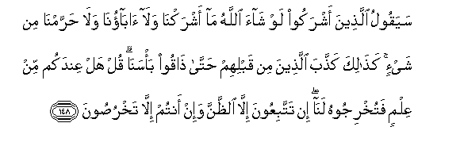

  
[Intangible Textual Heritage](../../index)  [Islam](../index.md) 
[Index](index.md)   
[Hypertext Qur'an](../htq/index)  [Unicode](../uq/006.htm#006_145.md) 
[Palmer](../sbe06/006)  [Pickthall](../pick/006.htm#006_145.md)  [Yusuf Ali
English](../yaq/yaq006)  [Rodwell](../qr/006.md)   
  
[Sūra VI.: An’ām, or Cattle. Index](006.md)  
  [Previous](00617)  [Next](00619.md) 

------------------------------------------------------------------------

  
*The Holy Quran*, tr. by Yusuf Ali, \[1934\], at Intangible Textual
Heritage

------------------------------------------------------------------------

# Sūra VI.: An’ām, or Cattle.

### Section 18

------------------------------------------------------------------------

145. Qul l<u>a</u> ajidu feem<u>a</u> oo<u>h</u>iya ilayya
mu<u>h</u>arraman AAal<u>a</u> <u>ta</u>AAimin ya<u>t</u>AAamuhu
ill<u>a</u> an yakoona maytatan aw daman masfoo<u>h</u>an aw
la<u>h</u>ma khinzeerin fa-innahu rijsun aw fisqan ohilla lighayri
All<u>a</u>hi bihi famani i<u>dt</u>urra ghayra b<u>a</u>ghin
wal<u>a</u> AA<u>a</u>din fa-inna rabbaka ghafoorun ra<u>h</u>eem**un**

145\. Say: "I find not  
In the Message received  
By me by inspiration  
Any (meat) forbidden  
To be eaten by one  
Who wishes to eat it,  
Unless it be dead meat,  
Or blood poured forth,  
Or the flesh of swine,—  
For it is an abomination—  
Or, what is impious, (meat)  
On which a name has been  
Invoked, other than God's."  
But (even so), if a person  
Is forced by necessity,  
Without wilful disobedience,  
Nor transgressing due limits,—  
Thy Lord is Oft-forgiving,  
Most Merciful.

------------------------------------------------------------------------

146. WaAAal<u>a</u> alla<u>th</u>eena h<u>a</u>doo
<u>h</u>arramn<u>a</u> kulla <u>th</u>ee *<u>th</u>*ufurin wamina
albaqari wa**a**lghanami <u>h</u>arramn<u>a</u> AAalayhim
shu<u>h</u>oomahum<u>a</u> ill<u>a</u> m<u>a</u> <u>h</u>amalat
*<u>th</u>*uhooruhum<u>a</u> awi al<u>h</u>aw<u>a</u>y<u>a</u> aw
m<u>a</u> ikhtala<u>t</u>a biAAa*<u>th</u>*min <u>tha</u>lika
jazayn<u>a</u>hum bibaghyihim wa-inn<u>a</u> la<u>sa</u>diqoon**a**

146\. For those who followed  
The Jewish Law, We forbade  
Every (animal) with  
Undivided hoof,  
And We forbade them  
The fat of the ox  
And the sheep, except  
What adheres to their backs  
Or their entrails,  
Or is mixed up  
With a bone:  
This in recompense  
For their wilful disobedience:  
For We are True  
(In Our ordinances).

------------------------------------------------------------------------

147. Fa-in ka<u>thth</u>abooka faqul rabbukum <u>th</u>oo
ra<u>h</u>matin w<u>a</u>siAAatin wal<u>a</u> yuraddu ba/suhu AAani
alqawmi almujrimeen**a**

147\. If they accuse thee  
Of falsehood, say:  
"Your Lord is full  
Of mercy all-embracing;  
But from people in guilt  
Never will His wrath  
Be turned back.

------------------------------------------------------------------------

148. Sayaqoolu alla<u>th</u>eena ashrakoo law sh<u>a</u>a All<u>a</u>hu
m<u>a</u> ashrakn<u>a</u> wal<u>a</u> <u>a</u>b<u>a</u>on<u>a</u>
wal<u>a</u> <u>h</u>arramn<u>a</u> min shay-in ka<u>tha</u>lika
ka<u>thth</u>aba alla<u>th</u>eena min qablihim <u>h</u>att<u>a</u>
<u>tha</u>qoo ba/san<u>a</u> qul hal AAindakum min AAilmin fatukhrijoohu
lan<u>a</u> in tattabiAAoona ill<u>a</u> a**l***<u>thth</u>*anna wa-in
antum ill<u>a</u> takhru<u>s</u>oon**a**

148\. Those who give partners  
(To God) will say:  
"If God had wished,  
We should not have  
Given partners to Him,  
Nor would our fathers;  
Nor should we have had  
Any taboos." So did  
Their ancestors argue  
Falsely, until they tasted  
Of Our wrath. Say:  
"Have ye any (certain)  
Knowledge? If so, produce  
It before us. Ye follow  
Nothing but conjecture:  
Ye do nothing but lie."

------------------------------------------------------------------------

149. Qul falill<u>a</u>hi al<u>h</u>ujjatu alb<u>a</u>lighatu falaw
sh<u>a</u>a lahad<u>a</u>kum ajmaAAeen**a**

149\. Say: "With God is the argument  
That reaches home: if it had  
Been His Will, He could  
Indeed have guided you all."

------------------------------------------------------------------------

150. Qul halumma shuhad<u>a</u>akumu alla<u>th</u>eena yashhadoona anna
All<u>a</u>ha <u>h</u>arrama h<u>atha</u> fa-in shahidoo fal<u>a</u>
tashhad maAAahum wal<u>a</u> tattabiAA ahw<u>a</u>a alla<u>th</u>eena
ka<u>thth</u>aboo bi-<u>a</u>y<u>a</u>tin<u>a</u>
wa**a**lla<u>th</u>eena l<u>a</u> yu/minoona bi**a**l-<u>a</u>khirati
wahum birabbihim yaAAdiloon**a**

150\. Say: "Bring forward your witnesses  
To prove that God did  
Forbid so and so." If they  
Bring such witnesses,  
Be not thou amongst them:  
Nor follow thou the vain  
Desires of such as treat  
Our Signs as falsehoods,  
And such as believe not  
In the Hereafter: for they  
Hold others as equal  
With their Guardian-Lord.

------------------------------------------------------------------------

[Next: Section 19 (151-154)](00619.md)

