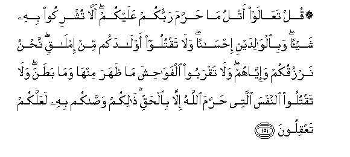
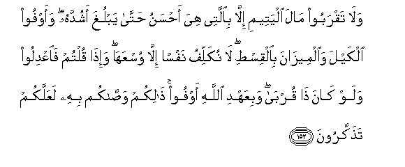
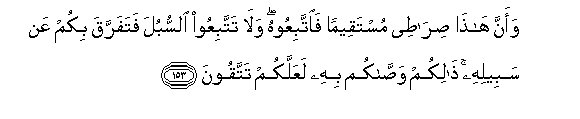
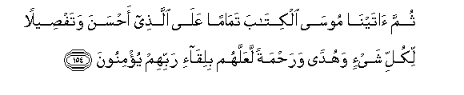

  
[Intangible Textual Heritage](../../index)  [Islam](../index.md) 
[Index](index.md)   
[Hypertext Qur'an](../htq/index)  [Unicode](../uq/006.htm#006_151.md) 
[Palmer](../sbe06/006)  [Pickthall](../pick/006.htm#006_151.md)  [Yusuf Ali
English](../yaq/yaq006)  [Rodwell](../qr/006.md)   
  
[Sūra VI.: An’ām, or Cattle. Index](006.md)  
  [Previous](00618)  [Next](00620.md) 

------------------------------------------------------------------------

  
*The Holy Quran*, tr. by Yusuf Ali, \[1934\], at Intangible Textual
Heritage

------------------------------------------------------------------------

# Sūra VI.: An’ām, or Cattle.

### Section 19

------------------------------------------------------------------------

151. Qul taAA<u>a</u>law atlu m<u>a</u> <u>h</u>arrama rabbukum
AAalaykum all<u>a</u> tushrikoo bihi shay-an wabi**a**lw<u>a</u>lidayni
i<u>h</u>s<u>a</u>nan wal<u>a</u> taqtuloo awl<u>a</u>dakum min
iml<u>a</u>qin na<u>h</u>nu narzuqukum wa-iyy<u>a</u>hum wal<u>a</u>
taqraboo alfaw<u>ah</u>isha m<u>a</u> *<u>th</u>*ahara minh<u>a</u>
wam<u>a</u> ba<u>t</u>ana wal<u>a</u> taqtuloo a**l**nnafsa allatee
<u>h</u>arrama All<u>a</u>hu ill<u>a</u> bi**a**l<u>h</u>aqqi
<u>tha</u>likum wa<u>ssa</u>kum bihi laAAallakum taAAqiloon**a**

151\. Say: "Come, I will rehearse  
What God hath (really)  
Prohibited you from": join not  
Anything as equal with Him;  
Be good to your parents;  
Kill not your children  
On a plea of want;—We  
Provide sustenance for you  
And for them;—come not  
Nigh to shameful deeds,  
Whether open or secret;  
Take not life, which God  
Hath made sacred, except  
By way of justice and law:  
Thus doth He command you,  
That ye may learn wisdom.

------------------------------------------------------------------------

152. Wal<u>a</u> taqraboo m<u>a</u>la alyateemi ill<u>a</u>
bi**a**llatee hiya a<u>h</u>sanu <u>h</u>att<u>a</u> yablugha ashuddahu
waawfoo alkayla wa**a**lmeez<u>a</u>na bi**a**lqis<u>t</u>i l<u>a</u>
nukallifu nafsan ill<u>a</u> wusAAah<u>a</u> wa-i<u>tha</u> qultum
fa**i**AAdiloo walaw k<u>a</u>na <u>tha</u> qurb<u>a</u> wabiAAahdi
All<u>a</u>hi awfoo <u>tha</u>likum wa<u>ssa</u>kum bihi laAAallakum
ta<u>th</u>akkaroon**a**

152\. And come not nigh  
To the orphan's property,  
Except to improve it,  
Until he attain the age  
Of full strength; give measure  
And weight with (full) justice;—  
No burden do We place  
On any soul, but that  
Which it can bear;—  
Whenever ye speak, speak justly,  
Even if a near relative  
Is concerned; and fulfil  
The Covenant of God:  
Thus doth He command you,  
That ye may remember.

------------------------------------------------------------------------

153. Waanna h<u>atha</u> <u>s</u>ir<u>at</u>ee mustaqeeman
fa**i**ttabiAAoohu wal<u>a</u> tattabiAAoo a**l**ssubula fatafarraqa
bikum AAan sabeelihi <u>tha</u>likum wa<u>ssa</u>kum bihi laAAallakum
tattaqoon**a**

153\. Verily, this is My Way,  
Leading straight: follow it:  
Follow not (other) paths:  
They will scatter you about  
From His (great) Path:  
Thus doth He command you,  
That ye may be righteous.

------------------------------------------------------------------------

154. Thumma <u>a</u>tayn<u>a</u> moos<u>a</u> alkit<u>a</u>ba
tam<u>a</u>man AAal<u>a</u> alla<u>th</u>ee a<u>h</u>sana
wataf<u>s</u>eelan likulli shay-in wahudan wara<u>h</u>matan laAAallahum
biliq<u>a</u>-i rabbihim yu/minoon**a**

154\. Moreover, We gave Moses  
The Book, completing  
(Our favour) to those  
Who would do right,  
And explaining all things  
In detail,—and a guide  
And a mercy, that they  
Might believe in the meeting  
With their Lord.

------------------------------------------------------------------------

[Next: Section 20 (155-165)](00620.md)

