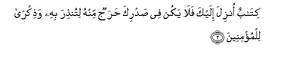
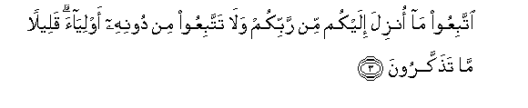
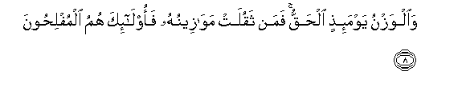
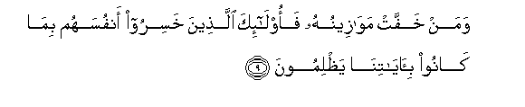
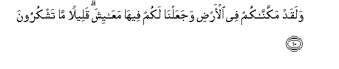

  
[Intangible Textual Heritage](../../index)  [Islam](../index.md) 
[Index](index.md)   
[Hypertext Qur'an](../htq/index)  [Unicode](../uq/007.htm#007_001.md) 
[Palmer](../sbe06/007)  [Pickthall](../pick/007.htm#007_001.md)  [Yusuf Ali
English](../yaq/yaq007)  [Rodwell](../qr/007.md)   
  
[Sūra VII.: A’rāf, or the Heights Index](007.md)  
  [Previous](00620)  [Next](00702.md) 

------------------------------------------------------------------------

  
*The Holy Quran*, tr. by Yusuf Ali, \[1934\], at Intangible Textual
Heritage

------------------------------------------------------------------------

# Sūra VII.: A’rāf, or the Heights

### Section 1

1. Alif-l<u>a</u>m-meem-<u>sa</u>d

1\. Alif, Lām, Mīm, Ṣād.

------------------------------------------------------------------------

2. Kit<u>a</u>bun onzila ilayka fal<u>a</u> yakun fee <u>s</u>adrika
<u>h</u>arajun minhu litun<u>th</u>ira bihi wa<u>th</u>ikr<u>a</u>
lilmu/mineen**a**

2\. A Book revealed unto thee,—  
So let thy heart be oppressed'  
No more by any difficulty  
On that account,  
That with it thou mightest  
Warn (the erring) and teach  
The Believers.

------------------------------------------------------------------------

3. IttabiAAoo m<u>a</u> onzila ilaykum min rabbikum wal<u>a</u>
tattabiAAoo min doonihi awliy<u>a</u>a qaleelan m<u>a</u>
ta<u>th</u>akkaroon**a**

3\. Follow (O men!) the revelation  
Given unto you from your Lord,  
And follow not, as friends  
Or protectors, other than Him.  
Little it is ye remember  
Of admonition.

------------------------------------------------------------------------

4. Wakam min qaryatin ahlakn<u>a</u>h<u>a</u> faj<u>a</u>ah<u>a</u>
ba/sun<u>a</u> bay<u>a</u>tan aw hum q<u>a</u>-iloon**a**

4\. How many towns have We  
Destroyed (for their sins)?  
Our punishment took them  
On a sudden by night  
Or while they slept  
For their afternoon rest.

------------------------------------------------------------------------

5. Fam<u>a</u> k<u>a</u>na daAAw<u>a</u>hum i<u>th</u> j<u>a</u>ahum
ba/sun<u>a</u> ill<u>a</u> an q<u>a</u>loo inn<u>a</u> kunn<u>a</u>
*<u>th</u>*<u>a</u>limeen**a**

5\. When (thus) Our punishment  
Took them, no cry  
Did they utter but this:  
"Indeed we did wrong."

------------------------------------------------------------------------

6. Falanas-alanna alla<u>th</u>eena orsila ilayhim walanas-alanna
almursaleen**a**

6\. When shall we question  
Those to whom Our Message  
Was sent and those by whom  
We sent it.

------------------------------------------------------------------------

7. Falanaqu<u>ss</u>anna AAalayhim biAAilmin wam<u>a</u> kunn<u>a</u>
gh<u>a</u>-ibeen**a**

7\. And verily We shall recount  
Their whole story  
With knowledge, for We  
Were never absent  
(At any time or place).

------------------------------------------------------------------------

8. Wa**a**lwaznu yawma-i<u>th</u>ini al<u>h</u>aqqu faman thaqulat
maw<u>a</u>zeenuhu faol<u>a</u>-ika humu almufli<u>h</u>oon**a**

8\. The balance that day  
Will be true (to a nicety):  
Those whose scale (of good)  
Will be heavy, will prosper:

------------------------------------------------------------------------

9. Waman khaffat maw<u>a</u>zeenuhu faol<u>a</u>-ika alla<u>th</u>eena
khasiroo anfusahum bim<u>a</u> k<u>a</u>noo
bi-<u>a</u>y<u>a</u>tin<u>a</u> ya*<u>th</u>*limoon**a**

9\. Those whose scale will be light,  
Will find their souls  
In perdition, for that they  
Wrongfully treated Our Signs.

------------------------------------------------------------------------

10. Walaqad makkann<u>a</u>kum fee al-ar<u>d</u>i wajaAAaln<u>a</u>
lakum feeh<u>a</u> maAA<u>a</u>yisha qaleelan m<u>a</u> tashkuroon**a**

10\. It is We Who have  
Placed you with authority  
On earth, and provided  
You therein with means  
For the fulfilment of your life:  
Small are the thanks  
That ye give!

------------------------------------------------------------------------

[Next: Section 2 (11-25)](00702.md)

