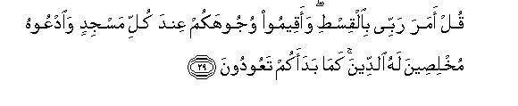

  
[Intangible Textual Heritage](../../index)  [Islam](../index) 
[Index](index)   
[Hypertext Qur'an](../htq/index)  [Unicode](../uq/007.htm#007_026) 
[Palmer](../sbe06/007)  [Pickthall](../pick/007.htm#007_026)  [Yusuf Ali
English](../yaq/yaq007)  [Rodwell](../qr/007)   
  
[Sūra VII.: A’rāf, or the Heights Index](007)  
  [Previous](00702)  [Next](00704) 

------------------------------------------------------------------------

  
*The Holy Quran*, tr. by Yusuf Ali, \[1934\], at Intangible Textual
Heritage

------------------------------------------------------------------------

# Sūra VII.: A’rāf, or the Heights

### Section 3

------------------------------------------------------------------------

26. Y<u>a</u> banee <u>a</u>dama qad anzaln<u>a</u> AAalaykum
lib<u>a</u>san yuw<u>a</u>ree saw-<u>a</u>tikum wareeshan
walib<u>a</u>su a**l**ttaqw<u>a</u> <u>tha</u>lika khayrun
<u>tha</u>lika min <u>a</u>y<u>a</u>ti All<u>a</u>hi laAAallahum
ya<u>thth</u>akkaroon**a**

26\. O ye Children of Adam!  
We have bestowed raiment  
Upon you to cover  
Your shame, as well as  
To be an adornment to you.  
But the raiment of righteousness,—  
That is the best.  
Such are among the Signs  
Of God, that they  
May receive admonition!

------------------------------------------------------------------------

27. Y<u>a</u> banee <u>a</u>dama l<u>a</u> yaftinannakumu
a**l**shshay<u>ta</u>nu kam<u>a</u> akhraja abawaykum mina aljannati
yanziAAu AAanhum<u>a</u> lib<u>a</u>sahum<u>a</u> liyuriyahum<u>a</u>
saw-<u>a</u>tihim<u>a</u> innahu yar<u>a</u>kum huwa waqabeeluhu min
<u>h</u>aythu l<u>a</u> tarawnahum inn<u>a</u> jaAAaln<u>a</u>
a**l**shshay<u>at</u>eena awliy<u>a</u>a lilla<u>th</u>eena l<u>a</u>
yu/minoon**a**

27\. O ye Children of Adam!  
Let not Satan seduce you,  
In the same manner as  
He got your parents out  
Of the Garden, stripping them  
Of their raiment, to expose  
Their shame: for he  
And his tribe watch you  
From a position where ye  
Cannot see them: We made  
The Evil Ones friends  
(Only) to those without Faith.

------------------------------------------------------------------------

28. Wa-i<u>tha</u> faAAaloo f<u>ah</u>ishatan q<u>a</u>loo
wajadn<u>a</u> AAalayh<u>a</u> <u>a</u>b<u>a</u>an<u>a</u>
wa**A**ll<u>a</u>hu amaran<u>a</u> bih<u>a</u> qul inna All<u>a</u>ha
l<u>a</u> ya/muru bi**a**lfa<u>h</u>sh<u>a</u>-i ataqooloona
AAal<u>a</u> All<u>a</u>hi m<u>a</u> l<u>a</u> taAAlamoon**a**

28\. When they do aught  
That is shameful, they say:  
"We found our fathers  
Doing so"; and "God  
Commanded us thus":  
Say: "Nay, God never  
Commands what is shameful:  
Do ye say of God  
What ye know not?"

------------------------------------------------------------------------

29. Qul amara rabbee bi**a**lqis<u>t</u>i waaqeemoo wujoohakum AAinda
kulli masjidin wa**o**dAAoohu mukhli<u>s</u>eena lahu a**l**ddeena
kam<u>a</u> badaakum taAAoodoon**a**

29\. Say: "My Lord hath commanded  
Justice; and that ye set  
Your whole selves (to Him)  
At every time and place  
Of prayer, and call upon Him,  
Making your devotion sincere  
As in His sight:  
Such as He created you  
In the beginning, so  
Shall ye return."

------------------------------------------------------------------------

30. Fareeqan had<u>a</u> wafareeqan <u>h</u>aqqa AAalayhimu
a**l**<u>dd</u>al<u>a</u>latu innahumu ittakha<u>th</u>oo
a**l**shshay<u>at</u>eena awliy<u>a</u>a min dooni All<u>a</u>hi
waya<u>h</u>saboona annahum muhtadoon**a**

30\. Some He hath guided:  
Others have (by their choice)  
Deserved the loss of their way;  
In that they took  
The Evil Ones, in preference  
To God, for their friends  
And protectors, and think  
That they receive guidance.

------------------------------------------------------------------------

31. Y<u>a</u> banee <u>a</u>dama khu<u>th</u>oo zeenatakum AAinda kulli
masjidin wakuloo wa**i**shraboo wal<u>a</u> tusrifoo innahu l<u>a</u>
yu<u>h</u>ibbu almusrifeen**a**

31\. O Children of Adam!  
Wear your beautiful apparel  
At every time and place  
Of prayer: eat and drink:  
But waste not by excess,  
For God loveth not the wasters.

------------------------------------------------------------------------

[Next: Section 4 (32-39)](00704)

