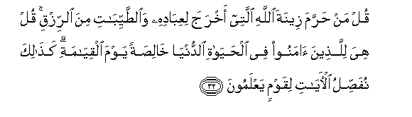
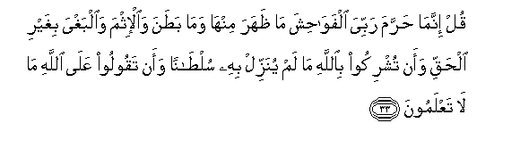
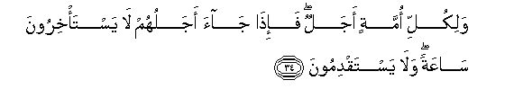
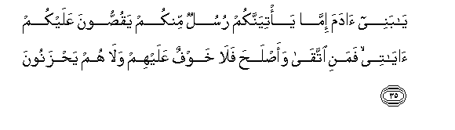
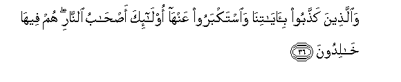
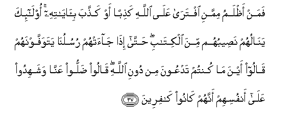
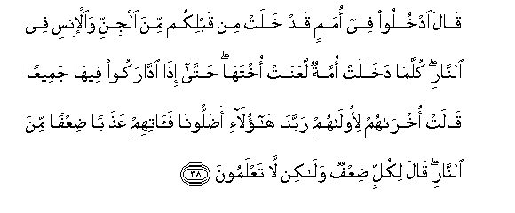
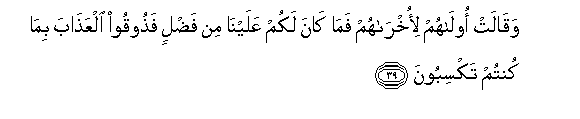

  
[Intangible Textual Heritage](../../index)  [Islam](../index.md) 
[Index](index.md)   
[Hypertext Qur'an](../htq/index)  [Unicode](../uq/007.htm#007_032.md) 
[Palmer](../sbe06/007)  [Pickthall](../pick/007.htm#007_032.md)  [Yusuf Ali
English](../yaq/yaq007)  [Rodwell](../qr/007.md)   
  
[Sūra VII.: A’rāf, or the Heights Index](007.md)  
  [Previous](00703)  [Next](00705.md) 

------------------------------------------------------------------------

  
*The Holy Quran*, tr. by Yusuf Ali, \[1934\], at Intangible Textual
Heritage

------------------------------------------------------------------------

# Sūra VII.: A’rāf, or the Heights

### Section 4

------------------------------------------------------------------------

32. Qul man <u>h</u>arrama zeenata All<u>a</u>hi allatee akhraja
liAAib<u>a</u>dihi wa**al**<u>tt</u>ayyib<u>a</u>ti mina a**l**rrizqi
qul hiya lilla<u>th</u>eena <u>a</u>manoo fee al<u>h</u>ay<u>a</u>ti
a**l**dduny<u>a</u> kh<u>a</u>li<u>s</u>atan yawma alqiy<u>a</u>mati
ka<u>tha</u>lika nufa<u>ss</u>ilu al-<u>a</u>y<u>a</u>ti liqawmin
yaAAlamoon**a**

32\. Say: Who hath forbidden  
The beautiful (gifts) of God,  
Which He hath produced  
For His servants,  
And the things, clean and pure,  
(Which He hath provided)  
For sustenance?  
Say: They are, in the life  
Of this world, for those  
Who believe, (and) purely  
For them on the Day  
Of Judgment. Thus do We  
Explain the Signs in detail  
For those who understand.

------------------------------------------------------------------------

33. Qul innam<u>a</u> <u>h</u>arrama rabbiya alfaw<u>ah</u>isha
m<u>a</u> *<u>th</u>*ahara minh<u>a</u> wam<u>a</u> ba<u>t</u>ana
wa**a**l-ithma wa**a**lbaghya bighayri al<u>h</u>aqqi waan tushrikoo
bi**A**ll<u>a</u>hi m<u>a</u> lam yunazzil bihi sul<u>ta</u>nan waan
taqooloo AAal<u>a</u> All<u>a</u>hi m<u>a</u> l<u>a</u> taAAlamoon**a**

33\. Say: The things that my Lord  
Hath indeed forbidden are:  
Shameful deeds, whether open  
Or secret; sins and trespasses  
Against truth or reason; assigning  
Of partners to God, for which  
He hath given no authority;  
And saying things about God  
Of which ye have no knowledge.

------------------------------------------------------------------------

34. Walikulli ommatin ajalun fa-i<u>tha</u> j<u>a</u>a ajaluhum
l<u>a</u> yasta/khiroona s<u>a</u>AAatan wal<u>a</u> yastaqdimoon**a**

34\. To every People is a term.  
Appointed: when their term  
Is reached, not an hour  
Can they cause delay,  
Nor (an hour) can they  
Advance (it in anticipation).

------------------------------------------------------------------------

35. Y<u>a</u> banee <u>a</u>dama imm<u>a</u> ya/tiyannakum rusulun
minkum yaqu<u>ss</u>oona AAalaykum <u>a</u>y<u>a</u>tee famani
ittaq<u>a</u> waa<u>s</u>la<u>h</u>a fal<u>a</u> khawfun AAalayhim
wal<u>a</u> hum ya<u>h</u>zanoon**a**

35\. O ye Children of Adam!  
Whenever there come to you  
Apostles from amongst you,  
Rehearsing My Signs unto you,  
Those who are righteous  
And mend (their lives),—  
On them shall be no fear  
Nor shall they grieve.

------------------------------------------------------------------------

36. Wa**a**lla<u>th</u>eena ka<u>thth</u>aboo
bi-<u>a</u>y<u>a</u>tin<u>a</u> wa**i**stakbaroo AAanh<u>a</u>
ol<u>a</u>-ika a<u>s</u>-<u>ha</u>bu a**l**nn<u>a</u>ri hum feeh<u>a</u>
kh<u>a</u>lidoon**a**

36\. But those who reject  
Our Signs and treat them  
With arrogance,—they  
Are Companions of the Fire,  
To dwell therein (for ever).

------------------------------------------------------------------------

37. Faman a*<u>th</u>*lamu mimmani iftar<u>a</u> AAal<u>a</u>
All<u>a</u>hi ka<u>th</u>iban aw ka<u>thth</u>aba
bi-<u>a</u>y<u>a</u>tihi ol<u>a</u>-ika yan<u>a</u>luhum
na<u>s</u>eebuhum mina alkit<u>a</u>bi <u>h</u>att<u>a</u> i<u>tha</u>
j<u>a</u>at-hum rusulun<u>a</u> yatawaffawnahum q<u>a</u>loo ayna
m<u>a</u> kuntum tadAAoona min dooni All<u>a</u>hi q<u>a</u>loo
<u>d</u>alloo AAann<u>a</u> washahidoo AAal<u>a</u> anfusihim annahum
k<u>a</u>noo k<u>a</u>fireen**a**

37\. Who is more unjust  
Than one who invents  
A lie against God  
Or rejects His Signs?  
For such, their portion  
Appointed must reach them  
From the Book (of Decrees):  
Until, when Our messengers  
(Of death) arrive and take  
Their souls, they say:  
"Where are the things  
That ye used to invoke  
Besides God?"  
They will reply, "They  
Have left us in the lurch,"  
And they will bear witness  
Against themselves, that they  
Had rejected God.

------------------------------------------------------------------------

38. Q<u>a</u>la odkhuloo fee omamin qad khalat min qablikum mina aljinni
wa**a**l-insi fee a**l**nn<u>a</u>ri kullam<u>a</u> dakhalat ommatun
laAAanat okhtah<u>a</u> <u>h</u>att<u>a</u> i<u>tha</u> idd<u>a</u>rakoo
feeh<u>a</u> jameeAAan q<u>a</u>lat okhr<u>a</u>hum li-ool<u>a</u>hum
rabban<u>a</u> h<u>a</u>ol<u>a</u>-i a<u>d</u>alloon<u>a</u>
fa<u>a</u>tihim AAa<u>tha</u>ban <u>d</u>iAAfan mina a**l**nn<u>a</u>ri
q<u>a</u>la likullin <u>d</u>iAAfun wal<u>a</u>kin l<u>a</u>
taAAlamoon**a**

38\. He will say: "Enter ye  
In the company of  
The Peoples who passed away  
Before you—men and Jinns,—  
Into the Fire. Every time  
A new People enters,  
It curses its sister-People  
(That went before), until  
They follow each other, all  
Into the Fire. Saith the last  
About the first: "Our Lord!  
It is these that misled us:  
So give them a double  
Penalty in the Fire."  
He will say: "Doubled  
For all": but this  
Ye do not understand.

------------------------------------------------------------------------

39. Waq<u>a</u>lat ool<u>a</u>hum li-okhr<u>a</u>hum fam<u>a</u>
k<u>a</u>na lakum AAalayn<u>a</u> min fa<u>d</u>lin fa<u>th</u>ooqoo
alAAa<u>tha</u>ba bim<u>a</u> kuntum taksiboon**a**

39\. Then the first will say  
To the last: "See then!  
No advantage have ye  
Over us; so taste ye  
Of the Penalty for all  
That ye did!"

------------------------------------------------------------------------

[Next: Section 5 (40-47)](00705.md)

