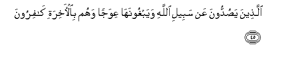

  
[Intangible Textual Heritage](../../index)  [Islam](../index) 
[Index](index)   
[Hypertext Qur'an](../htq/index)  [Unicode](../uq/007.htm#007_040) 
[Palmer](../sbe06/007)  [Pickthall](../pick/007.htm#007_040)  [Yusuf Ali
English](../yaq/yaq007)  [Rodwell](../qr/007)   
  
[Sūra VII.: A’rāf, or the Heights Index](007)  
  [Previous](00704)  [Next](00706) 

------------------------------------------------------------------------

  
*The Holy Quran*, tr. by Yusuf Ali, \[1934\], at Intangible Textual
Heritage

------------------------------------------------------------------------

# Sūra VII.: A’rāf, or the Heights

### Section 5

------------------------------------------------------------------------

40. Inna alla<u>th</u>eena ka<u>thth</u>aboo
bi-<u>a</u>y<u>a</u>tin<u>a</u> wa**i**stakbaroo AAanh<u>a</u> l<u>a</u>
tufatta<u>h</u>u lahum abw<u>a</u>bu a**l**ssam<u>a</u>-i wal<u>a</u>
yadkhuloona aljannata <u>h</u>att<u>a</u> yalija aljamalu fee sammi
alkhiy<u>at</u>i waka<u>tha</u>lika najzee almujrimeen**a**

40\. To those who reject  
Our Signs and treat them  
With arrogance, no opening  
Will there be of the gates  
Of heaven, nor will they  
Enter the Garden, until  
The camel can pass  
Through the eye of the needle:  
Such is Our reward  
For those in sin.

------------------------------------------------------------------------

41. Lahum min jahannama mih<u>a</u>dun wamin fawqihim ghaw<u>a</u>shin
waka<u>tha</u>lika najzee a**l***<u>thth</u>*<u>a</u>limeen**a**

41\. For them there is  
Hell, as a couch  
(Below) and folds and folds  
Of covering above: such  
Is Our requital of those  
Who do wrong.

------------------------------------------------------------------------

42. Wa**a**lla<u>th</u>eena <u>a</u>manoo waAAamiloo
a**l**<u>ssa</u>li<u>ha</u>ti l<u>a</u> nukallifu nafsan ill<u>a</u>
wusAAah<u>a</u> ol<u>a</u>-ika a<u>s</u>-<u>ha</u>bu aljannati hum
feeh<u>a</u> kh<u>a</u>lidoon**a**

42\. But those who believe  
And work righteousness,—  
No burden do We place  
On any soul, but that  
Which it can bear,  
They will be Companions  
Of the Garden, therein  
To dwell (for ever).

------------------------------------------------------------------------

43. WanazaAAn<u>a</u> m<u>a</u> fee <u>s</u>udoorihim min ghillin tajree
min ta<u>h</u>tihimu al-anh<u>a</u>ru waq<u>a</u>loo al<u>h</u>amdu
lill<u>a</u>hi alla<u>th</u>ee had<u>a</u>n<u>a</u> lih<u>atha</u>
wam<u>a</u> kunn<u>a</u> linahtadiya lawl<u>a</u> an
had<u>a</u>n<u>a</u> All<u>a</u>hu laqad j<u>a</u>at rusulu
rabbin<u>a</u> bi**a**l<u>h</u>aqqi wanoodoo an tilkumu aljannatu
oorithtumooh<u>a</u> bim<u>a</u> kuntum taAAmaloon**a**

43\. And We shall remove  
From their hearts any  
Lurking sense of injury;—  
Beneath them will be  
Rivers flowing;—and they  
Shall say: "Praise be, to God,  
Who hath guided us  
To this (felicity): never  
Could we have found  
Guidance, had it not been  
For the guidance of God:  
Indeed it was the truth.  
That the Apostles of our Lord  
Brought unto us." And they  
Shall hear the cry:  
"Behold! the Garden before you!  
Ye have been made  
Its inheritors, for your  
Deeds (of righteousness)."

------------------------------------------------------------------------

44. Wan<u>a</u>d<u>a</u> a<u>s</u>-<u>ha</u>bu aljannati
a<u>s</u>-<u>ha</u>ba a**l**nn<u>a</u>ri an qad wajadn<u>a</u> m<u>a</u>
waAAadan<u>a</u> rabbun<u>a</u> <u>h</u>aqqan fahal wajadtum m<u>a</u>
waAAada rabbukum <u>h</u>aqqan q<u>a</u>loo naAAam faa<u>thth</u>ana
mu-a<u>thth</u>inun baynahum an laAAnatu All<u>a</u>hi AAal<u>a</u>
a**l***<u>thth</u>*<u>a</u>limeen**a**

44\. The Companions of the Garden  
Will call out to the Companions  
Of the Fire: "We have  
Indeed found the promises  
Of our Lord to us true:  
Have you also found  
Your Lord's promises true?"  
They shall say, "Yes"; but  
A Crier shall proclaim  
Between them: "The curse  
Of God is on the wrong-doers;—

------------------------------------------------------------------------

45. Alla<u>th</u>eena ya<u>s</u>uddoona AAan sabeeli All<u>a</u>hi
wayabghoonah<u>a</u> AAiwajan wahum bi**a**l-<u>a</u>khirati
k<u>a</u>firoon**a**

45\. "Those who would hinder (men)  
From the path of God  
And would seek in it  
Something crooked:  
They were those who  
Denied the Hereafter."

------------------------------------------------------------------------

46. Wabaynahum<u>a</u> <u>h</u>ij<u>a</u>bun waAAal<u>a</u>
al-aAAr<u>a</u>fi rij<u>a</u>lun yaAArifoona kullan biseem<u>a</u>hum
wan<u>a</u>daw a<u>s</u>-<u>ha</u>ba aljannati an sal<u>a</u>mun
AAalaykum lam yadkhulooh<u>a</u> wahum ya<u>t</u>maAAoon**a**

46\. Between them shall be  
A veil, and on the Heights  
Will be men  
Who would know every one  
By his marks: they will call  
Out to the Companions  
Of the Garden, "Peace on you":  
They will not have entered,  
But they will have  
An assurance (thereof.)

------------------------------------------------------------------------

47. Wa-i<u>tha</u> <u>s</u>urifat ab<u>sa</u>ruhum tilq<u>a</u>a
a<u>s</u>-<u>ha</u>bi a**l**nn<u>a</u>ri q<u>a</u>loo rabban<u>a</u>
l<u>a</u> tajAAaln<u>a</u> maAAa alqawmi
a**l***<u>thth</u>*<u>a</u>limeen**a**

47\. When their eyes shall be turned  
Towards the Companions  
Of the Fire, they will say:  
"Our Lord! send us not  
To the company  
Of the wrong-doers."

------------------------------------------------------------------------

[Next: Section 6 (48-53)](00706)

