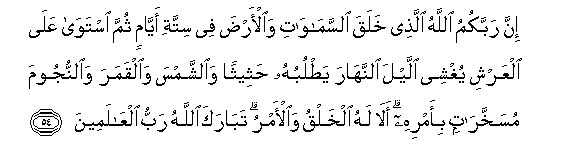
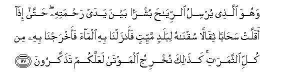
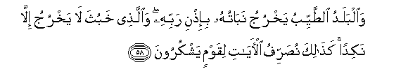

  
[Intangible Textual Heritage](../../index)  [Islam](../index) 
[Index](index)   
[Hypertext Qur'an](../htq/index)  [Unicode](../uq/007.htm#007_054) 
[Palmer](../sbe06/007)  [Pickthall](../pick/007.htm#007_054)  [Yusuf Ali
English](../yaq/yaq007)  [Rodwell](../qr/007)   
  
[Sūra VII.: A’rāf, or the Heights Index](007)  
  [Previous](00706)  [Next](00708) 

------------------------------------------------------------------------

  
*The Holy Quran*, tr. by Yusuf Ali, \[1934\], at Intangible Textual
Heritage

------------------------------------------------------------------------

# Sūra VII.: A’rāf, or the Heights

### Section 7

------------------------------------------------------------------------

54. Inna rabbakumu All<u>a</u>hu alla<u>th</u>ee khalaqa
a**l**ssam<u>a</u>w<u>a</u>ti wa**a**l-ar<u>d</u>a fee sittati
ayy<u>a</u>min thumma istaw<u>a</u> AAal<u>a</u> alAAarshi yughshee
allayla a**l**nnah<u>a</u>ra ya<u>t</u>lubuhu <u>h</u>atheethan
wa**al**shshamsa wa**a**lqamara wa**al**nnujooma musakhkhar<u>a</u>tin
bi-amrihi al<u>a</u> lahu alkhalqu wa**a**l-amru tab<u>a</u>raka
All<u>a</u>hu rabbu alAA<u>a</u>lameen**a**

54\. Your Guardian-Lord  
Is God, Who created  
The heavens and the earth  
In six Days, and is firmly  
Established on the Throne  
(Of authority): He draweth  
The night as a veil  
O'er the day, each seeking  
The other in rapid succession:  
He created the sun,  
The moon, and the stars,  
(All) governed by laws  
Under His Command.  
Is it not His to create  
And to govern? Blessed  
Be God, the Cherisher  
And Sustainer of the Worlds!

------------------------------------------------------------------------

55. OdAAoo rabbakum ta<u>d</u>arruAAan wakhufyatan innahu l<u>a</u>
yu<u>h</u>ibbu almuAAtadeen**a**

55\. Call on your Lord  
With humility and in private:  
For God loveth not  
Those who trespass beyond bounds.

------------------------------------------------------------------------

56. Wal<u>a</u> tufsidoo fee al-ar<u>d</u>i baAAda
i<u>s</u>l<u>ah</u>ih<u>a</u> wa**o**dAAoohu khawfan wa<u>t</u>amaAAan
inna ra<u>h</u>mata All<u>a</u>hi qareebun mina almu<u>h</u>sineen**a**

56\. Do no mischief on the earth,  
After it hath been  
Set in order, but call  
On Him with fear  
And longing (in your hearts):  
For the Mercy of God  
Is (always) near  
To those who do good.

------------------------------------------------------------------------

57. Wahuwa alla<u>th</u>ee yursilu a**l**rriy<u>ah</u>a bushran bayna
yaday ra<u>h</u>matihi <u>h</u>att<u>a</u> i<u>tha</u> aqallat
sa<u>ha</u>ban thiq<u>a</u>lan suqn<u>a</u>hu libaladin mayyitin
faanzaln<u>a</u> bihi alm<u>a</u>a faakhrajn<u>a</u> bihi min kulli
a**l**ththamar<u>a</u>ti ka<u>tha</u>lika nukhriju almawt<u>a</u>
laAAallakum ta<u>th</u>akkaroon**a**

57\. It is He Who sendeth  
The Winds like heralds  
Of glad tidings, going before  
His Mercy: when they have  
Carried the heavy-laden  
Clouds, We drive them  
To a land that is dead,  
Make rain to descend thereon,  
And produce every kind  
Of harvest therewith: thus  
Shall We raise up the dead:  
Perchance ye may remember.

------------------------------------------------------------------------

58. Wa**a**lbaladu a**l**<u>tt</u>ayyibu yakhruju nab<u>a</u>tuhu
bi-i<u>th</u>ni rabbihi wa**a**lla<u>th</u>ee khabutha l<u>a</u>
yakhruju ill<u>a</u> nakidan ka<u>tha</u>lika nu<u>s</u>arrifu
al-<u>a</u>y<u>a</u>ti liqawmin yashkuroon**a**

58\. From the land that is clean  
And good, by the Will  
Of its Cherisher, springs up  
Produce, (rich) after its kind:  
But from the land that is  
Bad, springs up nothing  
But that which is niggardly:  
Thus do we explain the Signs  
By various (symbols) to those  
Who are grateful.

------------------------------------------------------------------------

[Next: Section 8 (58-64)](00708)

