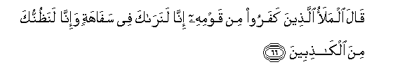
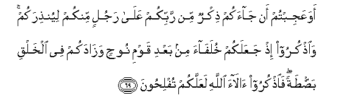
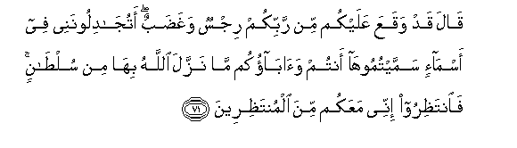
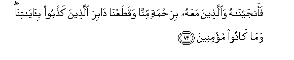

  
[Intangible Textual Heritage](../../index)  [Islam](../index.md) 
[Index](index.md)   
[Hypertext Qur'an](../htq/index)  [Unicode](../uq/007.htm#007_065.md) 
[Palmer](../sbe06/007)  [Pickthall](../pick/007.htm#007_065.md)  [Yusuf Ali
English](../yaq/yaq007)  [Rodwell](../qr/007.md)   
  
[Sūra VII.: A’rāf, or the Heights Index](007.md)  
  [Previous](00708)  [Next](00710.md) 

------------------------------------------------------------------------

  
*The Holy Quran*, tr. by Yusuf Ali, \[1934\], at Intangible Textual
Heritage

------------------------------------------------------------------------

# Sūra VII.: A’rāf, or the Heights

### Section 9

------------------------------------------------------------------------

65. Wa-il<u>a</u> AA<u>a</u>din akh<u>a</u>hum hoodan q<u>a</u>la
y<u>a</u> qawmi oAAbudoo All<u>a</u>ha m<u>a</u> lakum min il<u>a</u>hin
ghayruhu afal<u>a</u> tattaqoon**a**

65\. To the ’Ad people,  
(We sent) Hūd, one  
Of their (own) brethren:  
He said: "O my people!  
Worship God! ye have  
No other god but Him.  
Will ye not fear (God)?

------------------------------------------------------------------------

66. Q<u>a</u>la almalao alla<u>th</u>eena kafaroo min qawmihi
inn<u>a</u> lanar<u>a</u>ka fee saf<u>a</u>hatin wa-inn<u>a</u>
lana*<u>th</u>*unnuka mina alk<u>ath</u>ibeen**a**

66\. The leaders of the unbelievers  
Among his people said:  
"Ah! we see thou art  
An imbecile!" and "We think  
Thou art a liar!"

------------------------------------------------------------------------

67. Q<u>a</u>la y<u>a</u> qawmi laysa bee saf<u>a</u>hatun
wal<u>a</u>kinnee rasoolun min rabbi alAA<u>a</u>lameen**a**

67\. He said: "O my people!  
I am no imbecile, but  
(I am) an apostle from  
The Lord and Cherisher  
Of the Worlds!

------------------------------------------------------------------------

68. Oballighukum ris<u>a</u>l<u>a</u>ti rabbee waan<u>a</u> lakum
n<u>as</u>i<u>h</u>un ameen**un**

68\. "I but fulfil towards you  
The duties of my Lord's mission:  
I am to you a sincere  
And trustworthy adviser.

------------------------------------------------------------------------

69. Awa AAajibtum an j<u>a</u>akum <u>th</u>ikrun min rabbikum
AAal<u>a</u> rajulin minkum liyun<u>th</u>irakum wa**o**<u>th</u>kuroo
i<u>th</u> jaAAalakum khulaf<u>a</u>a min baAAdi qawmi noo<u>h</u>in
waz<u>a</u>dakum fee alkhalqi bas<u>t</u>atan fa**o**<u>th</u>kuroo
<u>a</u>l<u>a</u>a All<u>a</u>hi laAAallakum tufli<u>h</u>oon**a**

69\. "Do ye wonder that  
There hath come to you  
A message from your Lord  
Through a man of your own  
People, to warn you?  
Call in remembrance  
That He made you  
Inheritors after the people  
Of Noah, and gave you  
A stature tall among the nations.  
Call in remembrance  
The benefits (ye have received)  
From God: that so  
Ye may prosper."

------------------------------------------------------------------------

70. Q<u>a</u>loo aji/tan<u>a</u> linaAAbuda All<u>a</u>ha wa<u>h</u>dahu
wana<u>th</u>ara m<u>a</u> k<u>a</u>na yaAAbudu
<u>a</u>b<u>a</u>on<u>a</u> fa/tin<u>a</u> bim<u>a</u> taAAidun<u>a</u>
in kunta mina a**l**<u>ssa</u>diqeen**a**

70\. They said: "Comest thou  
To us, that we may worship  
God alone, and give up  
The cult of our fathers?  
Bring us what thou  
Threatenest us with,  
If so be that thou  
Tellest the truth!"

------------------------------------------------------------------------

71. Q<u>a</u>la qad waqaAAa AAalaykum min rabbikum rijsun
wagha<u>d</u>abun atuj<u>a</u>diloonanee fee asm<u>a</u>-in
sammaytumooh<u>a</u> antum wa<u>a</u>b<u>a</u>okum m<u>a</u> nazzala
All<u>a</u>hu bih<u>a</u> min sul<u>ta</u>nin fa**i**nta*<u>th</u>*iroo
innee maAAakum mina almunta*<u>th</u>*ireen**a**

71\. He said: "Punishment  
And wrath have already  
Come upon you from your Lord  
Dispute ye with me  
Over names which ye  
Have devised—ye  
And your fathers,  
Without authority from God?  
Then wait: I am  
Amongst you, also waiting."

------------------------------------------------------------------------

72. Faanjayn<u>a</u>hu wa**a**lla<u>th</u>eena maAAahu bira<u>h</u>matin
minn<u>a</u> waqa<u>t</u>aAAn<u>a</u> d<u>a</u>bira alla<u>th</u>eena
ka<u>thth</u>aboo bi-<u>a</u>y<u>a</u>tin<u>a</u> wam<u>a</u>
k<u>a</u>noo mu/mineen**a**

72\. We saved him and those  
Who adhered to him,  
By Our Mercy, and We  
Cut off the roots of those  
Who rejected Our Signs  
And did not believe.

------------------------------------------------------------------------

[Next: Section 10 (73-84)](00710.md)

