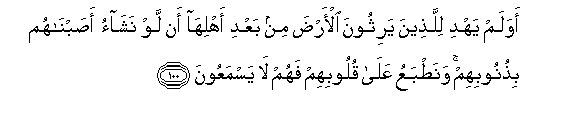
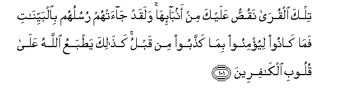
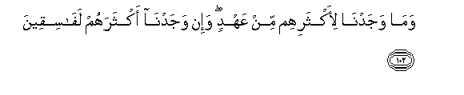
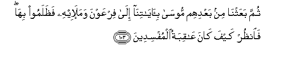
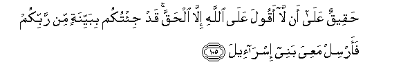

  
[Intangible Textual Heritage](../../index)  [Islam](../index.md) 
[Index](index.md)   
[Hypertext Qur'an](../htq/index)  [Unicode](../uq/007.htm#007_100.md) 
[Palmer](../sbe06/007)  [Pickthall](../pick/007.htm#007_100.md)  [Yusuf Ali
English](../yaq/yaq007)  [Rodwell](../qr/007.md)   
  
[Sūra VII.: A’rāf, or the Heights Index](007.md)  
  [Previous](00712)  [Next](00714.md) 

------------------------------------------------------------------------

  
*The Holy Quran*, tr. by Yusuf Ali, \[1934\], at Intangible Textual
Heritage

------------------------------------------------------------------------

# Sūra VII.: A’rāf, or the Heights

### Section 13

------------------------------------------------------------------------

100. Awa lam yahdi lilla<u>th</u>eena yarithoona al-ar<u>d</u>a min
baAAdi ahlih<u>a</u> an law nash<u>a</u>o a<u>s</u>abn<u>a</u>hum
bi<u>th</u>unoobihim wana<u>t</u>baAAu AAal<u>a</u> quloobihim fahum
l<u>a</u> yasmaAAoon**a**

100\. To those who inherit  
The earth in succession  
To its (previous) possessors,  
Is it not a guiding (lesson)  
That, if We so willed,  
We could punish them (too)  
For their sins, and seal up  
Their hearts so that they  
Could not hear?

------------------------------------------------------------------------

101. Tilka alqur<u>a</u> naqu<u>ss</u>u AAalayka min
anb<u>a</u>-ih<u>a</u> walaqad j<u>a</u>at-hum rusuluhum
bi**a**lbayyin<u>a</u>ti fam<u>a</u> k<u>a</u>noo liyu/minoo bim<u>a</u>
ka<u>thth</u>aboo min qablu ka<u>tha</u>lika ya<u>t</u>baAAu
All<u>a</u>hu AAal<u>a</u> quloobi alk<u>a</u>fireen**a**

101\. Such were the towns  
Whose story We (thus)  
Relate unto thee:  
There came indeed to them  
Their apostles with clear (Signs):  
But they would not believe  
What they had rejected before.  
Thus doth God seal up  
The hearts of those  
Who reject Faith.

------------------------------------------------------------------------

102. Wam<u>a</u> wajadn<u>a</u> li-aktharihim min AAahdin wa-in
wajadn<u>a</u> aktharahum laf<u>a</u>siqeen**a**

102\. Most of them We found not  
Men (true) to their covenant:  
But most of them We found  
Rebellious and disobedient.

------------------------------------------------------------------------

103. Thumma baAAathn<u>a</u> min baAAdihim moos<u>a</u>
bi-<u>a</u>y<u>a</u>tin<u>a</u> il<u>a</u> firAAawna wamala-ihi
fa*<u>th</u>*alamoo bih<u>a</u> fa**o**nu*<u>th</u>*ur kayfa k<u>a</u>na
AA<u>a</u>qibatu almufsideen**a**

103\. Then after them We sent  
Moses with Our Signs  
To Pharaoh and his chiefs,  
But they wrongfully rejected them:  
So see what was the end  
Of those who made mischief.

------------------------------------------------------------------------

104. Waq<u>a</u>la moos<u>a</u> y<u>a</u> firAAawnu innee rasoolun min
rabbi alAA<u>a</u>lameen**a**

104\. Moses said: "O Pharaoh!  
I am an apostle from  
The Lord of the Worlds,—

------------------------------------------------------------------------

105. <u>H</u>aqeequn AAal<u>a</u> an l<u>a</u> aqoola AAal<u>a</u>
All<u>a</u>hi ill<u>a</u> al<u>h</u>aqqa qad ji/tukum bibayyinatin min
rabbikum faarsil maAAiya banee isr<u>a</u>-eel**a**

105\. One for whom it is right  
To say nothing but truth  
About God. Now have I  
Come unto you (people), from  
Your Lord, with a clear (Sign):  
So let the Children of Israel  
Depart along with me."

------------------------------------------------------------------------

106. Q<u>a</u>la in kunta ji/ta bi-<u>a</u>yatin fa/ti bih<u>a</u> in
kunta mina a**l**<u>ssa</u>diqeen**a**

106\. (Pharaoh) said: "If indeed  
Thou hast come with a Sign,  
Show it forth,  
If thou tellest the truth."

------------------------------------------------------------------------

107. Faalq<u>a</u> AAa<u>sa</u>hu fa-i<u>tha</u> hiya thuAAb<u>a</u>nun
mubeen**un**

107\. Then (Moses) threw his rod,  
And behold! it was  
A serpent, plain (for all to see)!

------------------------------------------------------------------------

108. WanazaAAa yadahu fa-i<u>tha</u> hiya bay<u>da</u>o
li**l**nn<u>a</u>*<u>th</u>*ireen**a**

108\. And he drew out his hand,  
And behold! it was white  
To all beholders!

------------------------------------------------------------------------

[Next: Section 14 (109-126)](00714.md)

