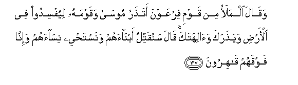
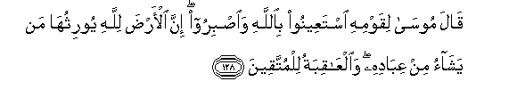
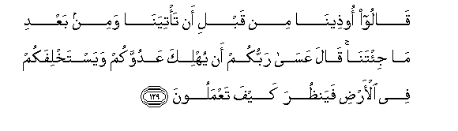

  
[Intangible Textual Heritage](../../index)  [Islam](../index) 
[Index](index)   
[Hypertext Qur'an](../htq/index)  [Unicode](../uq/007.htm#007_127) 
[Palmer](../sbe06/007)  [Pickthall](../pick/007.htm#007_127)  [Yusuf Ali
English](../yaq/yaq007)  [Rodwell](../qr/007)   
  
[Sūra VII.: A’rāf, or the Heights Index](007)  
  [Previous](00714)  [Next](00716) 

------------------------------------------------------------------------

  
*The Holy Quran*, tr. by Yusuf Ali, \[1934\], at Intangible Textual
Heritage

------------------------------------------------------------------------

# Sūra VII.: A’rāf, or the Heights

### Section 15

------------------------------------------------------------------------

127. Waq<u>a</u>la almalao min qawmi firAAawna ata<u>th</u>aru
moos<u>a</u> waqawmahu liyufsidoo fee al-ar<u>d</u>i waya<u>th</u>araka
wa<u>a</u>lihataka q<u>a</u>la sanuqattilu abn<u>a</u>ahum
wanasta<u>h</u>yee nis<u>a</u>ahum wa-inn<u>a</u> fawqahum
q<u>a</u>hiroon**a**

127\. Said the chiefs of Pharaoh's  
People: "Wilt thou leave  
Moses and his people,  
To spread mischief in the land,  
And to abandon thee  
And thy gods?" He said:  
"Their male children will we  
Slay; (only) their females  
Will we save alive;  
And we have over them  
(Power) irresistible."

------------------------------------------------------------------------

128. Q<u>a</u>la moos<u>a</u> liqawmihi istaAAeenoo bi**A**ll<u>a</u>hi
wa**i**<u>s</u>biroo inna al-ar<u>d</u>a lill<u>a</u>hi
yoorithuh<u>a</u> man yash<u>a</u>o min AAib<u>a</u>dihi
wa**a**lAA<u>a</u>qibatu lilmuttaqeen**a**

128\. Said Moses to his people:  
"Pray for help from God,.  
And (wait) in patience and  
constancy:  
For the earth is God's,  
To give as a heritage  
To such of His servants  
As He pleaseth; and the end  
Is (best) for the righteous.

------------------------------------------------------------------------

129. Q<u>a</u>loo oo<u>th</u>een<u>a</u> min qabli an ta/tiyan<u>a</u>
wamin baAAdi m<u>a</u> ji/tan<u>a</u> q<u>a</u>la AAas<u>a</u> rabbukum
an yuhlika AAaduwwakum wayastakhlifakum fee al-ar<u>d</u>i
fayan*<u>th</u>*ura kayfa taAAmaloon**a**

129\. They said: "We have had  
(Nothing but) trouble, both before  
And after thou camest  
To us." He said:  
"It may be that your Lord  
Will destroy your enemy  
And make you inheritors  
In the earth; that so  
He may try you  
By your deeds."

------------------------------------------------------------------------

[Next: Section 16 (130-141)](00716)

