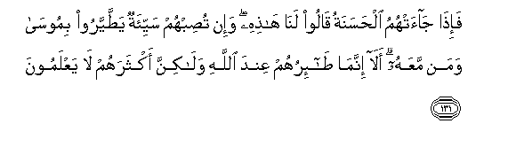
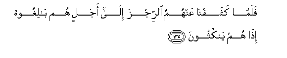
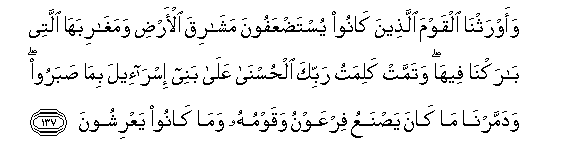
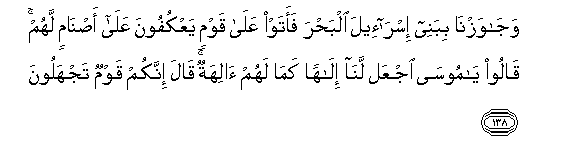
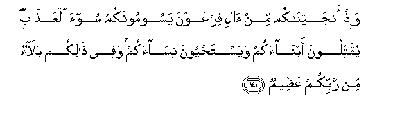

  
[Intangible Textual Heritage](../../index)  [Islam](../index) 
[Index](index)   
[Hypertext Qur'an](../htq/index)  [Unicode](../uq/007.htm#007_130) 
[Palmer](../sbe06/007)  [Pickthall](../pick/007.htm#007_130)  [Yusuf Ali
English](../yaq/yaq007)  [Rodwell](../qr/007)   
  
[Sūra VII.: A’rāf, or the Heights Index](007)  
  [Previous](00715)  [Next](00717) 

------------------------------------------------------------------------

  
*The Holy Quran*, tr. by Yusuf Ali, \[1934\], at Intangible Textual
Heritage

------------------------------------------------------------------------

# Sūra VII.: A’rāf, or the Heights

### Section 16

------------------------------------------------------------------------

130. Walaqad akha<u>th</u>n<u>a</u> <u>a</u>la firAAawna
bi**al**ssineena wanaq<u>s</u>in mina a**l**ththamar<u>a</u>ti
laAAallahum ya<u>thth</u>akkaroon**a**

130\. We punished the people  
Of Pharaoh with years  
(Of drought) and shortness  
Of crops; that they might  
Receive admonition.

------------------------------------------------------------------------

131. Fa-i<u>tha</u> j<u>a</u>at-humu al<u>h</u>asanatu q<u>a</u>loo
lan<u>a</u> h<u>ath</u>ihi wa-in tu<u>s</u>ibhum sayyi-atun
ya<u>tt</u>ayyaroo bimoos<u>a</u> waman maAAahu al<u>a</u> innam<u>a</u>
<u>ta</u>-iruhum AAinda All<u>a</u>hi wal<u>a</u>kinna aktharahum
l<u>a</u> yaAAlamoon**a**

131\. But when good (times) came,  
They said, "This is due  
To us;" when gripped  
By calamity, they ascribed it  
To evil omens connected  
With Moses and those with him!  
Behold! in truth the omens  
Of evil are theirs  
In God's sight, but most  
Of them do not understand!

------------------------------------------------------------------------

132. Waq<u>a</u>loo mahm<u>a</u> ta/tin<u>a</u> bihi min <u>a</u>yatin
litas<u>h</u>aran<u>a</u> bih<u>a</u> fam<u>a</u> na<u>h</u>nu laka
bimu/mineen**a**

132\. They said (to Moses):  
"Whatever be the Signs  
Thou bringest, to work  
Therewith thy sorcery on us,"  
We shall never believe  
In thee."

------------------------------------------------------------------------

133. Faarsaln<u>a</u> AAalayhimu a**l**<u>tt</u>oof<u>a</u>na
wa**a**ljar<u>a</u>da wa**a**lqummala wa**al**<u>dd</u>af<u>a</u>diAAa
wa**al**ddama <u>a</u>y<u>a</u>tin mufa<u>ss</u>al<u>a</u>tin
fa**i**stakbaroo wak<u>a</u>noo qawman mujrimeen**a**

133\. So We sent (plagues) on them:  
Wholesale Death,  
Locusts, Lice, Frogs,  
And Blood: Signs openly  
Self-explained: but they  
Were steeped in arrogance,—  
A people given to sin.

------------------------------------------------------------------------

134. Walamm<u>a</u> waqaAAa AAalayhimu a**l**rrijzu q<u>a</u>loo
y<u>a</u> moos<u>a</u> odAAu lan<u>a</u> rabbaka bim<u>a</u> AAahida
AAindaka la-in kashafta AAann<u>a</u> a**l**rrijza lanu/minanna laka
walanursilanna maAAaka banee isr<u>a</u>-eel**a**

134\. Every time the Penalty  
Fell on them, they said:  
"O Moses! on our behalf  
Call on thy Lord in virtue  
Of his promise to thee:  
If thou wilt remove  
The Penalty from us,  
We shall truly believe in thee,  
And we shall send away  
The Children of Israel  
With thee."

------------------------------------------------------------------------

135. Falamm<u>a</u> kashafn<u>a</u> AAanhumu a**l**rrijza il<u>a</u>
ajalin hum b<u>a</u>lighoohu i<u>tha</u> hum yankuthoon**a**

135\. But every tune We removed  
The Penalty from them  
According to a fixed term  
Which they had to fulfil,—  
Behold! they broke their word!

------------------------------------------------------------------------

136. Fa**i**ntaqamn<u>a</u> minhum faaghraqn<u>a</u>hum fee alyammi
bi-annahum ka<u>thth</u>aboo bi-<u>a</u>y<u>a</u>tin<u>a</u>
wak<u>a</u>noo AAanh<u>a</u> gh<u>a</u>fileen**a**

136\. So We exacted retribution  
From them: We drowned them  
In the sea, because they  
Rejected Our Signs, and failed  
To take warning from them.

------------------------------------------------------------------------

137. Waawrathn<u>a</u> alqawma alla<u>th</u>eena k<u>a</u>noo
yusta<u>d</u>AAafoona mash<u>a</u>riqa al-ar<u>d</u>i
wamagh<u>a</u>ribah<u>a</u> allatee b<u>a</u>rakn<u>a</u> feeh<u>a</u>
watammat kalimatu rabbika al<u>h</u>usn<u>a</u> AAal<u>a</u> banee
isr<u>a</u>-eela bim<u>a</u> <u>s</u>abaroo wadammarn<u>a</u> m<u>a</u>
k<u>a</u>na ya<u>s</u>naAAu firAAawnu waqawmuhu wam<u>a</u> k<u>a</u>noo
yaAArishoon**a**

137\. And We made a people,  
Considered weak (and of no account),  
Inheritors of lands  
In both East and West,—  
Lands whereon We sent  
Down Our blessings.  
The fair promise of thy Lord  
Was fulfilled for the Children  
Of Israel, because they had  
Patience and constancy,  
And We levelled to the ground  
The great Works and fine Buildings  
Which Pharaoh and his people  
Erected (with such pride).

------------------------------------------------------------------------

138. Waj<u>a</u>wazn<u>a</u> bibanee isr<u>a</u>-eela alba<u>h</u>ra
faataw AAal<u>a</u> qawmin yaAAkufoona AAal<u>a</u>
a<u>s</u>n<u>a</u>min lahum q<u>a</u>loo y<u>a</u> moos<u>a</u> ijAAal
lan<u>a</u> il<u>a</u>han kam<u>a</u> lahum <u>a</u>lihatun q<u>a</u>la
innakum qawmun tajhaloon**a**

138\. We took the Children of Israel  
(With safety) across the sea.  
They came upon a people  
Devoted entirely to some idols  
They had. They said:  
"O Moses! fashion for us  
A god like unto the gods  
They have." He said:  
"Surely ye are a people  
Without knowledge.

------------------------------------------------------------------------

139. Inna h<u>a</u>ol<u>a</u>-i mutabbarun m<u>a</u> hum feehi
wab<u>at</u>ilun m<u>a</u> k<u>a</u>noo yaAAmaloon**a**

139\. "As to these folk,—  
The cult they are in  
Is (but) a fragment of a ruin,  
And vain is the (worship)  
Which they practise."

------------------------------------------------------------------------

140. Q<u>a</u>la aghayra All<u>a</u>hi abgheekum il<u>a</u>han wahuwa
fa<u>dd</u>alakum AAal<u>a</u> alAA<u>a</u>lameen**a**

140\. He said: "Shall I seek for you  
A god other than the (true)  
God, when it is God  
Who hath endowed you  
With gifts above the nations?"

------------------------------------------------------------------------

141. Wa-i<u>th</u> anjayn<u>a</u>kum min <u>a</u>li firAAawna
yasoomoonakum soo-a alAAa<u>tha</u>bi yuqattiloona abn<u>a</u>akum
wayasta<u>h</u>yoona nis<u>a</u>akum wafee <u>tha</u>likum bal<u>a</u>on
min rabbikum AAa*<u>th</u>*eem**un**

141\. And remember We rescued you  
From Pharaoh's people,  
Who afflicted you with  
The worst of penalties,  
Who slew your male children  
And saved alive your females:  
In that was a momentous  
Trial from your Lord.

------------------------------------------------------------------------

[Next: Section 17 (142-147)](00717)

