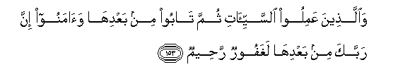
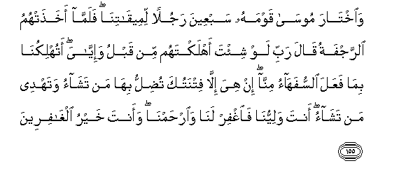

  
[Intangible Textual Heritage](../../index)  [Islam](../index) 
[Index](index)   
[Hypertext Qur'an](../htq/index)  [Unicode](../uq/007.htm#007_152) 
[Palmer](../sbe06/007)  [Pickthall](../pick/007.htm#007_152)  [Yusuf Ali
English](../yaq/yaq007)  [Rodwell](../qr/007)   
  
[Sūra VII.: A’rāf, or the Heights Index](007)  
  [Previous](00718)  [Next](00720) 

------------------------------------------------------------------------

  
*The Holy Quran*, tr. by Yusuf Ali, \[1934\], at Intangible Textual
Heritage

------------------------------------------------------------------------

# Sūra VII.: A’rāf, or the Heights

### Section 19

------------------------------------------------------------------------

152. Inna alla<u>th</u>eena ittakha<u>th</u>oo alAAijla
sayan<u>a</u>luhum gha<u>d</u>abun min rabbihim wa<u>th</u>illatun fee
al<u>h</u>ay<u>a</u>ti a**l**dduny<u>a</u> waka<u>tha</u>lika najzee
almuftareen**a**

152\. Those who took the calf  
(For worship) will indeed  
Be overwhelmed with wrath  
From their Lord, and with  
Shame in this life:  
Thus do We recompense  
Those who invent (falsehoods).

------------------------------------------------------------------------

153. Wa**a**lla<u>th</u>eena AAamiloo a**l**ssayyi-<u>a</u>ti thumma
t<u>a</u>boo min baAAdih<u>a</u> wa<u>a</u>manoo inna rabbaka min
baAAdih<u>a</u> laghafoorun ra<u>h</u>eem**un**

153\. But those who do wrong  
But repent thereafter and  
(Truly) believe,—verily  
Thy Lord is thereafter  
Oft-forgiving, Most Merciful.

------------------------------------------------------------------------

154. Walamm<u>a</u> sakata AAan moos<u>a</u> algha<u>d</u>abu
akha<u>th</u>a al-alw<u>ah</u>a wafee nuskhatih<u>a</u> hudan
wara<u>h</u>matun lilla<u>th</u>eena hum lirabbihim yarhaboon**a**

154\. When the anger of Moses  
Was appeased, he took up  
The Tablets: in the writing  
Thereon was Guidance and Mercy  
For such as fear their Lord.

------------------------------------------------------------------------

155. Wa**i**kht<u>a</u>ra moos<u>a</u> qawmahu sabAAeena rajulan
limeeq<u>a</u>tin<u>a</u> falamm<u>a</u> akha<u>th</u>at-humu
a**l**rrajfatu q<u>a</u>la rabbi law shi/ta ahlaktahum min qablu
wa-iyy<u>a</u>ya atuhlikun<u>a</u> bim<u>a</u> faAAala
a**l**ssufah<u>a</u>o minn<u>a</u> in hiya ill<u>a</u> fitnatuka
tu<u>d</u>illu bih<u>a</u> man tash<u>a</u>o watahdee man tash<u>a</u>o
anta waliyyun<u>a</u> fa**i**ghfir lan<u>a</u>
wa**i**r<u>h</u>amn<u>a</u> waanta khayru algh<u>a</u>fireen**a**

155\. And Moses chose seventy  
Of his people for Our place  
Of meeting: when they  
Were seized with violent quaking,  
He prayed: "O my Lord!  
If it had been Thy Will  
Thou couldst have destroyed,  
Long before, both them  
And me: wouldst Thou  
Destroy us for the deeds  
Of the foolish ones among us?  
This is no more than  
Thy trial: by it Thou causest  
Whom Thou wilt to stray,  
And Thou leadest whom  
Thou wilt into the right path.  
Thou art our Protector:  
So forgive us and give us  
Thy mercy; for Thou art  
The Best of those who forgive.

------------------------------------------------------------------------

156. Wa**o**ktub lan<u>a</u> fee h<u>ath</u>ihi a**l**dduny<u>a</u>
<u>h</u>asanatan wafee al-<u>a</u>khirati inn<u>a</u> hudn<u>a</u>
ilayka q<u>a</u>la AAa<u>tha</u>bee o<u>s</u>eebu bihi man ash<u>a</u>o
wara<u>h</u>matee wasiAAat kulla shay-in fasaaktubuh<u>a</u>
lilla<u>th</u>eena yattaqoona wayu/toona a**l**zzak<u>a</u>ta
wa**a**lla<u>th</u>eena hum bi-<u>a</u>y<u>a</u>tin<u>a</u>
yu/minoon**a**

156\. "And ordain for us  
That which is good,  
In this life  
And in the Hereafter:  
For we have turned unto Thee."  
He said: "With My Punishment  
I visit whom I will;  
But My Mercy extendeth  
To all things. That (Mercy)  
I shall ordain for those  
Who do right, and practise  
Regular charity, and those  
Who believe in Our Signs;—

------------------------------------------------------------------------

157. Alla<u>th</u>eena yattabiAAoona a**l**rrasoola a**l**nnabiyya
al-ommiyya alla<u>th</u>ee yajidoonahu maktooban AAindahum fee
a**l**ttawr<u>a</u>ti wa**a**l-injeeli ya/muruhum bi**a**lmaAAroofi
wayanh<u>a</u>hum AAani almunkari wayu<u>h</u>illu lahumu
a**l**<u>tt</u>ayyib<u>a</u>ti wayu<u>h</u>arrimu AAalayhimu
alkhab<u>a</u>-itha waya<u>d</u>aAAu AAanhum i<u>s</u>rahum
wa**a**l-aghl<u>a</u>la allatee k<u>a</u>nat AAalayhim
fa**a**lla<u>th</u>eena <u>a</u>manoo bihi waAAazzaroohu
wana<u>s</u>aroohu wa**i**ttabaAAoo a**l**nnoora alla<u>th</u>ee onzila
maAAahu ol<u>a</u>-ika humu almufli<u>h</u>oon**a**

157\. "Those who follow the Apostle,  
The unlettered Prophet,  
Whom they find mentioned  
In their own (Scriptures),—  
In the Law and the Gospel;—  
For he commands them  
What is just and forbids them  
What is evil; he allows  
Them as lawful what is good  
(And pure) and prohibits them  
From what is bad (and impure);  
He releases them  
From their heavy burdens  
And from the yokes  
That are upon them.  
So it is those who believe  
In him, honour him,  
Help him, and follow the Light  
Which is sent down with him,—  
It is they who will prosper."

------------------------------------------------------------------------

[Next: Section 20 (158-162)](00720)

