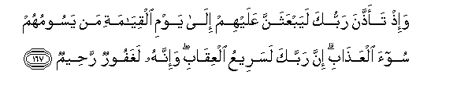
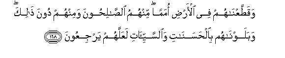
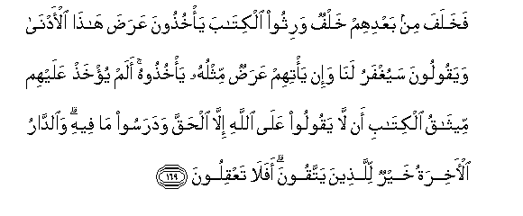
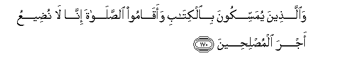
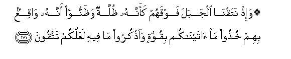

  
[Intangible Textual Heritage](../../index)  [Islam](../index) 
[Index](index)   
[Hypertext Qur'an](../htq/index)  [Unicode](../uq/007.htm#007_163) 
[Palmer](../sbe06/007)  [Pickthall](../pick/007.htm#007_163)  [Yusuf Ali
English](../yaq/yaq007)  [Rodwell](../qr/007)   
  
[Sūra VII.: A’rāf, or the Heights Index](007)  
  [Previous](00720)  [Next](00722) 

------------------------------------------------------------------------

  
*The Holy Quran*, tr. by Yusuf Ali, \[1934\], at Intangible Textual
Heritage

------------------------------------------------------------------------

# Sūra VII.: A’rāf, or the Heights

### Section 21

------------------------------------------------------------------------

163. Wa**i**s-alhum AAani alqaryati allatee k<u>a</u>nat <u>had</u>irata
alba<u>h</u>ri i<u>th</u> yaAAdoona fee a**l**ssabti i<u>th</u>
ta/teehim <u>h</u>eet<u>a</u>nuhum yawma sabtihim shurraAAan wayawma
l<u>a</u> yasbitoona l<u>a</u> ta/teehim ka<u>tha</u>lika nabloohum
bim<u>a</u> k<u>a</u>noo yafsuqoon**a**

163\. Ask them concerning the town  
Standing close by the sea.  
Behold! they transgressed  
In the matter of the Sabbath.  
For on the day of their Sabbath  
Their fish did come to them,  
Openly holding up their heads,  
But on the day they had  
No Sabbath, they came not:  
Thus did We make a trial  
Of them, for they were  
Given to transgression.

------------------------------------------------------------------------

164. Wa-i<u>th</u> q<u>a</u>lat ommatun minhum lima taAAi*<u>th</u>*oona
qawman All<u>a</u>hu muhlikuhum aw muAAa<u>thth</u>ibuhum
AAa<u>tha</u>ban shadeedan q<u>a</u>loo maAA<u>th</u>iratan il<u>a</u>
rabbikum walaAAallahum yattaqoon**a**

164\. When some of them said:  
"Why do ye preach  
To a people whom God  
Will destroy or visit  
With a terrible punishment?"—  
Said the preachers: "To discharge  
Our duty to your Lord,  
And perchance they may fear Him."

------------------------------------------------------------------------

165. Falamm<u>a</u> nasoo m<u>a</u> <u>th</u>ukkiroo bihi anjayn<u>a</u>
alla<u>th</u>eena yanhawna AAani a**l**ssoo-i waakha<u>th</u>n<u>a</u>
alla<u>th</u>eena *<u>th</u>*alamoo biAAa<u>tha</u>bin ba-eesin
bim<u>a</u> k<u>a</u>noo yafsuqoon**a**

165\. When they disregarded the warnings  
That had been given them,  
We rescued those who forbade  
Evil; but We visited  
The wrong-doers with a  
Grievous [punishment](errata.htm#1), because  
They were given to transgression.

------------------------------------------------------------------------

166. Falamm<u>a</u> AAataw AAan m<u>a</u> nuhoo AAanhu quln<u>a</u>
lahum koonoo qiradatan kh<u>a</u>si-een**a**

166\. When in their insolence  
They transgressed (all) prohibitions,  
We said to them:  
"Be ye apes,  
Despised and rejected."

------------------------------------------------------------------------

167. Wa-i<u>th</u> taa<u>thth</u>ana rabbuka layabAAathanna AAalayhim
il<u>a</u> yawmi alqiy<u>a</u>mati man yasoomuhum soo-a
alAAa<u>tha</u>bi inna rabbaka lasareeAAu alAAiq<u>a</u>bi wa-innahu
laghafoorun ra<u>h</u>eem**un**

167\. Behold! thy Lord did declare  
That He would send  
Against them, to the Day  
Of Judgment, those who would  
Afflict them with grievous  
Penalty. Thy Lord is quick  
In retribution, but He is also  
Oft-forgiving, Most Merciful.

------------------------------------------------------------------------

168. Waqa<u>tt</u>aAAn<u>a</u>hum fee al-ar<u>d</u>i omaman minhumu
a**l**<u>ssa</u>li<u>h</u>oona waminhum doona <u>tha</u>lika
wabalawn<u>a</u>hum bi**a**l<u>h</u>asan<u>a</u>ti
wa**al**ssayyi-<u>a</u>ti laAAallahum yarjiAAoon**a**

168\. We broke them up  
Into sections on this earth.  
There are among them some  
That are the righteous, and some  
That are the opposite.  
We have tried them  
With both prosperity and adversity:  
In order that they  
Might turn (to Us).

------------------------------------------------------------------------

169. Fakhalafa min baAAdihim khalfun warithoo alkit<u>a</u>ba
ya/khu<u>th</u>oona AAara<u>d</u>a h<u>atha</u> al-adn<u>a</u>
wayaqooloona sayughfaru lan<u>a</u> wa-in ya/tihim AAara<u>d</u>un
mithluhu ya/khu<u>th</u>oohu alam yu/kha<u>th</u> AAalayhim
meeth<u>a</u>qu alkit<u>a</u>bi an l<u>a</u> yaqooloo AAal<u>a</u>
All<u>a</u>hi ill<u>a</u> al<u>h</u>aqqa wadarasoo m<u>a</u> feehi
wa**al**dd<u>a</u>ru al-<u>a</u>khiratu khayrun lilla<u>th</u>eena
yattaqoona afal<u>a</u> taAAqiloon**a**

169\. After them succeeded  
An (evil) generation: they  
Inherited the Book, but  
They chose (for themselves)  
The vanities of this world,  
Saying (for excuse): "(Everything)  
Will be forgiven us."  
(Even so), if similar vanities  
Came their way, they would  
(Again) seize them.  
Was not the Covenant  
Of the Book taken from them,  
That they would not  
Ascribe to God anything  
But the truth? And they  
Study what is in the Book.  
But best for the righteous  
Is the Home in the Hereafter.  
Will ye not understand?

------------------------------------------------------------------------

170. Wa**a**lla<u>th</u>eena yumassikoona bi**a**lkit<u>a</u>bi
waaq<u>a</u>moo a**l**<u>ss</u>al<u>a</u>ta inn<u>a</u> l<u>a</u>
nu<u>d</u>eeAAu ajra almu<u>s</u>li<u>h</u>een**a**

170\. As to those who hold fast  
By the Book and establish  
Regular Prayer,—never  
Shall we suffer the reward  
Of the righteous to perish.

------------------------------------------------------------------------

171. Wa-i<u>th</u> nataqn<u>a</u> aljabala fawqahum kaannahu
*<u>th</u>*ullatun wa*<u>th</u>*annoo annahu w<u>a</u>qiAAun bihim
khu<u>th</u>oo m<u>a</u> <u>a</u>tayn<u>a</u>kum biquwwatin
wa**o**<u>th</u>kuroo m<u>a</u> feehi laAAallakum tattaqoon**a**

171\. When We shook the Mount  
Over them, as if it had been  
A canopy, and they thought  
It was going to fall on them  
(We said): "Hold firmly  
To what We have given you,  
And bring (ever) to remembrance  
What is therein;  
Perchance ye may fear God."

------------------------------------------------------------------------

[Next: Section 22 (172-181)](00722)

