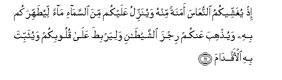
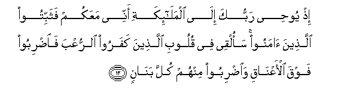
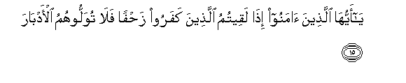
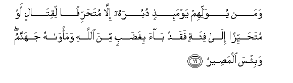
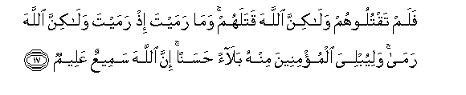
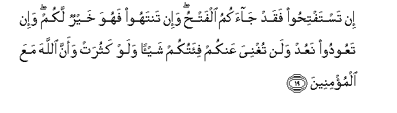

  
[Intangible Textual Heritage](../../index)  [Islam](../index.md) 
[Index](index.md)   
[Hypertext Qur'an](../htq/index)  [Unicode](../uq/008.htm#008_011.md) 
[Palmer](../sbe06/008)  [Pickthall](../pick/008.htm#008_011.md)  [Yusuf Ali
English](../yaq/yaq008)  [Rodwell](../qr/008.md)   
  
[Sūra VIII.: Anfāl, or the Spoils of War. Index](008.md)  
  [Previous](00801)  [Next](00803.md) 

------------------------------------------------------------------------

  
*The Holy Quran*, tr. by Yusuf Ali, \[1934\], at Intangible Textual
Heritage

------------------------------------------------------------------------

# Sūra VIII.: Anfāl, or the Spoils of War.

### Section 2

------------------------------------------------------------------------

11. I<u>th</u> yughashsheekumu a**l**nnuAA<u>a</u>sa amanatan minhu
wayunazzilu AAalaykum mina a**l**ssam<u>a</u>-i m<u>a</u>an
liyu<u>t</u>ahhirakum bihi wayu<u>th</u>hiba AAankum rijza
a**l**shshay<u>ta</u>ni waliyarbi<u>t</u>a AAal<u>a</u> quloobikum
wayuthabbita bihi al-aqd<u>a</u>m**a**

11\. Remember He covered you  
With a sort of drowsiness,  
To give you calm as from  
Himself, and he caused  
Rain to descend on you  
From heaven, to clean you  
Therewith, to remove from you  
The stain of Satan,  
To strengthen your hearts,  
And to plant your feet  
Firmly therewith.

------------------------------------------------------------------------

12. I<u>th</u> yoo<u>h</u>ee rabbuka il<u>a</u> almal<u>a</u>-ikati
annee maAAakum fathabbitoo alla<u>th</u>eena <u>a</u>manoo saolqee fee
quloobi alla<u>th</u>eena kafaroo a**l**rruAAba fa**i**<u>d</u>riboo
fawqa al-aAAn<u>a</u>qi wa**i**<u>d</u>riboo minhum kulla
ban<u>a</u>n**in**

12\. Remember thy Lord inspired  
The angels (with the message):  
"I am with you: give  
Firmness to the Believers:  
I will instil terror  
Into the hearts of the Unbelievers:  
Smite ye above their necks  
And smite all their  
Finger-tips off them.

------------------------------------------------------------------------

13. <u>Tha</u>lika bi-annahum sh<u>a</u>qqoo All<u>a</u>ha warasoolahu
waman yush<u>a</u>qiqi All<u>a</u>ha warasoolahu fa-inna All<u>a</u>ha
shadeedu alAAiq<u>a</u>b**i**

13\. This because they contended  
Against God and His Apostle:  
If any contend against God  
And His Apostle, God  
Is strict in punishment.

------------------------------------------------------------------------

14. <u>Tha</u>likum fa<u>th</u>ooqoohu waanna lilk<u>a</u>fireena
AAa<u>tha</u>ba a**l**nn<u>a</u>r**i**

14\. Thus (will it be said): "Taste ye  
Then of the (punishment):  
For those who resist God,  
Is the penalty of the Fire."

------------------------------------------------------------------------

15. Y<u>a</u> ayyuh<u>a</u> alla<u>th</u>eena <u>a</u>manoo i<u>tha</u>
laqeetumu alla<u>th</u>eena kafaroo za<u>h</u>fan fal<u>a</u>
tuwalloohumu al-adb<u>a</u>r**a**

15\. O ye who believe!  
When ye meet  
The Unbelievers  
In hostile array,  
Never turn your backs  
To them.

------------------------------------------------------------------------

16. Waman yuwallihim yawma-i<u>th</u>in duburahu ill<u>a</u>
muta<u>h</u>arrifan liqit<u>a</u>lin aw muta<u>h</u>ayyizan il<u>a</u>
fi-atin faqad b<u>a</u>a bigha<u>d</u>abin mina All<u>a</u>hi
wama/w<u>a</u>hu jahannamu wabi/sa alma<u>s</u>eer**u**

16\. If any do turn his back  
To them on such a day—  
Unless it be in a stratagem  
Of war, or to retreat  
To a troop (of his own)—  
He draws on himself  
The wrath of God,  
And his abode is Hell,—  
An evil refuge (indeed)!

------------------------------------------------------------------------

17. Falam taqtuloohum wal<u>a</u>kinna All<u>a</u>ha qatalahum
wam<u>a</u> ramayta i<u>th</u> ramayta wal<u>a</u>kinna All<u>a</u>ha
ram<u>a</u> waliyubliya almu/mineena minhu bal<u>a</u>an <u>h</u>asanan
inna All<u>a</u>ha sameeAAun AAaleem**un**

17\. It is not ye who  
Slew them; it was God:  
When thou threwest (a handful  
Of dust), it was not  
Thy act, but God's:  
In order that He might  
Test the Believers  
By a gracious trial  
From Himself: for God  
Is He Who heareth  
And knoweth (all things).

------------------------------------------------------------------------

18. <u>Tha</u>likum waanna All<u>a</u>ha moohinu kaydi
alk<u>a</u>fireen**a**

18\. That, and also because  
God is He Who makes feeble  
The plans and stratagems  
Of the Unbelievers.

------------------------------------------------------------------------

19. In tastafti<u>h</u>oo faqad j<u>a</u>akumu alfat<u>h</u>u wa-in
tantahoo fahuwa khayrun lakum wa-in taAAoodoo naAAud walan tughniya
AAankum fi-atukum shay-an walaw kathurat waanna All<u>a</u>ha maAAa
almu/mineen**a**

19\. (O Unbelievers!) if ye prayed  
For victory and judgment,  
Now hath the judgment  
Come to you: if ye desist  
(From wrong), it will be  
Best for you: if ye return  
(To the attack), so shall We.  
Not the least good  
Will your forces be to you  
Even if they were multiplied:  
For verily God  
Is with those who believe!

------------------------------------------------------------------------

[Next: Section 3 (19-28)](00803.md)

