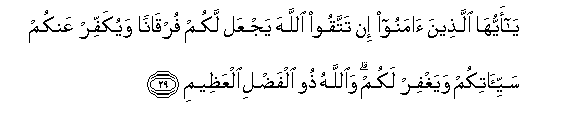
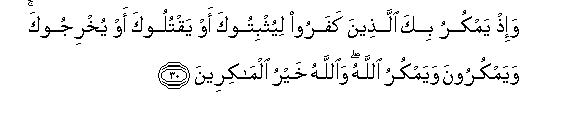
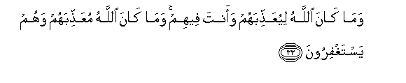
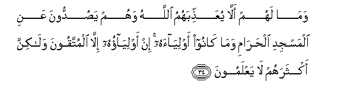
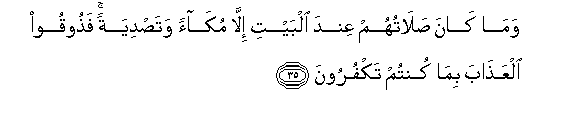
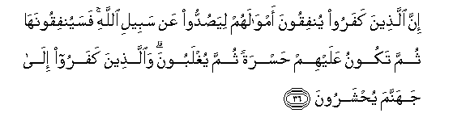
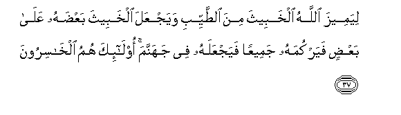

  
[Intangible Textual Heritage](../../index)  [Islam](../index.md) 
[Index](index.md)   
[Hypertext Qur'an](../htq/index)  [Unicode](../uq/008.htm#008_029.md) 
[Palmer](../sbe06/008)  [Pickthall](../pick/008.htm#008_029.md)  [Yusuf Ali
English](../yaq/yaq008)  [Rodwell](../qr/008.md)   
  
[Sūra VIII.: Anfāl, or the Spoils of War. Index](008.md)  
  [Previous](00803)  [Next](00805.md) 

------------------------------------------------------------------------

  
*The Holy Quran*, tr. by Yusuf Ali, \[1934\], at Intangible Textual
Heritage

------------------------------------------------------------------------

# Sūra VIII.: Anfāl, or the Spoils of War.

### Section 4

------------------------------------------------------------------------

29. Y<u>a</u> ayyuh<u>a</u> alla<u>th</u>eena <u>a</u>m<u>a</u>noo in
tattaqoo All<u>a</u>ha yajAAal lakum furq<u>a</u>nan wayukaffir AAankum
sayyi-<u>a</u>tikum wayaghfir lakum wa**A**ll<u>a</u>hu <u>th</u>oo
alfa<u>d</u>li alAAa*<u>th</u>*eem**i**

29\. O ye who believe!  
If ye fear God,  
He will grant you a Criterion  
(To judge between right and wrong),  
Remove from you (all) evil  
(That may afflict) you,  
And forgive you:  
For God is the Lord  
Of grace unbounded.

------------------------------------------------------------------------

30. Wa-i<u>th</u> yamkuru bika alla<u>th</u>eena kafaroo liyuthbitooka
aw yaqtulooka aw yukhrijooka wayamkuroona wayamkuru All<u>a</u>hu
wa**A**ll<u>a</u>hu khayru alm<u>a</u>kireen**a**

30\. Remember how the Unbelievers  
Plotted against thee, to keep  
Thee in bonds, or slay thee,  
Or get thee out (of thy home).  
They plot and plan,  
And God too plans,  
But the best of planners  
Is God.

------------------------------------------------------------------------

31. Wa-i<u>tha</u> tutl<u>a</u> AAalayhim <u>a</u>y<u>a</u>tun<u>a</u>
q<u>a</u>loo qad samiAAn<u>a</u> law nash<u>a</u>o laquln<u>a</u> mithla
h<u>atha</u> in h<u>atha</u> ill<u>a</u> as<u>at</u>eeru
al-awwaleen**a**

31\. When Our Signs are rehearsed  
To them, they say: "We  
Have heard this (before):  
If we wished, we could  
Say (words) like these:  
These are nothing  
But tales of the ancients."

------------------------------------------------------------------------

32. Wa-i<u>th</u> q<u>a</u>loo all<u>a</u>humma in k<u>a</u>na
h<u>atha</u> huwa al<u>h</u>aqqa min AAindika faam<u>t</u>ir
AAalayn<u>a</u> <u>h</u>ij<u>a</u>ratan mina a**l**ssam<u>a</u>-i awi
i/tin<u>a</u> biAAa<u>tha</u>bin aleem**in**

32\. Remember how they said:  
"O God! if this is indeed  
The Truth from Thee,  
Rain down on as a shower  
Of stones from the sky,  
Or send us a grievous Penalty.

------------------------------------------------------------------------

33. Wam<u>a</u> k<u>a</u>na All<u>a</u>hu liyuAAa<u>thth</u>ibahum
waanta feehim wam<u>a</u> k<u>a</u>na All<u>a</u>hu
muAAa<u>thth</u>ibahum wahum yastaghfiroon**a**

33\. But God was not going  
To send them a Penalty  
Whilst thou wast amongst them;  
Nor was He going to send it  
Whilst they could ask for pardon

------------------------------------------------------------------------

34. Wam<u>a</u> lahum all<u>a</u> yuAAa<u>thth</u>ibahumu All<u>a</u>hu
wahum ya<u>s</u>uddoona AAani almasjidi al<u>h</u>ar<u>a</u>mi
wam<u>a</u> k<u>a</u>noo awliy<u>a</u>ahu in awliy<u>a</u>ohu
ill<u>a</u> almuttaqoona wal<u>a</u>kinna aktharahum l<u>a</u>
yaAAlamoon**a**

34\. But what plea have they  
That God should not punish  
Them, when they keep out  
(Men) from the Sacred Mosque—  
And they are not its guardians?  
No men can be its guardians  
Except the righteous; but most  
Of them do not understand.

------------------------------------------------------------------------

35. Wam<u>a</u> k<u>a</u>na <u>s</u>al<u>a</u>tuhum AAinda albayti
ill<u>a</u> muk<u>a</u>an wata<u>s</u>diyatan fa<u>th</u>ooqoo
alAAa<u>tha</u>ba bim<u>a</u> kuntum takfuroon**a**

35\. Their prayer at the House  
(Of God) is nothing but  
Whistling and clapping of hands:  
(Its only answer can be),  
"Taste ye the Penalty  
Because ye blasphemed."

------------------------------------------------------------------------

36. Inna alla<u>th</u>eena kafaroo yunfiqoona amw<u>a</u>lahum
liya<u>s</u>uddoo AAan sabeeli All<u>a</u>hi fasayunfiqoonah<u>a</u>
thumma takoonu AAalayhim <u>h</u>asratan thumma yughlaboona
wa**a**lla<u>th</u>eena kafaroo il<u>a</u> jahannama
yu<u>h</u>sharoon**a**

36\. The Unbelievers spend their wealth  
To hinder (men) from the path  
Of God, and so will they  
Continue to spend; but  
In the end they will have  
(Only) regrets and sighs;  
At length they will be overcome:  
And the Unbelievers will be  
Gathered together to Hell;—

------------------------------------------------------------------------

37. Liyameeza All<u>a</u>hu alkhabeetha mina a**l**<u>tt</u>ayyibi
wayajAAala alkhabeetha baAA<u>d</u>ahu AAal<u>a</u> baAA<u>d</u>in
fayarkumahu jameeAAan fayajAAalahu fee jahannama ol<u>a</u>-ika humu
alkh<u>a</u>siroon**a**

37\. In order that God may separate  
The impure from the pure,  
Put the impure, one on another,  
Heap them together, and cast them  
Into Hell. They will be  
The ones to have lost.

------------------------------------------------------------------------

[Next: Section 5 (38-44)](00805.md)

