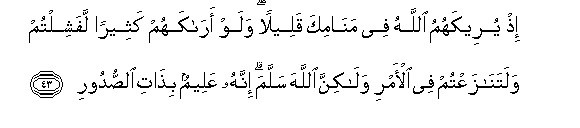

  
[Intangible Textual Heritage](../../index)  [Islam](../index.md) 
[Index](index.md)   
[Hypertext Qur'an](../htq/index)  [Unicode](../uq/008.htm#008_038.md) 
[Palmer](../sbe06/008)  [Pickthall](../pick/008.htm#008_038.md)  [Yusuf Ali
English](../yaq/yaq008)  [Rodwell](../qr/008.md)   
  
[Sūra VIII.: Anfāl, or the Spoils of War. Index](008.md)  
  [Previous](00804)  [Next](00806.md) 

------------------------------------------------------------------------

  
*The Holy Quran*, tr. by Yusuf Ali, \[1934\], at Intangible Textual
Heritage

------------------------------------------------------------------------

# Sūra VIII.: Anfāl, or the Spoils of War.

### Section 5

------------------------------------------------------------------------

38. Qul lilla<u>th</u>eena kafaroo in yantahoo yughfar lahum m<u>a</u>
qad salafa wa-in yaAAoodoo faqad ma<u>d</u>at sunnatu al-awwaleen**a**

38\. Say to the Unbelievers,  
If (now) they desist (from Unbelief),  
Their past would be forgiven them;  
But if they persist, the punishment  
Of those before them is already  
(A matter of warning for them).

------------------------------------------------------------------------

39. Waq<u>a</u>tiloohum <u>h</u>att<u>a</u> l<u>a</u> takoona fitnatun
wayakoona a**l**ddeenu kulluhu lill<u>a</u>hi fa-ini intahaw fa-inna
All<u>a</u>ha bim<u>a</u> yaAAmaloona ba<u>s</u>eer**un**

39\. And fight them on  
Until there is no [more](errata.htm#2.md)  
Tumult or oppression,  
And there prevail  
Justice and faith in God  
Altogether and everywhere;  
But if they cease, verily God  
Doth see all that they do.

------------------------------------------------------------------------

40. Wa-in tawallaw fa**i**AAlamoo anna All<u>a</u>ha mawl<u>a</u>kum
niAAma almawl<u>a</u> waniAAma a**l**nna<u>s</u>eer**u**

40\. If they refuse, be sure  
That God is your Protector—  
The Best to protect  
And the Best to help.

------------------------------------------------------------------------

41. Wa**i**AAlamoo annam<u>a</u> ghanimtum min shay-in faanna
lill<u>a</u>hi khumusahu wali**l**rrasooli wali<u>th</u>ee
alqurb<u>a</u> wa**a**lyat<u>a</u>m<u>a</u> wa**a**lmas<u>a</u>keeni
wa**i**bni a**l**ssabeeli in kuntum <u>a</u>mantum bi**A**ll<u>a</u>hi
wam<u>a</u> anzaln<u>a</u> AAal<u>a</u> AAabdin<u>a</u> yawma
alfurq<u>a</u>ni yawma iltaq<u>a</u> aljamAA<u>a</u>ni
wa**A**ll<u>a</u>hu AAal<u>a</u> kulli shay-in qadeer**un**

41\. And know that out of  
All the booty that ye  
May acquire (in war),  
A fifth share is assigned  
To God,—and to the Apostle,  
And to near relatives,  
Orphans, the needy,  
And the wayfarer,  
If ye do believe in God  
And in the revelation  
We sent down to Our Servant  
On the Day of Testing,—  
The Day of the meeting  
Of the two forces.  
For God hath power  
Over all things.

------------------------------------------------------------------------

42. I<u>th</u> antum bi**a**lAAudwati a**l**dduny<u>a</u> wahum
bi**a**lAAudwati alqu<u>s</u>w<u>a</u> wa**al**rrakbu asfala minkum
walaw taw<u>a</u>AAadtum la**i**khtalaftum fee almeeAA<u>a</u>di
wal<u>a</u>kin liyaq<u>d</u>iya All<u>a</u>hu amran k<u>a</u>na
mafAAoolan liyahlika man halaka AAan bayyinatin waya<u>h</u>y<u>a</u>
man <u>h</u>ayya AAan bayyinatin wa-inna All<u>a</u>ha lasameeAAun
AAaleem**un**

42\. Remember ye were  
On the hither side  
Of the valley, and they  
On the farther side,  
And the caravan  
On lower ground than ye.  
Even if ye had made  
A mutual appointment  
To meet, ye would certainly:  
Have failed in the appointment:  
But (thus ye met),  
That God might accomplish  
A matter already enacted;  
That those who died might  
Die after a clear Sign  
(Had been given), and those who lived  
Might live after a Clear Sign  
(Had been given). And verily  
God is He who heareth  
And knoweth (all things).

------------------------------------------------------------------------

43. I<u>th</u> yureekahumu All<u>a</u>hu fee man<u>a</u>mika qaleelan
walaw ar<u>a</u>kahum katheeran lafashiltum walatan<u>a</u>zaAAtum fee
al-amri wal<u>a</u>kinna All<u>a</u>ha sallama innahu AAaleemun
bi<u>tha</u>ti a**l**<u>ss</u>udoor**i**

43\. Remember in thy dream  
God showed them to thee  
As few: if He had shown  
Them to thee as many,  
Ye would surely have been  
Discouraged, and ye would  
Surely have disputed  
In (your) decision: but God  
Saved (you): for He knoweth  
Well the (secrets) of (all) hearts.

------------------------------------------------------------------------

44. Wa-i<u>th</u> yureekumoohum i<u>th</u>i iltaqaytum fee aAAyunikum
qaleelan wayuqallilukum fee aAAyunihim liyaq<u>d</u>iya All<u>a</u>hu
amran k<u>a</u>na mafAAoolan wa-il<u>a</u> All<u>a</u>hi turjaAAu
al-omoor**u**

44\. And remember when ye met,  
He showed them to you  
As few in your eyes,  
And He made you appear  
As contemptible in their eyes:  
That God might accomplish  
A matter already enacted.  
For to God do all questions  
Go back (for decision).

------------------------------------------------------------------------

[Next: Section 6 (45-48)](00806.md)

