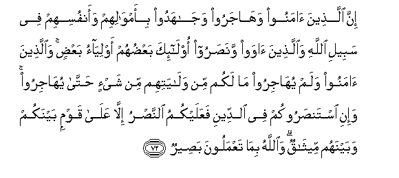

  
[Intangible Textual Heritage](../../index)  [Islam](../index.md) 
[Index](index.md)   
[Hypertext Qur'an](../htq/index)  [Unicode](../uq/008.htm#008_070.md) 
[Palmer](../sbe06/008)  [Pickthall](../pick/008.htm#008_070.md)  [Yusuf Ali
English](../yaq/yaq008)  [Rodwell](../qr/008.md)   
  
[Sūra VIII.: Anfāl, or the Spoils of War. Index](008.md)  
  [Previous](00809)  [Next](00901.md) 

------------------------------------------------------------------------

  
*The Holy Quran*, tr. by Yusuf Ali, \[1934\], at Intangible Textual
Heritage

------------------------------------------------------------------------

# Sūra VIII.: Anfāl, or the Spoils of War.

### Section 10

------------------------------------------------------------------------

70. Y<u>a</u> ayyuh<u>a</u> a**l**nnabiyyu qul liman fee aydeekum mina
al-asr<u>a</u> in yaAAlami All<u>a</u>hu fee quloobikum khayran yu/tikum
khayran mimm<u>a</u> okhi<u>th</u>a minkum wayaghfir lakum
wa**A**ll<u>a</u>hu ghafoorun ra<u>h</u>eem**un**

70\. "

------------------------------------------------------------------------

71. Wa-in yureedoo khiy<u>a</u>nataka faqad kh<u>a</u>noo All<u>a</u>ha
min qablu faamkana minhum wa**A**ll<u>a</u>hu AAaleemun
<u>h</u>akeem**un**

71\. But if they have  
Treacherous designs against thee,  
(O Apostle!), they have already  
Been in treason against God,  
And so hath He given  
(Thee) power over them.  
And God is He who hath  
(Full) knowledge and wisdom.

------------------------------------------------------------------------

72. Inna alla<u>th</u>eena <u>a</u>manoo wah<u>a</u>jaroo
waj<u>a</u>hadoo bi-amw<u>a</u>lihim waanfusihim fee sabeeli
All<u>a</u>hi wa**a**lla<u>th</u>eena <u>a</u>waw wana<u>s</u>aroo
ol<u>a</u>-ika baAA<u>d</u>uhum awliy<u>a</u>o baAA<u>d</u>in
wa**a**lla<u>th</u>eena <u>a</u>manoo walam yuh<u>a</u>jiroo m<u>a</u>
lakum min wal<u>a</u>yatihim min shay-in <u>h</u>att<u>a</u>
yuh<u>a</u>jiroo wa-ini istan<u>s</u>arookum fee a**l**ddeeni
faAAalaykumu a**l**nna<u>s</u>ru ill<u>a</u> AAal<u>a</u> qawmin
baynakum wabaynahum meeth<u>a</u>qun wa**A**ll<u>a</u>hu bim<u>a</u>
taAAmaloona ba<u>s</u>eer**un**

72\. Those who believed,  
And adopted exile,  
And fought for the Faith,  
With their property  
And their persons,  
In the cause of God,  
As well as those  
Who gave (them) asylum  
And aid,—these are (all)  
Friends and protectors,  
One of another.  
As to those who believed  
But came not into exile,  
Ye owe no duty  
Of protection to them  
Until they come into exile;  
But if they seek  
Your aid in religion,  
It is your duty  
To help them,  
Except against a people  
With whom ye have  
A treaty of mutual alliance.  
And (remember) God  
Seeth all that ye do.

------------------------------------------------------------------------

73. Wa**a**lla<u>th</u>eena kafaroo baAA<u>d</u>uhum awliy<u>a</u>o
baAA<u>d</u>in ill<u>a</u> tafAAaloohu takun fitnatun fee al-ar<u>d</u>i
wafas<u>a</u>dun kabeer**un**

73\. The Unbelievers are  
Protectors, one of another:  
Unless ye do this,  
(Protect each other),  
There would be  
Tumult and oppression  
On earth, and great mischief.

------------------------------------------------------------------------

74. Wa**a**lla<u>th</u>eena <u>a</u>manoo wah<u>a</u>jaroo
waj<u>a</u>hadoo fee sabeeli All<u>a</u>hi wa**a**lla<u>th</u>eena
<u>a</u>waw wana<u>s</u>aroo ol<u>a</u>-ika humu almu/minoona
<u>h</u>aqqan lahum maghfiratun warizqun kareem**un**

74\. Those who believe,  
And adopt exile,  
And tight for the Faith,  
In the cause of God,  
As well as those  
Who give (them) asylum  
And aid,—these are (all)  
In very truth the Believers:  
For them is the forgiveness  
Of sins and a provision  
Most generous.

------------------------------------------------------------------------

75. Wa**a**lla<u>th</u>eena <u>a</u>manoo min baAAdu wah<u>a</u>jaroo
waj<u>a</u>hadoo maAAakum faol<u>a</u>-ika minkum waoloo
al-ar<u>ha</u>mi baAA<u>d</u>uhum awl<u>a</u> bibaAA<u>d</u>in fee
kit<u>a</u>bi All<u>a</u>hi inna All<u>a</u>ha bikulli shay-in
AAaleem**un**

75\. And those who  
Accept Faith subsequently,  
And adopt exile,  
And fight for the Faith  
In your company,  
They are of you.  
But kindred by blood  
Have prior rights  
Against each other  
In the Book of God.  
Verily God is well-acquainted  
With all things.

------------------------------------------------------------------------

[Next: Section 1 (1-6)](00901.md)

